# 내부 개발 논의용 데이터 아키텍처 브리프

**작성일:** 2026-08-25<br>
**상태:** Discussion draft, 구현 승인 문서 아님<br>
**대상:** 애플리케이션·데이터·플랫폼·보안 개발자, 제품 책임자<br>
**현재 단계:** `PROJECT_PHASE=demo`<br>
**교차검토:** Claude 읽기 전용 저장소 리뷰 후 Codex가 계약·테스트·공식 문서와 대조

이 문서의 목적은 기존 105쪽 기술문서를 다시 읽는 회의가 아니라, 다음 구현
단계에서 개발팀이 실제로 결정해야 할 경계와 검증 방법을 60분 안에 합의하는
것이다. 합의 결과는 GitHub Issue와 `contracts/proposal-package-v11.yml`에
기록한다. 이 문서 자체는 별도 백로그가 아니다.

## 0. 교차검토 반영 요약

독립 모델 리뷰의 지적은 저장소 정본과 실행 결과로 다시 확인했다. 의견 차이가 아니라
현재 변경분의 결함으로 확인된 항목은 회의 전에 바로 고쳤다.

| 확인된 결함 | 처리 | 검증 위치 |
|---|---|---|
| Pages가 저장소 전체를 artifact로 올림 | `_site` 공개 3파일 allowlist로 변경 | `scripts/build_pages_site.py`, `pages_boundary` 검사 |
| 그림이 집계 정책을 `CANONICAL`에 연결 | 정책 화살표를 `person-grain MART`에만 연결 | `diagrams/iclo-a3-data-architecture.mmd` |
| 카탈로그 회차와 기업별 월 집합을 원자성 게이트가 검사하지 않음 | release envelope·월 집합 검사 추가 | `test_export_contract.py` |
| 생성기 머리글 검사가 gitignored `tmp/`를 봄 | 추적된 `scripts/build/...` 경로로 수정 | `scripts/check-package-consistency.py` |

반면 카탈로그 발행 주체, rolling 지표의 사람 모집단, 조건부 정책 면제 롤은 저장소만
보고 정할 수 없는 설계 선택이다. 이를 임의로 닫지 않고 D3·D5·D8에 올렸다. Python
3.14.7 정확 고정은 재현 가능한 개발환경이라는 기존 결정이므로 유지한다.

## 1. 먼저 맞춰야 할 현실

현재 제품에는 데이터 플랫폼이 없다. `index.html`과 `app.html`은 브라우저 안의
합성 값과 로컬 JSON으로 동작하며, 백엔드·인증·Snowflake 연결·실데이터 적재가
없다. 따라서 현재 화면을 근거 레이어가 이미 운영 중인 것처럼 설명하면 안 된다.

권장 단계 구분은 다음과 같다.

| 구분 | 지금 `demo` | A3 근거 레이어 | A2 실데이터 파일럿 |
|---|---|---|---|
| 검증할 것 | 화면 규칙과 합성 시나리오 | Snowflake 변환·격리·최소 셀·내보내기 구조 | 법적 근거를 갖춘 실제 운영 경로 |
| 입력 | 브라우저 상수, 로컬 합성 JSON | 3개 기업·36개월 합성 데이터 | 자격·부서·TPA 청구·앱·동의·신호 데이터 |
| Snowflake | 없음 | **Enterprise 이상 필요, 계정 에디션·리전 미확인** | **Business Critical 이상 + Snowflake BAA + 미국 리전 전제** |
| 전달 | 공개 GitHub Pages | 공개 필드 검사를 통과한 기업 롤별 합성 JSON만 Pages allowlist에 추가 | 인증된 비공개 앱/API. Pages 경로 재사용 금지 |
| 개인 단위 데이터 | 합성 개인 레코드 있음 (`data/member-demo.json`: 계정·보장·목적별 동의) | 합성 `party_sk`만 | 존재하되 기업에는 집계·밴드만 노출 |
| 성공 기준 | 10개 저장소 게이트 | 정책이 걸린 쿼리와 내보내기 계약을 재현 가능하게 증명 | 착수 게이트·보안·감사·운영까지 서면/실측으로 증명 |

핵심은 A3와 A2를 같은 프로젝트 이름으로 섞지 않는 것이다. A3는 합성 데이터로
통제 구조를 검증하는 단계이고, A2는 실데이터의 법적·운영 경계를 추가하는 별도
아키텍처 단계다.

또한 “내부용”은 독자 범위이지 보안 등급이 아니다. 이 저장소 자체가 공개이므로 이
문서에는 비밀정보를 기록하지 않는다. Pages 배포는 저장소 루트가 아니라 `_site`의
`index.html`, `app.html`, `data/member-demo.json`만 올리는 allowlist 방식으로
제한한다. A3 export는 합성 여부와 공개 필드를 검사하는 별도 변경 전에는 여기에
추가하지 않는다.

## 2. 권장 A3 데이터 흐름



편집 원본은 `diagrams/iclo-a3-data-architecture.mmd` 하나다. `.svg`, `.png`,
`.excalidraw`는 이 원본에서 함께 다시 만드는 검토 산출물이다. 현재 이 네 파일은
`doc-manifest.json`의 자동 freshness 대상이 아니므로 리뷰에서 묶음 변경을 확인한다.

### 레이어별 책임

| 레이어 | 책임 | 쓰기 주체 | 읽기 주체 | 실패 시 처리 |
|---|---|---|---|---|
| `RAW` | 원본 형태와 적재 회차를 보존. 합성 입력도 실제 원천과 같은 입구 사용 | 적재 롤 | 데이터 엔지니어링 롤 | 원본을 수정하지 않고 회차 전체 격리 |
| `STAGED` | 파싱, 타입 지정, 코드 표준화, 원본 키 유지 | 변환 롤 | 데이터 엔지니어링 롤 | 오류 행을 별도 격리하고 조용한 강제 변환 금지 |
| `CANONICAL` | 사람·기업·자격·청구·앱·동의의 정본 모델과 시간 이력 | 변환 롤 | 제한된 내부 롤 | 신원 미매칭·중복·역전 기간을 품질 실패로 승격 |
| `MART` | `party_sk`를 보유한 사람×기업×월 grain과 지표별 사람 grain | `R_ENGINEER` | 기업 노출용 뷰/정책 | 기존 fixture는 PMPM·member-month만 검증. KPI·억제 fixture가 추가되기 전에는 해당 릴리스 증거로 보지 않음 |
| `EMPLOYER` | 기업 역할이 허용된 집계 쿼리만 실행하는 노출 경계 | 플랫폼/보안 관리자 | `R_EMPLOYER_*` | 다른 기업 행, 개인 행, 미허용 함수는 거부 |
| Export | 기업별 JSON 3개와 부서 카탈로그를 한 회차로 발행 | 기업별 역할 + 카탈로그 발행 주체는 D8에서 결정 | 정적 대시보드 | 일부 파일 또는 회차 혼합이면 원자적으로 거부 |

### 왜 사람 grain 중간 테이블이 필요한가

최소 셀 20은 행 20개가 아니라 **고유한 사람 20명**이어야 한다. 청구·앱 이벤트는
한 사람이 여러 행을 만들기 때문에 `party_sk` 없는 집계 테이블에 정책을 걸면 한
사람의 여러 행이 20명처럼 계산될 수 있다. 반대로 너무 이른 원천 레이어에 집계
정책을 걸면 변환의 윈도우 함수와 조인이 제한된다.

따라서 버전 선택과 grain 정리는 내부 엔지니어링 롤이 수행하고,
`mart.person_month_fact`처럼 `party_sk`가 남은 사람 grain에 집계 정책과
`ENTITY KEY (party_sk)`를 적용한다. 기업 역할은 이 경계를 통해 `SUM`·`COUNT`
중심의 허용된 집계만 실행한다. 집계 정책은 `CANONICAL`이 아니라 이 MART 경계에
붙는다.

다만 사람×기업×월 grain 하나로 모든 지표가 자동 해결되는 것은 아니다. 보고월
시점 지표와 rolling 12개월 지표는 고유 인물 모집단이 다르고, 관측 창 중간에 부서가
바뀐 사람의 귀속 규칙도 아직 없다. `repeat`와 signal 분포가 월·부서 간 합산 가능한지,
지표별 최소 셀을 어느 모집단으로 판정할지도 D5에서 확정한다.

`R_ENGINEER`의 집계 정책 면제는 롤 이름만으로 생기는 속성이 아니다. Snowflake의
조건부 집계 정책 본문이 `CURRENT_ROLE()` 등의 조건으로 명시적으로 부여해야 한다.
정책 작성 책임자, 면제 롤, fixture 대조용 내부 경로와 기업 발행 경로를 D3에서 함께
정한다.

Snowflake 공식 문서상 집계 정책과 entity-level privacy는 Enterprise 이상 기능이며,
entity key가 있을 때 최소 그룹 크기는 행 수가 아니라 고유 entity 수를 기준으로
평가된다. 작은 그룹은 GROUP BY 키가 `NULL`인 remainder group으로 합쳐질 수 있다.
마스킹 정책은 집계 정책보다 먼저 적용되므로 `party_sk`를 상수로 바꾸는 마스킹은
고유 entity 수를 무너뜨릴 수 있다. 가능하면 기업용 보호 뷰에서 식별자를 투영하지
않는 경계를 우선 검토하고, 마스킹이 필요하면 실제 계정에서 조합을 테스트한다.

## 3. 데이터 계약에서 이미 확정된 것

### 지표 시간 계약

지표 이름만 맞아서는 부족하다. 각 지표의 사람 단위, 관측 기간, 분모와 성숙 시점이
고정돼야 SQL과 화면이 같은 값을 만든다.

| 지표 | 현재 계약의 핵심 | 개발 시 특히 볼 실패 |
|---|---|---|
| Activated | 유효 참여 누적 분자와 보고월 자격 분모 | 소급 자격 정정으로 분모가 조용히 바뀌는가 |
| Repeat | 누적이 아니라 rolling 12개월 | 시간이 지나며 자동으로 100%에 접근하지 않는가 |
| Signal distribution | 사람별 보고월 최신 1건 | 이벤트 행 수가 사람 수처럼 집계되지 않는가 |
| Open actions | 관측 창 안에서 아직 종료되지 않은 행동 | 취소·만료·미완료 상태를 한 값으로 섞지 않는가 |
| Completed actions | 청구가 성숙한 코호트만 분모로 사용 | 최근 코호트가 포함돼 완료율을 인위적으로 낮추지 않는가 |

청구 지연 P90은 첫 실데이터 분기의 측정값이 필요하므로 아직 잠정값이다. 이를
상수처럼 영구 고정하지 않는다.

### 내보내기 계약

한 릴리스는 다음을 동시에 만족해야 한다.

- `employer-a.json`, `employer-b.json`, `employer-c.json`,
  `departments.json`이 모두 존재한다.
- 기업 파일은 `schema_version`, `run_id`, `report_snapshot_seq`, `exported_at`,
  `employer_id`, `synthetic` 전체 envelope을 갖는다. 카탈로그도 적어도
  `schema_version`, `run_id`, `report_snapshot_seq`, `exported_at`, `synthetic`을
  갖는다.
- 세 기업 파일과 카탈로그의 `run_id`, `schema_version`, `report_snapshot_seq`가
  같고, 세 기업 파일의 월 집합도 동일하다. `test_export_contract.py`가 이를 검사한다.
- `exported_at`은 배달 시각이고 `eligibility_thru`·`claims_thru`는 원천 데이터
  신선도다. 둘을 하나의 “최신” 표시로 합치지 않는다.
- 작은 부서의 값은 `null`/remainder로 억제하되 부서 이름은 카탈로그에 남긴다.
- 카탈로그 행은 `departments` 배열이며 각 행은 비어 있지 않은 `department`와
  기업 파일 중 하나와 일치하는 `employer_id`를 갖는다.
- 각 필드는 HRIS/앱/TPA/신호라는 원천 구분과 Snowflake 객체 provenance를 함께
  갖는다.
- `_TEST_` 기업은 내부 테스트 전용이며 공개 내보내기에 나타나면 실패한다.

현재 계약의 단일 `departments.json`은 세 기업의 `employer_id`와 부서명을 담지만,
행 접근 정책 아래에서는 어떤 기업 롤도 전체 카탈로그를 만들 수 없다. 기업별
카탈로그 3개로 나눌지, 부서명만 읽는 좁은 발행 롤을 둘지는 아직 결정되지 않았다.
이 모순을 닫기 전에는 “기업별 롤 각각이 4파일을 발행한다”고 구현하지 않는다(D8).

## 4. 보안·신뢰 경계

### A3에서 증명할 것

1. 행 접근 정책이 기업 A/B/C를 분리한다.
2. 집계 정책과 `ENTITY KEY`가 고유 인물 기준 최소 셀 20을 강제한다.
3. `party_sk`는 정책 계산에는 쓰이지만 기업 역할이 결과로 읽을 수 없다. 보호 뷰에서
   제외하는 안과 마스킹 안을 비교한다.
4. 마스킹을 쓰면 적용 후 entity 수가 보존되는지 확인하고, 정책 본문의 엔지니어링
   면제 조건도 `POLICY_CONTEXT`와 실제 역할 쿼리로 검증한다.
5. B/C 입력만 바꿨을 때 A의 정규화된 payload가 바뀌지 않는 비간섭 테스트를
   통과한다. 매번 바뀌는 `run_id`·`exported_at`은 비교에서 제외하고, 행 순서와 수치
   포맷은 결정적으로 고정한다.
6. 기업 파일은 `R_ENGINEER`가 아닌 기업별 역할로 내보낸다. 어떤 내부 롤이 정책을
   면제받는지는 D3의 정책 본문 결정이며, 카탈로그 발행 롤은 D8에서 정한다.

### A3가 증명하지 못하는 것

- 정적 JSON과 GitHub Pages는 런타임 테넌트 격리가 아니다. 세 합성 파일이 모두
  공개된다는 전제다.
- Pages 배포 allowlist는 현재 데모 파일 3개만 포함하고 A3 export는 제외한다. 다만
  저장소 자체가 공개이므로 내부 회의 문서는 GitHub에서 비밀이 아니다.
- `ACCESS_HISTORY`는 Snowflake 객체·컬럼 접근만 본다. 객체 저장소, 서명 URL,
  추론 API, 앱 프로필 전환, 관리자 차단 이벤트는 별도 감사 모델이 필요하다.
- 최소 셀 하나만으로 반복 쿼리를 통한 차분 공격이 완전히 사라지지 않는다.
- 합성 데이터 성공은 기업 수요나 실데이터 권리를 증명하지 않는다.

### A2 전에 닫을 착수 게이트

| 게이트 | 열려 있으면 생기는 문제 | 이슈 |
|---|---|---|
| HIPAA 역할과 BAA chain | 누가 어떤 책임으로 PHI를 처리하는지 정할 수 없음 | #13 |
| 기업–TPA 데이터 권리 | 데이터를 받아도 필드·목적별 사용 권리가 없음 | #14 |
| 동의 이전 baseline 적재 | 끝내 동의하지 않는 사람의 PHI 처리 근거가 없음 | #15 |
| 공통 식별키 | 자격·청구·앱을 같은 사람으로 연결할 수 없음 | #16 |

`동의 철회의 과거 집계 처리`(#17)는 현재 정본의 네 착수 게이트가 아니라
`awaiting_decision: CONSENT-WITHDRAWAL-RETRO`다. A2 착수 게이트로 승격할지는
결정이 필요하며, 승격하면 계약과 대외 문서 노출 검사도 함께 바꾼다.

게이트 총수 불일치는 문서 대 계약의 단순 차이가 아니다. 기술문서 §16은
`12~21`을 “10개 항목”이라고 쓰지만 §16.1에는 11개를 나열하고, §17.1은
22개(본문 11 + §16.1의 11)라고 쓴다. 계약 주석은 21개다. #11에서 §16 자체의
계수부터 고친 뒤 하나의 수를 정본으로 삼는다.

## 5. 회의에서 확정할 결정

| ID | 결정 질문 | 권장안 | 완료 증거 | 연결 이슈 |
|---|---|---|---|---|
| D1 | A3를 지금 시작할 근거가 있는가 | 고객/채널 증거를 회의 전 입력으로 받는다. 없으면 go/no-go 대신 담당자·기한 결정 | 서면 근거 링크 또는 확인 책임자·기한 | #2, #3, #4 |
| D2 | A3 실행 계정이 정책 기능을 지원하는가 | edition은 계정 관리자/콘솔, region은 `CURRENT_REGION()`으로 확인하고 기능 spike 실행 | cloud/region/edition 기록과 실제 정책 쿼리 | #2, #5 |
| D3 | 최소 셀 정책 경계와 면제는 무엇인가 | `person_month_fact`의 entity key, 기업 보호 뷰, 조건부 정책 면제 롤을 한 세트로 결정 | A/B role, 19/20/21명, 마스킹/비투영, `POLICY_CONTEXT` 테스트 | #5 |
| D4 | 기업 내보내기는 누가 어떻게 발행하는가 | A3는 기업 역할별 수동 스크립트 + 원자성 게이트부터 시작 | 기업 3파일 manifest와 실패 주입 테스트 | #8 |
| D5 | 시간 이력과 rolling 지표의 기준은 무엇인가 | source/event/load/snapshot 시간, 12개월 모집단, 부서 이동 귀속, 합산 가능 필드를 함께 결정 | 소급 정정·부서 이동 fixture와 과거 분모 재현 | #7 |
| D6 | 화면 장애 시 무엇을 보여주는가 | 마지막 값을 합성 fallback하지 않고 오류·stale 상태 표시 | JSON 404/혼합 회차/unknown schema UI 테스트 | #9, #10 |
| D7 | 무엇을 A2로 명시적으로 미루는가 | PHI·인증·백엔드·실시간 연결·as-of UI는 A2 게이트 뒤 | A3 scope/anti-goal 승인 | #13–#21 |
| D8 | 부서 카탈로그는 누가 어떤 모양으로 발행하는가 | 기업별 3파일 또는 좁은 카탈로그 발행 롤을 비교하고 A2에서는 교차 기업 목록 금지 | 선택한 JSON schema, role grant, A/B 격리 테스트 | #8 |

## 6. 권장 구현 순서

```text
0. 고객 근거 + Snowflake edition/region 확인 책임자·기한     (#2–#4)
1. Versioned DDL, roles, schemas, person-grain policy spike  (#5)
2. 3기업 합성 생성기 + 기존 fixture의 KPI/19·20·21명 확장   (#6)
3. STAGED → CANONICAL → temporal/KPI MART                   (#7)
4. 기업 역할별 atomic export + D8에서 정한 catalog          (#8)
5. 대시보드 계산 → JSON 조회 전환                           (#9)
6. single-source/isolation/suppression/failure 회귀 게이트   (#10)
7. 계약·기술문서 gate register 일치                         (#11)
```

1–4는 Snowflake SQL과 export schema를 공유하므로 순차성이 강하다. 생성기/fixture는
DDL과 병렬로 시작할 수 있지만 export 구현보다 먼저 끝내야 한다. 화면 전환은 JSON
schema가 고정된 뒤 시작한다.

기존 fixture 7종과 `test_fixtures.py`는 이미 존재하지만 `member_months`와
`dental_pmpm` 중심의 기반 변환만 검증한다. Activated, rolling Repeat, 사람별 최신
Signal, Open/Completed actions, 19/20/21명 억제는 아직 릴리스 증거가 아니다. #6의
완료 조건은 새 파일 개수 자체가 아니라 이 시간 계약과 정책 경계를 손 계산 기대값으로
검증하는 것이다.

## 7. 60분 개발자 회의 안

| 시간 | 논의 | 회의 종료 조건 |
|---:|---|---|
| 0–5분 | 현재/설계/실운영 구분 | “현재 돌아가는 것” 한 문장 합의 |
| 5–15분 | A3 목적과 D1/D2 외부 입력 상태 | A3 범위 승인, 미확인 사실의 담당자·기한 지정 |
| 15–30분 | 사람 grain, 시간 이력, KPI 계약 | `party_sk`, rolling 모집단, 부서 이동 규칙과 담당자 결정 |
| 30–42분 | 정책, 역할, 내보내기 | D3·D4·D8의 권한·기업 파일·카탈로그 발행안 결정 |
| 42–52분 | 테스트와 관측성 | 기능별 필수 실패 주입 테스트 확정 |
| 52–60분 | 순서·담당·증거 | #2–#11 owner와 첫 spike 날짜 기록 |

고객 근거와 계정 edition/region이 회의 전에 들어오지 않으면 D1·D2는 닫지 않는다.
그 경우 회의 산출물은 확인 담당자, 방법, 기한이다. 참석자는
`contracts/proposal-package-v11.yml`의 `dashboard.metric_time_contracts`와
`export_contract`를 읽고 다음 질문에 답을 적어 온다.

1. `person_month_fact` 한 행을 정확히 어떤 키와 시간으로 정의할 것인가?
2. 마스킹된 `party_sk`가 entity key 계산과 함께 동작하는지 어떤 쿼리로 증명할
   것인가?
3. JSON 네 파일 중 하나만 실패했을 때 마지막 정상 릴리스를 어떻게 식별하고
   되돌릴 것인가?
4. 모든 기업의 부서를 담는 `departments.json`은 어떤 롤이 만들며, A2에서 기업 간
   부서명 노출을 어떻게 막을 것인가?

## 8. 이번 단계의 anti-goals

- 브라우저에 Snowflake 자격증명을 넣지 않는다.
- A3를 위해 인증·백엔드·실시간 API를 먼저 만들지 않는다.
- JavaScript 억제만으로 데이터 계층의 최소 셀을 대체하지 않는다.
- `R_ENGINEER`로 공개 산출물을 내보내지 않는다.
- 로드 실패를 현재 합성 상수로 조용히 대체하지 않는다.
- 실데이터 또는 개인 단위 데이터를 GitHub Pages에 배포하지 않는다.
- A3의 단일 부서 카탈로그 모양을 A2의 다중 기업 비공개 전달에 그대로 재사용하지 않는다.
- 목적별 동의, `STALE`, `policy_version` 규칙을 새 모델로 다시 정의하지 않고 기존
  `status.built.consent_model`과 `test_consent.py`를 출발점으로 삼는다.
- 제품 수요 미검증을 기술 완성도로 덮지 않는다.

## 9. 근거 문서

### 저장소 정본

- `contracts/proposal-package-v11.yml`: 지표·내보내기·착수 게이트·결정 등록부
- `output/proposal-v10/06_Tech/ICLO-Evidence-Layer-DB-설계-KO.md`: 상세 논리/물리 설계
- `employer-dashboard-poc/docs/ARCHITECTURE.md`: 현재·A3·완제품 실행 구조
- `BACKLOG.md`와 GitHub Milestones: 현재 작업 큐

### Snowflake 공식 근거

- [Aggregation policies](https://docs.snowflake.com/en/user-guide/aggregation-policies)
- [Entity-level privacy with aggregation policies](https://docs.snowflake.com/en/user-guide/aggregation-policies-entity-privacy)
- [Row access policies](https://docs.snowflake.com/en/user-guide/security-row-intro)
- [Access History](https://docs.snowflake.com/en/user-guide/access-history)
- [Snowflake editions and PHI/BAA note](https://docs.snowflake.com/en/user-guide/intro-editions)

위 기능 지원은 2026-08-25 공식 문서 기준이다. 실제 계약·계정 활성화 상태는
Snowflake 지원 답변과 계정 내 기능 spike로 별도 확인한다.
