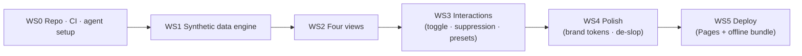

# employer-dashboard-poc: Aggregate oral-health dashboard click demo for self-funded employers

> **Canonical values live in `contracts/proposal-package-v11.yml`.** Screen names, KPI labels, constants,
> colors, terminology and start gates are defined there and shared with the report, the proposal decks and
> the engineering design doc. Change that file first, run `scripts/check-package-consistency.sh`, then change
> this one. The shipped code is `index.html` **at the repo root** — not inside this folder.
>
> `report §N` references below point at the **v2 report in the external Obsidian vault** (`20_Business/25_iclo/01_strategy/`,
> 2026-07-30), not the v10 package in this repo. They do not resolve here.

> **Status**: Draft v0.4 · 2026-07-30 (v0.4 = repo decision: project lives as a subfolder of the existing `iclo` monorepo; bootstrap kit seeded. v0.3 = restructured to skill v2.0, English)
> **Product Type**: SW (web SPA, frontend-only) · **Stage**: PoC — click demo, synthetic data
> **Owner**: Jangwoo Kim (CFO) — single decision-maker
> **Audience**: Internal + AI coding agents (Codex = primary implementer · Claude Code = review/QA)
> **Source of truth**: v2 narrative report §9–§10, §13–§14 and Snowflake 3-pager §2 (vault: `20_Business/25_iclo/01_strategy/`, saved 2026-07-30)

> **⚠️ This spec needs validation — see Section 5.2.** Zero problem-validation interviews with US channel partners exist; this PoC is itself the validation instrument. Never present demo output as performance evidence.

---

## 1. Why — Channel partners judge vendors on screens, not documents

**1.1 Action title.** **Benefits consultants and self-funded employers judge vendors on screens — this PoC turns the dashboard specified in report §9 into a clickable artifact that converts Sep–Oct 2026 US channel meetings.**

**1.2 Situation.** The US stay (2026-09-06 → 10-24) is defined in the GTM plan as the channel / design-partner sourcing stage (M0–3 on a T+18–24-month revenue path — report §15). Meeting counterparts: benefits consultants (the RFP gate), dental TPA/ASOs, self-funded employers. Current assets: two written documents plus the deployed synthetic dashboard (`index.html`, live on GitHub Pages). The Korean HomeDen app cannot be demoed to US channels: it contains disease-specific outputs, which the FDA 2026 wellness guidance places outside the permitted boundary (intended-use firewall, no cross-contamination — report §13).

**1.3 Complication.** ICLO's differentiators — aggregate-only views, `n >= 20` suppression, dual denominators — are all properties of *what the screen looks like*. (The J-curve guardrail was cut with the Trend view; see §2.) Prose conveys them poorly. In a point-solution-fatigued market (report §18), consultants do not shortlist vendors without a working artifact. There is no time to build real-data integration or a backend before the first September meetings.

**1.4 Question → Answer.** Q: What must be shown in a US channel meeting to convert it into a design-partner conversation? A: a synthetic-data click demo. Four reasons (MECE):

| # | Reason | So-what |
|---|---|---|
| 1 | Materializes buyer language — activation, preventive visits, PMPM, restorative mix shown as buyers define them | Layer 1–2 value narrative lands in a 3-minute demo |
| 2 | Visually proves the regulatory/privacy boundary — no individual screens, suppression that actually fires, non-disease signal labels | Compliance that runs, not compliance that is claimed |
| 3 | Embeds the J-curve anti-misreading narrative — short-term allowed shown only as a guardrail band | Prevents the month-12 renewal own-goal (report §10) before any contract exists |
| 4 | Collects feedback — channel reactions to metric definitions and view priorities feed pilot design | The PoC is an input to pilot design (report §17), not a one-way pitch |

---

## 2. What — Concept and boundaries

**2.1 Concept.** A single-page web app. Four views of an oral-health program from a self-funded employer's executive perspective: **Executive Overview · Oral-Health Signals · Intervention Funnel · Trend vs Control**. All data is synthetic (fixed-seed generator). No backend, no auth. Static build, runs offline. **UI language: English.** Every view carries a permanent label: "Synthetic data — illustrative only."

**2.2 Positioning.** (One framework; it drives the §5.3 competition argument.)

```mermaid
quadrantChart
    title Employer-facing oral/health dashboard positioning
    x-axis Engagement metrics only --> Claims-linked economics
    y-axis Individual-level exposure --> Aggregate-only
    quadrant-1 Where ICLO must win
    quadrant-2 Privacy-safe but shallow
    quadrant-3 Risky and shallow
    quadrant-4 Deep but privacy-exposed
    HomeDen KR app (not for US): [0.25, 0.2]
    Generic wellness dashboards: [0.3, 0.75]
    Carrier annual reports (static): [0.7, 0.8]
    Springbuk (medical-wide): [0.85, 0.85]
    ICLO PoC (dental vertical): [0.8, 0.95]
```

Springbuk and carrier reports already occupy the same quadrant — differentiation is not quadrant position but **dental vertical + signal→action→claims loop + suppression that visibly works** (§5.3).

**2.3 In-scope / Out-of-scope.** Out is the first line of defense against agent scope creep. Each Out has a reason.

| In (build) | Out (do not build — reason) |
|---|---|
| 3 views: Program overview (KPI band) · Oral-health signal distribution (Low/Moderate/**Priority**) · Intervention funnel | Login / roles / backend / DB — unnecessary for a PoC, pure time cost |
| — | **Preventive-visit Trend vs Control — deferred, not cut.** It needs a control arm, and experiment assignment has no consent basis, allocation rule or protocol owner agreed yet. Returns after legal/protocol sign-off. |
| Denominator discipline: funnel uses eligible employees (10,000); PMPM uses covered member-months (22,000 members, est. ×2.2) — each chart labels its denominator | Real-data integration — data rights not secured (report §11); scope creep |
| Suppression demo: department/site filter; any cell with `n < 20` shows "Suppressed (n<20)" instead of values | Individual-level views — RED-class function (report §13); refuse even if requested |
| — | **J-curve guardrail band — deferred with the Trend view above** (it lives on the allowed-trend chart) |
| — | Any disease-specific wording — FDA 2026 red line |
| 3 scenario presets: A baseline (10K) · B small (2.5K) · C large (25K) — §9 ratios preserved, fixed seed | PDF export, mobile optimization, i18n — not needed for a projector demo |
| Offline execution (local `dist/` bundle) — meeting-room network distrust | Live/streaming data effects — invites misreading |

**2.4 Core hypotheses.** (A hypothesis without a verification method is not a hypothesis.)

| # | Hypothesis | Verification |
|---|---|---|
| H1 | A working aggregate-only + suppression screen preempts privacy objections inside the meeting | Meeting log: privacy question raised → resolved on-screen (Y/N) |
| H2 | ~~The J-curve guardrail view handles the "so costs go up?" objection~~ — **untestable in v1**; the Trend view it depends on is deferred | n/a until the Trend view ships |
| H3 | The metric-definition view elicits concrete consultant feedback usable in pilot design | Count of feedback items captured (§4c) |

---

## 3. How — Execution model

**3.1 Agent workflow and roles.** This PRD is the input to gstack `/office-hours` — the first W1 task. Premises broken there flow back into this document as a PR.

| Role | Actor | Tools |
|---|---|---|
| Design interrogation & planning | Claude Code | gstack `/office-hours` → `/plan-ceo-review` → `/plan-eng-review` |
| Implementation | Codex | ponytail ruleset always-on |
| Review, QA, ship gate | Claude Code | gstack `/review` `/qa` `/ship` + `ponytail-review` |
| Reverse review | Codex | reviews any Claude-Code-authored change |
| Final approval & merge | Jangwoo Kim | GitHub (human merges; agents never self-merge) |

Cross-check rule: **the authoring agent never approves its own PR.**

> **⚠️ NOTE (ponytail activation trap):** copying SKILL.md into a skills folder yields ~zero self-activation. Install as a plugin (`/plugin marketplace add DietrichGebert/ponytail` → `/plugin install ponytail@ponytail`; for Codex use the plugin or `AGENTS.md` rule file) and ensure `node` is on PATH. W1 exit verifies activation on both agents.

**3.2 Roadmap — 3 waves.** (Dates are planning values; hard anchors: departure 9/6 · Core20 week 9/7–13 · Pitch Night 9/10.)

| Wave | Window | Entrance | Exit criteria |
|---|---|---|---|
| W1 Shape | now → 8/16 | PRD approved | gstack `/office-hours` design doc accepted · repo scaffold + CI green · ponytail active on both agents · synthetic generator runs |
| W2 Build | 8/17 → 8/31 | W1 exit | 4 views + 3 interactions complete · §4a all ✅ · kill-ai-slop pass · `/qa` pass |
| W3 Ship & operate | 9/1 → 10/24 | W2 exit | **Freeze 9/5** · first live use in Core20 week · meeting log accumulating · patches only on non-meeting days |

**3.3 Task decomposition principle.** Tasks must be implementable and verifiable in isolation — "suppression masks any cell below n=20 and prints the reason" ✅, "build the dashboard" ❌. The detailed task list is delegated to the gstack plan phase; this principle governs it. Workstream dependencies:



**3.4 Stack.** (Standard agent-training-distribution stack; minimal dependencies — any new npm package requires a stated reason in the PR.)

| Layer | Choice | Note |
|---|---|---|
| Build/FW | **Single vanilla HTML file** (`index.html` at repo root), inline CSS + JS | Vite/React/TS was the original plan and was not adopted. No `package.json`, `src/` or `dist/` exists. |
| Style | Inline CSS custom properties (Coral `#C2333A` · Navy `#1B2A4A` · Teal `#007A87`, white bg) | Tailwind not adopted. Coral changed from `#FF7A79` on 2026-08-08: it measured 2.53:1 on white, failing WCAG AA, and the "synthetic data" disclaimer was the least readable text on the page. `#C2333A` is 5.49:1. Dark mode uses `#FF8E8D`. |
| Charts | Hand-drawn CSS/SVG bars | no chart library at all (ponytail) |
| State | Plain JS module-scope variables | **`?scenario=A` URL state is not implemented.** Either build it or drop this row. |

**3.5 Architecture & data.** Pure client: ratio constants inline in `index.html` (`SCEN`, `FRAC`, `SIGNALS`, `FRESH`) → 3 views, computed in the browser on every render. No build step, no generator script, no JSON data files. **No API** (out of scope). Baseline scenario A reproduces report §9 values exactly: 10,000 eligible employees / 22,000 covered members / 38% activated / 61% repeat / $31.40 PMPM / signal mix 52·33·15% / funnel 3,800 → 2,800 → 950 → 420. (Trend values are held for the deferred view.)

**3.6 Repo.** Subfolder `employer-dashboard-poc/` inside the existing monorepo `github.com/[FILL: owner]/iclo`
- Project layout (inside the subfolder): `/src` · `/scripts` · `/src/data` · `/docs` (this PRD as `docs/PRD.md`) · `AGENTS.md` · `CLAUDE.md` — agents run from `employer-dashboard-poc/` so the nested context files apply
- Monorepo rule: GitHub Actions workflows live at the **repo root** (`.github/workflows/employer-dashboard-poc-ci.yml`) with `paths: ['employer-dashboard-poc/**']` filters
- Bootstrap kit pre-seeded 2026-07-30: AGENTS.md · CLAUDE.md · SETUP.md · docs/PRD.md · docs/meeting-log.md · scripts/check-forbidden-terms.sh · root CI. Codex extends these in W1 — does not replace them
- **AGENTS.md / CLAUDE.md stay short**: build/test commands, ponytail pointer, and a pointer to `/docs/PRD.md`. No long generated context files (measured to degrade agent performance).
- Rules: protected `main` · PRs required · conventional commits · cross-review per §3.1 · spec changes only via PR (living document — no verbal amendments)
- CI: build + `scripts/check-forbidden-terms.sh` (§5.6 grep) + Lighthouse CI

**3.7 Deploy.** GitHub Pages via an Actions artifact built from the subfolder (monorepo-safe) + an offline bundle (`dist/` zipped as a release artifact; must run from local files with network off).

---

## 4. Verification & Success

**Success = at least 3 channel meetings convert into data-readiness-workshop follow-ups by 2026-10-24** (the M4–6 entry signal in report §15).

### 4a. Machine-verifiable acceptance (Definition of Done)

- [ ] All 4 views render; zero console errors
- [ ] Denominator discipline: funnel denominator = eligible employees; PMPM denominator = covered member-months; values match §3.5 scenario-A numbers exactly
- [ ] Filtering to any cell with `n < 20` masks values and prints "Suppressed (n<20)"
- [ ] `scripts/check-forbidden-terms.sh` exits 0 — no forbidden terms across `src`, `dist`, and `docs` (the spec's own red-line table in `docs/PRD.md` is excluded; term list in §5.6)
- [ ] "Synthetic data — illustrative only" label present on every view (screenshot test)
- [ ] `dist/` opens and fully functions on a network-disabled machine
- [ ] Entire UI in English
- [ ] Lighthouse Performance ≥ 90; initial load < 2s local
- [ ] kill-ai-slop Mode B scan pass
- [ ] Fixed seed: two generator runs → `diff` of outputs = 0

### 4b. Human verification script (non-programmer walkthrough)

The Owner performs this alone; passing all 10 steps = approval. Together with §4a this covers every in-scope feature.

1. Open the Pages URL — or, with Wi-Fi off, open `dist/index.html` locally.
2. Confirm the "Synthetic data — illustrative only" label is visible on each of the 3 views.
3. Program overview shows: 10,000 eligible employees · 22,000 covered members · 38% activated · 61% repeat · $31.40 PMPM.
4. Toggle the denominator control: funnel figures stay employee-based; PMPM stays member-based; each chart states its denominator in its caption.
5. Oral-health signal distribution shows exactly three bands — Low 52% / Moderate 33% / **Priority** 15% — and no disease words anywhere on screen.
6. Intervention funnel reads 10,000 → 3,800 → 2,800 → 950 → 420.
7. *(Trend view — deferred. No step.)*
8. Apply a department/site filter until a small group: values are replaced by "Suppressed (n<20)".
9. Switch presets B (2.5K) and C (25K): numbers change, ratios hold, layout does not break.
10. Resize to a 1366-px window (projector case): no horizontal scroll; text legible.

### 4c. Outcome metrics

| Metric | Baseline | Target | Method | Cadence | Owner |
|---|---|---|---|---|---|
| Demo freeze met | n/a (new) | 9/5, binary | repo tag | once | J. Kim |
| Meetings using the demo | 0 | ≥ 8 | `/docs/meeting-log.md` | per meeting | J. Kim |
| Workshop follow-up conversions | 0 | ≥ 3 | meeting log | per meeting | J. Kim |
| Metric-definition feedback items | 0 | ≥ 10 | meeting log → issues | weekly | J. Kim |
| Initial load (local) | n/a | < 2s | Lighthouse CI | per PR | Claude Code |
| Lighthouse Performance | n/a | ≥ 90 | Lighthouse CI | per PR | Claude Code |
| Console errors | n/a | 0 | `/qa` | per PR | Claude Code |

**Cost & payback (honest).** Inputs: agent subscriptions (already held, marginal cost ≈ 0), hosting $0 (static), Owner time [FILL: weekly hour budget]. This PoC is a cost center with no direct revenue; payback exists only through design-partner conversion (§4 success line) into a fixed-fee pilot (report §15 planning). Any "results" claim before that is prohibited.

### 4d. Anti-goals (achieving these = failure)

- Any disease-specific wording appears in screens, code, or screenshots (FDA red line)
- A screenshot without the "Synthetic" label circulates externally (performance misattribution)
- An individual-level view gets added because someone asked
- Chasing polish past the 9/5 freeze (the demo is a means; meetings are the end)
- Starting real-data integration (scope creep — forbidden before the data-rights gate, report §17)

---

## 5. Risk & Guardrails

**5.1 Pressure test.** Direct evidence that a US customer pays for this dashboard: **none** (0 US customers, 0 interviews). Indirect: consultant channels demand working artifacts as standard vendor diligence; report §15's workshop-first strategy; the Korean 위탁테스트 structural lesson (proposals without artifact + in-house data failed matching). Verdict: **⚠️ Weak** — closing this gap is the PoC's reason to exist.

**5.2 Problem validation.** Interviews/observation with US benefits consultants or employers: **0**. Verdict: **🚨 Blocking** — this PoC is itself the validation instrument (H1–H3). No production decision until the W3 meeting log fills this in. (Basis of the warning box at the top.)

**5.3 Competition.** In-room comparisons: polished Springbuk-class demos (medical-wide), static carrier annual reports. The single reason we win: **the only demo that shows a dental-vertical aggregate loop (signal → action → claims) with the privacy boundary visibly operating.** Risk: if our demo looks crude next to Springbuk, it backfires → brand tokens + the kill-ai-slop gate are the defense. Verdict: **✅ Passed**.

**5.4 First 10 targets.** Named list [FILL: build during August — via Core20 network, Snowflake intros, GMEP VentureDock]. Personas (from report §15 ICP):
1. Principal at a US-West regional benefits consultancy with self-funded dental clients of 2,000–25,000 employees
2. Total Rewards director at a 5,000–15,000-employee self-funded firm — medical and dental both self-funded
3. BD lead at a dental TPA/ASO exploring wellness add-ons for employer clients
Verdict: **⚠️ Weak** (persona level; converting to names is a W1–W2 parallel task).

**5.5 Smallest validating build.** Minimum unit to test H1–H3 = 4 views + 3 interactions (denominator toggle · suppression · presets) + the meeting-log template. Everything else stays unbuilt (§2.3 Out). Verdict: **✅ Passed**.

**5.6 Agent red lines (violation = auto-reject).** Specified as checks, not prose:

| Red line | Enforcement |
|---|---|
| Forbidden terms: `diagnos*, cavit*, caries, decay, gingivit*, periodont*, abscess, lesion`; signal label "Review" banned (use "Priority") | `scripts/check-forbidden-terms.sh` in CI; grep must return 0 |
| No individual-level screens; no mock person profiles | PR review checklist item; any such PR is rejected without discussion |
| "Synthetic data — illustrative only" on every view | screenshot test in CI |
| Cells with `n < 20` never show values | unit test on the suppression function |
| No AI-slop visual patterns (indigo/violet gradients, glassmorphism, etc.) | kill-ai-slop Mode B gate before `/ship` |
| Brand Coral is `#C2333A`; every light-mode declaration must use the same value | `scripts/check-package-consistency.sh` |
| Absolute privacy claims must be scoped (`no individual PHI` → `no individual PHI in employer views`) | `scripts/check-package-consistency.sh` |

Stage gate: this PoC has no login, PII, or payments, so vibecoding-security-audit is **not** required now — the moment any of those appear (scope escalation), the audit becomes a release condition. Agent conduct: on spec ambiguity, open a `question`-labeled issue — **guessing is prohibited**; no unrequested features or dependencies (YAGNI).

---

## 📋 Handoff Brief (for AI coding agents — self-contained)

### Background
ICLO is a smartphone oral-imaging AI company entering the US self-funded-employer market. This repo builds the **employer-facing aggregate dashboard click demo** used in California channel meetings, Sep–Oct 2026. No real data, no backend — synthetic only. The screen rules here are **regulatory requirements, not stylistic taste** (FDA 2026 wellness boundary · HIPAA aggregate principle) — do not modify them on your own judgment.

### Constraints
- **Time**: kickoff now → W2 complete 8/31 → **freeze 9/5** (KST)
- **Tech**: stack per §3.4 (vanilla HTML, no framework); any new dependency needs a stated reason in the PR (ponytail)
- **Red lines**: §5.6 — violation = auto-reject
- **Brand**: Coral `#C2333A` · Navy `#1B2A4A` · Teal `#007A87` · white background; AI-slop patterns banned

### Deliverables
| # | Deliverable | Form | Milestone | Owner |
|---|---|---|---|---|
| D1 | Project scaffold (Vite app) + CI completion (build · Lighthouse jobs; red-line grep pre-seeded) | `employer-dashboard-poc/` | W1 | Codex |
| D2 | Synthetic generator (fixed seed, 3 presets) | `scripts/generate.ts` | W1 | Codex |
| D3 | Dashboard SPA (4 views + 3 interactions) | `src/` | W2 | Codex |
| D4 | Deploy (Pages URL + offline `dist/` zip) | release | W2 | Claude Code `/ship` |
| D5 | README (run & demo-operation guide) + `/docs/meeting-log.md` template | md | W2 | Claude Code |

### Acceptance Criteria
→ Section 4a, every checkbox. All machine-verifiable.

### Human Verification
→ Section 4b. The Owner runs the 10-step script alone; pass = approval.

### Communication & Decision
- **Decision-maker**: Jangwoo Kim (single)
- **Channel**: GitHub Issues/PR (ambiguity → `question` label; guessing prohibited)
- **Workflow**: Codex PR → Claude Code `/review` + `/qa` → fixes → human merge. Claude-Code-authored changes get Codex reverse review
- **Escalation**: `blocked` label + decision-maker mention
- **Spec canon**: this document = `/docs/PRD.md`; changes via PR only (living document)

### Payment & Contract
Not applicable (AI-agent work; no separate contract or compensation). This PRD ships in-repo as the spec canon.

---

### Tool references
- gstack — https://github.com/garrytan/gstack (Claude Code workflow: office-hours → plan → review → qa → ship)
- ponytail — https://github.com/DietrichGebert/ponytail (YAGNI ruleset for Claude Code & Codex — must install as plugin; requires node on PATH)
- Source documents — v2 report & 3-pager (vault `20_Business/25_iclo/01_strategy/`, 2026-07-30)

<!-- Gate: 5/6 passed + 1 conditional — (1) pressure test: indirect evidence only, stated as such (⚠️, PoC designed as the validation instrument) (2) first-10 at persona level ✅ (3) anti-goals ✅ (4) single decision-maker ✅ (5) all KPIs have baseline/target/method ✅ (6) all acceptance machine- or eye-verifiable; zero code-review-premised criteria ✅. 5.2 Blocking → warning box inserted at top -->
