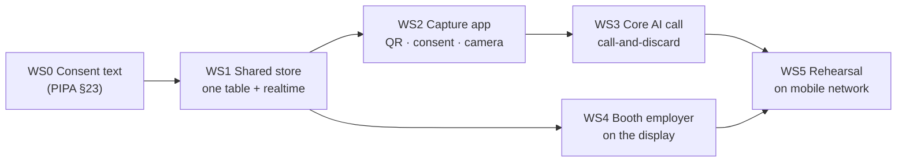

# employer-dashboard-poc: Aggregate oral-health dashboard — booth demo with live capture

> **Canonical values live in `contracts/proposal-package-v11.yml`.** Screen names, KPI labels, constants,
> colors, terminology and start gates are defined there and shared with the report, the proposal decks and
> the engineering design doc. Change that file first, run `scripts/check-package-consistency.py`, then change
> this one. The shipped code is `index.html` **at the repo root** — not inside this folder.
>
> `report §N` references below point at the **v2 report in the external Obsidian vault** (`20_Business/25_iclo/01_strategy/`,
> 2026-07-30), not the v10 package in this repo. They do not resolve here.

> **Status**: v0.5 · 2026-08-09 — **rewritten against the actual event.** v0.4 assumed a US stay (2026-09-06 → 10-24)
> with US benefits consultants as the audience and a 9/5 freeze. That is not what is happening first.
> The next live use is **Snowflake World Tour Seoul, COEX, 2026-08-27**. Audience, language, jurisdiction,
> deadline and scope all move. v0.4's US channel plan is not cancelled — it is downstream of this event.
> **Product Type**: SW (web) · **Stage**: PoC — booth demo, synthetic base + live real oral signal
> **Owner**: Jangwoo Kim (CFO) — single decision-maker
> **Audience**: Internal + AI coding agents (Codex = primary implementer · Claude Code = review/QA)

> **⚠️ This spec needs validation — see §5.2.** Zero problem-validation interviews with paying customers exist.
> Never present demo output as performance evidence. This now matters more, not less: from 8/27 the screen
> carries **real oral signals from real people**, and a real number is easier to mistake for a real result.

---

## 1. Why — one booth day, 3,000 attendees, and the routing decision we actually need

**1.1 Action title.** **Snowflake World Tour Seoul (2026-08-27, COEX) puts ICLO in front of Snowflake Korea and 3,000+ Korean data leaders for one day. The demo's job is to make the governed-evidence story physically undeniable so Snowflake routes us to US HLS GTM — and to capture leads, since the organizer provides no lead scanning.**

**1.2 Situation.** ICLO is one of **7 startups** in Startup Village. Provided: one counter, two chairs, one wall-mounted display, a power strip, **one wired internet line**. Event runs 08:00–17:00; keynote from 10:00; the mini-session slots are at lunch (12:00–12:25 / 12:30–12:50, fireside format, 3–4 companies per panel, **live-relayed to every session hall**). 2025 drew 3,000+ attendees from 600+ accounts, mostly Technology → Manufacturing → Retail, mostly Manager level with a rising Director+ share. Roughly 80% are existing Snowflake customers.

**Almost none of those 3,000 will use our demo, and the plan does not assume otherwise.** Startup Village is one zone among many, we are one of seven booths in it, and putting a camera in your own mouth in a public expo hall is a high-friction ask. Plan for tens of captures, not hundreds. Every number in §4c is sized to that, and §5.8 covers what breaks when the population is small.

These are not our buyers. US self-funded employers and benefits consultants are, and none of them are at COEX. So the booth is not a sales motion — it is a **credibility and routing motion**, aimed at three groups actually in the room: Snowflake Korea (who can route us to US HLS GTM — the Step 0 ask in the joint-validation package), Korean enterprises and VCs (the organizer offers matched meetings), and the live-relayed session audience.

**1.3 Complication.** A static synthetic dashboard is indistinguishable from every other booth screen at a data conference. Everyone has charts. What nobody else has is a screen where **the privacy boundary can be tested by the person standing in front of it**. And the organizer explicitly provides no lead-scanning system, so any lead capture has to be ours.

The current demo cannot do either. It is frontend-only with hardcoded ratio constants — no backend, no way for a visitor to put anything into it.

**1.4 Question → Answer.** Q: What must the booth do on 8/27 that a slide deck cannot? A: **let a visitor put their own real oral capture into the evidence layer and then fail to find themselves in it.**

| # | Reason | So-what |
|---|---|---|
| 1 | The suppression rule stops being a claim and becomes an experience — the visitor's own row is provably in there and provably unretrievable | This is the single strongest possible answer to "how do you handle privacy", and it takes 30 seconds instead of 3 slides |
| 1b | The screen pointedly does *not* react to your capture, and we say why | Refusing an obvious demo flourish because it would leak the visitor is more convincing than any chart |
| 2 | It demonstrates the full loop live — capture → inference → governed store → aggregate — which is exactly the Snowflake-platform story, independent of the dental vertical | Gives Snowflake Korea something concrete to route on |
| 3 | The QR flow is the lead capture the organizer does not provide | Turns booth traffic into a contactable list |
| 4 | Real signal + synthetic benefit context, labeled per field | Shows we know which parts we can actually evidence — the same discipline the joint-validation package is built on |

---

## 2. What — Concept and boundaries

**2.1 Concept.** Two surfaces sharing one store.

- **Booth display** (wall-mounted, wired line): the existing aggregate dashboard. Three synthetic employers (A/B/C) plus a fourth, **the live booth employer**. Its participation counter moves the instant a capture lands; everything carrying a band re-renders in batches of five (§5.8).
- **Capture app** (visitor's own phone, opened from a printed QR at the booth): consent → **badge QR scan (enrolment)** → oral capture → Core AI inference → **the visitor sees their own band on their own phone, and only there**.

The badge scan is the enrolment step — the booth analogue of an eligibility file. It is **hashed on read and the plaintext is discarded**, exactly as the engineering design §4 treats SSN: HMAC only, never a key. The hash prevents the same person being counted twice; it cannot be reversed to a name. Contact details are a **separate, later, optional step** (§5.9).

Each capture writes exactly one row: band, timestamp, model version, and synthesized benefit context. **The image is never stored.** UI language stays English on the booth display (it is the US product); the capture app and its consent text are Korean.

**2.2 Positioning.** Unchanged — this still drives §5.3.

```mermaid
quadrantChart
    title Employer-facing oral/health dashboard positioning
    x-axis Engagement metrics only --> Claims-linked economics
    y-axis Individual-level exposure --> Aggregate-only
    quadrant-1 Where ICLO must win
    quadrant-2 Privacy-safe but shallow
    quadrant-3 Risky and shallow
    quadrant-4 Deep but privacy-exposed
    HomeDen KR app (not for US): [0.25, 0.2]
    Generic wellness dashboards: [0.3, 0.75]
    Carrier annual reports (static): [0.7, 0.8]
    Springbuk (medical-wide): [0.85, 0.85]
    ICLO PoC (dental vertical): [0.8, 0.95]
```

Springbuk and carrier reports already occupy the same quadrant — differentiation is not quadrant position but **dental vertical + signal→action→claims loop + suppression that visibly works** (§5.3).

**2.3 In-scope / Out-of-scope.** Out is the first line of defense against agent scope creep. Each Out has a reason.

| In (build) | Out (do not build — reason) |
|---|---|
| 3 views: Program overview (KPI band) · Oral-health signal distribution (Low/Moderate/**Priority**) · Intervention funnel | Login / roles / user accounts — the capture app is anonymous by design; accounts would create exactly the identifiability we are demonstrating against |
| **Live booth employer** — a 4th scenario, pre-seeded with synthetic members, into which real captures land | Storing the oral image — never. Inference is call-and-discard (§5.7) |
| **Capture app** — QR entry, Korean consent gate, badge scan (hash-only), camera capture, Core AI call, own-band-only result screen | Showing any individual on the booth display — including the visitor's own row, including "the last capture" |
| **Badge hash** — HMAC of the badge QR payload, stored instead of it, for duplicate detection | Storing badge plaintext, or any field decoded from it (name, company, title, email, phone), anywhere — memory only, discarded after hashing |
| **Contact capture** — a separate optional step after the result, into a separate table, **date-only timestamp** | Any join path between a contact and a capture — separate tables is not enough, second-precision timestamps join them by themselves |
| A three-level band: LOW / MODERATE / PRIORITY | **A numeric score.** More re-identifying (72 is near-unique, LOW is not) and closer to the medical-device line |
| **Shared store** — one Supabase table + realtime subscription to the booth display | A general backend — one table, one insert path, one subscription. Nothing else |
| **Live participation counter** — "captures today: N" increments the moment a capture lands | — |
| **Batched distribution** — every figure that carries a band re-renders only once ≥5 new captures have landed (§5.8) | Live refresh of the signal distribution — it leaks the capturer's band to anyone watching. Not a tuning parameter |
| Denominator discipline: funnel uses eligible employees; PMPM uses covered member-months (×2.2) — each chart labels its denominator | Real claims/eligibility integration — data rights not secured (report §11) |
| Suppression: any cell with `n < 20` shows "Suppressed (n<20)" instead of values — **applies to the booth employer identically** | Relaxing suppression so the booth employer "shows something" — this would destroy the only reason the feature exists |
| Per-field provenance chips: signal = real capture, everything else = synthetic | — |
| **Offline fallback**: if the network drops, A/B/C keep working and the booth employer degrades to a clear "live feed unavailable" state | Any design where a network failure blanks the booth screen |
| — | **Preventive-visit Trend vs Control — still deferred.** Needs a control arm; experiment assignment has no consent basis, allocation rule or protocol owner. Returns after legal/protocol sign-off |
| — | Any disease-specific wording — FDA 2026 red line, and now also a PIPA 민감정보 exposure |

**2.5 What survives the US pivot.** The Seoul booth is a one-day instrument. When the US work starts, the product pivots to US conditions — different law, different language, different enrolment, and no strangers capturing at a booth. Build accordingly: **invest in the left column, keep the right column cheap and deletable.**

| Survives — this is the product | Seoul-only — disposable after 8/27 |
|---|---|
| The aggregate dashboard and scenarios A/B/C | The live booth employer as a 4th scenario |
| The Overview tab, once its numbers are real | Its booth-only name, **"U.S. GTM sample"** — on the booth employer that tab holds no capture data, so it is named as the sample it is. It reverts to "Overview" after the pivot |
| `n < 20` suppression and per-field provenance | The batch-of-5 refresh guard — a booth-scale patch for differencing, not the production answer (engineering design §16 item 5 owns that) |
| Band, never a score | The Korean consent text and its PIPA §23 framing — the US version answers to HIPAA and state law instead |
| The Core AI call contract (engineering design §8.2) | Badge-QR enrolment — US employers enrol from an eligibility file, not a conference lanyard |
| The demo beat: capture, then fail to find yourself | The QR-as-lead-capture workaround — a US booth or meeting has other options |
| Hash-on-read, discard-plaintext as a habit | `capture.html` as a whole, most likely |

Two consequences for how this gets built. Keep the booth code **additive and removable** — the booth employer is a fourth scenario the dashboard can lose without a rewrite, and the capture app is a separate file. And do not polish the disposable column: it has to work on 8/27, not survive review in 2027.

**2.4 Core hypotheses.**

| # | Hypothesis | Verification |
|---|---|---|
| H1 | A visitor who captures and then cannot find themselves stops asking privacy questions | Booth log: privacy question raised → resolved on-screen (Y/N), per conversation |
| H2 | ~~J-curve guardrail~~ — **untestable**; the Trend view it depends on is deferred | n/a until the Trend view ships |
| H3 | The live loop gives Snowflake Korea something concrete enough to act on | ≥ 1 written follow-up toward US HLS GTM routing within 10 business days of 8/27 |
| H4 | The QR flow works as lead capture without a scanning system | Count of completed captures; count of opted-in contacts |

---

## 3. How — Execution model

**3.1 Agent workflow and roles.** Unchanged.

| Role | Actor | Tools |
|---|---|---|
| Design interrogation & planning | Claude Code | gstack `/office-hours` → `/plan-ceo-review` → `/plan-eng-review` |
| Implementation | Codex | ponytail ruleset always-on |
| Review, QA, ship gate | Claude Code | gstack `/review` `/qa` `/ship` + `ponytail-review` |
| Reverse review | Codex | reviews any Claude-Code-authored change |
| Final approval & merge | Jangwoo Kim | GitHub (human merges; agents never self-merge) |

Cross-check rule: **the authoring agent never approves its own PR.**

**3.2 Roadmap — 18 days.** Organizer deadlines are hard and externally owned; ours are set to land before them.

| Date | Owner | Item |
|---|---|---|
| **8/10 (Mon)** | J. Kim | **Booth back-wall content to Snowflake** — 850×300mm, .ai file or ≤30 Korean characters of slogan text |
| 8/12 | Claude Code | Consent text drafted (PIPA §23 separate consent for 민감정보) and reviewed — **blocks all capture work** |
| **8/14 (Fri)** | J. Kim | Mini-session speaker info + content + **DocuSign consent form**; booth staff list (≤6, all registered on the SWT site) |
| 8/17 | Codex | Shared store + insert path + realtime subscription working end to end with a stubbed inference call |
| 8/19 | Codex | Core AI wired in (real endpoint); capture app complete; booth employer live on the display |
| **8/21 (Fri)** | J. Kim | Company promo video (≤2 min) to Snowflake |
| 8/22 | Claude Code | `/qa` + `/review` + kill-ai-slop + consistency check all green; **on-venue-conditions rehearsal** (mobile network, not office wifi) |
| **8/25 (Mon)** | — | **Freeze.** Tag the repo. Patches after this only for a demo-breaking defect |
| **8/26 (Tue)** | J. Kim | Booth setup + operating rehearsal at COEX |
| **8/27 (Thu)** | — | Event, 08:00–17:00. Keynote from 10:00. Mini-session 12:00–12:25 or 12:30–12:50, live-relayed |

Booth events must be shared with the organizer in advance and must not disturb neighbouring booths (operation guide). The QR capture activity counts as a booth event — **tell Snowflake before 8/14**, in the same mail as the staff list.

**3.3 Task decomposition principle.** Tasks must be implementable and verifiable in isolation. Workstream dependencies:



WS0 gates everything. Capturing before the consent text is settled is not a schedule risk, it is a legal one.

**3.4 Stack.**

| Layer | Choice | Note |
|---|---|---|
| Booth display | **Single vanilla HTML file** (`index.html` at repo root), inline CSS + JS | Vite/React/TS was the original plan and was not adopted. No `package.json`, `src/` or `dist/` exists |
| Capture app | Second single HTML file, `capture.html` | Same discipline. `getUserMedia` for the camera; no native app, no store review |
| Shared store | **Supabase, Seoul region (ap-northeast-2)** — one table, anon-key insert under a row-level-security policy that permits insert only, plus a realtime subscription for the display | Already an available dependency with zero prior use in this repo. Realtime removes polling. One table only. **The region is not a preference**: an overseas region makes this a cross-border transfer under PIPA §28-8, which needs its own disclosure and its own separate consent — one more screen and more drop-off. Seoul avoids the clause entirely |
| Inference | ICLO Core AI, `POST /v1/oral-signal` per engineering design §8.2 | Response must carry `model_version`; without it past signal distributions cannot be reproduced |
| Style | Inline CSS custom properties (Coral `#C2333A` · Navy `#1B2A4A` · Teal `#007A87`, white bg) | Coral changed from `#FF7A79` on 2026-08-08: 2.53:1 on white failed WCAG AA. `#C2333A` is 5.49:1. Dark mode `#FF8E8D` |
| Charts | Hand-drawn CSS/SVG bars | no chart library (ponytail) |
| State | Plain JS module-scope variables + a realtime subscription | `?scenario=A` URL state is still not implemented; drop it from the spec if 8/27 passes without needing it |

**3.5 Architecture & data.**

```
visitor phone                    ICLO                     booth display
─────────────                    ────                     ─────────────
QR → capture.html
  consent (PIPA §23)
  camera capture
  POST image ──────────────► Core AI /v1/oral-signal
                              returns band + model_version
  image discarded ◄──────────┘   (never written anywhere)
  INSERT one row ──────────► Supabase booth_capture ──────► realtime ──► index.html
  own band shown                                                    buffered; renders only
  on own phone,                                                     every 5th new capture
  immediately                                                       aggregate only, n<20 suppressed
```

Row shape: `employer_id · captured_at · signal_band · model_version` plus synthesized context (department, tenure band, eligibility span, claim lines). No image, no name, no phone, no email, no device identifier. Contact details, if the visitor opts in for follow-up, go to a **separate** table with no link to the capture row.

The booth employer is pre-seeded with synthetic members so the aggregate is not fully suppressed on the first capture of the day. Seed size and pre-seeded distribution are canonical values — see `contracts/proposal-package-v11.yml`.

Scenarios A/B/C keep their current behaviour exactly: inline constants, no network, 10,000 / 2,500 / 25,000 · 38% activated · 61% repeat · $31.40 PMPM · 52·33·15 signal mix · funnel 3,800 → 2,800 → 950 → 420.

**3.6 Repo.** Subfolder `employer-dashboard-poc/` holds spec and scripts only. Shipped code is at the repo root. Rules: protected `main` · PRs required · conventional commits · cross-review per §3.1 · spec changes only via PR.

**3.7 Deploy.** GitHub Pages. The capture app must be reachable over HTTPS from a phone on a cellular network — Pages satisfies this. The booth display runs from the wired line; the offline bundle remains the fallback if COEX networking fails (see §2.3, offline fallback).

---

## 4. Verification & Success

**Success = (a) the live capture loop runs all day on 8/27 without a privacy incident, and (b) at least one written Snowflake follow-up toward US HLS GTM routing within 10 business days.**

### 4a. Machine-verifiable acceptance

- [ ] All 3 views render for all 4 employers; zero console errors
- [ ] Scenario A/B/C values match §3.5 exactly and still work with the network disabled
- [ ] A capture inserts exactly one row; the row contains no image, no badge plaintext and no field decoded from it
- [ ] Badge plaintext never leaves memory: absent from the row, from logs, from storage and from any network call except the hash input
- [ ] The same badge captured twice is detected by hash; the hash cannot be reversed to any badge field
- [ ] Contact rows carry a date, not a timestamp, and share no key with any capture row
- [ ] The result is a band, never a numeric score
- [ ] The participation counter increments within 3 seconds of a capture
- [ ] No figure carrying a band changes on a single capture; those re-render only after ≥5 new captures
- [ ] Two consecutive renders of the signal distribution never differ by fewer than 5 people
- [ ] The visitor's own phone shows their band and the aggregate they just joined; the booth display shows neither for them individually
- [ ] Any cell with `n < 20` masks values and prints "Suppressed (n<20)" — **including on the booth employer**
- [ ] The visitor's own band renders on the visitor's device and appears in no booth-display DOM at any time
- [ ] Consent gate blocks capture until explicitly accepted; declining leaves no row
- [ ] Inference failure degrades to a clear message; no row is written with a fabricated band
- [ ] `scripts/check-forbidden-terms.sh` exits 0
- [ ] `scripts/check-package-consistency.py` exits 0
- [ ] Provenance label present on every booth-employer figure (real vs synthetic, per field)
- [ ] Capture app works on iOS Safari and Android Chrome over a cellular network
- [ ] kill-ai-slop Mode B scan pass

### 4b. Human verification script

The Owner performs this alone on a phone that is **not** on office wifi; passing all 12 = approval.

1. Open the booth display. Confirm A/B/C behave exactly as before.
2. Turn wifi off on the display machine: A/B/C still work; the booth employer shows "live feed unavailable", not a blank or an error.
3. Restore the network. Scan the printed QR with a phone on cellular.
4. The consent screen is Korean, states that an oral image is processed and not stored, and cannot be skipped.
5. Decline. Confirm no row appears and nothing is sent.
6. Scan your own conference badge. Confirm the app shows enrolment succeeded but displays none of your badge details back to you — if it can show them, it has them.
6b. Capture. Your own band appears on your phone. A band, not a number.
7. Watch the booth display. The capture counter goes up. The signal distribution does **not** move — deliberate (§5.8).
8. Search the entire booth display for yourself. You cannot find yourself. Say so out loud — this is the demo.
9. Filter the booth employer to a small department: values are replaced by "Suppressed (n<20)".
10. Check the provenance chips: the signal is marked real, the benefit context is marked synthetic.
11. Capture from four more phones. The counter moves each time; on the fifth the distribution re-renders. Confirm you still cannot attribute that change to any one of the five.
12. Resize the display to 1366px: no horizontal scroll; legible from two metres.

### 4c. Outcome metrics

| Metric | Baseline | Target | Method | Cadence | Owner |
|---|---|---|---|---|---|
| Freeze met | n/a | 8/25, binary | repo tag | once | J. Kim |
| Completed captures on 8/27 | 0 | ≥ 20 (floor 12) | store count | end of day | J. Kim |
| Opted-in contacts | 0 | ≥ 15 | contact table count | end of day | J. Kim |
| Snowflake follow-up toward US HLS routing | 0 | ≥ 1 written | mail thread | within 10 business days | J. Kim |
| Korean enterprise / VC meetings booked | 0 | ≥ 3 | booth log | end of day | J. Kim |
| Privacy incidents | 0 | **0** | booth log | continuous | J. Kim |

**Cost.** Agent subscriptions (already held), Pages hosting $0, Supabase free tier, Core AI inference at whatever a few hundred calls cost. The booth slot is the real expense and it is already committed.

### 4d. Anti-goals (achieving these = failure)

- Any individual result appears on the booth display, in any form, at any moment
- An oral image is persisted anywhere — server, log, browser cache, screenshot
- A capture happens before consent, or after a decline
- A fabricated band is written when inference fails
- Any disease-specific wording appears on screen, in code, or in a screenshot
- Booth aggregate numbers get presented as customer performance evidence
- A badge field is written anywhere, or a capture row can be traced to a named person
- A numeric score is shown or stored in place of a band
- The booth display changes in a way an onlooker can tie to the person who just captured
- The network fails and the booth screen goes blank
- Chasing polish past the 8/25 freeze

---

## 5. Risk & Guardrails

**5.1 Pressure test.** Direct evidence that a customer pays for this dashboard: **none**. The booth does not change that — it tests whether the governed-evidence story is legible to a technical audience, which is a different and lower bar. Verdict: **⚠️ Weak**, deliberately.

**5.2 Problem validation.** Interviews with US benefits consultants or employers: **0**. Verdict: **🚨 Blocking** for any production decision. The Seoul booth cannot close this gap — its audience is not the buyer. It can only produce the routing that leads to the buyer.

**5.3 Competition.** In-room comparison is now every other booth at a data conference, not Springbuk. The differentiator is the same but the framing changes: **we are the only booth where the visitor can test the privacy claim themselves.** Risk: if the capture loop fails live, that inverts into the strongest possible negative demonstration. Mitigation: §2.3 offline fallback and §4b step 2. Verdict: **✅ Passed, conditional on rehearsal.**

**5.4 First 10 targets.** For 8/27 specifically: Snowflake Korea HLS/GTM contacts, the mini-session moderator, the organizer-matched enterprise and VC meetings. The US persona list from v0.4 stands but is downstream.

**5.5 Smallest validating build.** Consent gate + one capture + one row + the display moving + suppression holding. Everything else is padding. If 8/22 arrives and the loop is not solid, **ship A/B/C only** — a working static demo beats a broken live one.

**5.6 Agent red lines (violation = auto-reject).**

| Red line | Enforcement |
|---|---|
| Forbidden terms: `diagnos*, cavit*, caries, decay, gingivit*, periodont*, abscess, lesion`; signal label "Review" banned (use "Priority") | `scripts/check-forbidden-terms.sh`; grep must return 0 |
| No individual-level screens; no mock person profiles; **the booth display never renders a single person's result** | PR review; any such PR rejected without discussion |
| **The oral image is never persisted** — not on a server, not in a log, not in localStorage, not in a cache | code review of the capture path + a test asserting no write |
| **No row without consent**; declining writes nothing and sends nothing | unit test on the consent gate |
| **No fabricated band.** Inference failure surfaces as failure | unit test on the error path |
| Cells with `n < 20` never show values, on every employer including the live one | unit test on the suppression function |
| **No band-carrying figure re-renders on a single capture** — minimum batch of 5. The participation counter is exempt: it carries no band | unit test on the refresh gate |
| **Badge plaintext is never stored** — hash on read, discard. No decoded field persisted anywhere | code review of the badge path + a test asserting no write |
| **No join path between a contact and a capture** — separate tables, date-only on contacts | schema review; a test asserting contacts carry no time component |
| **Band, never a numeric score** | unit test on the inference response handler |
| **Store stays in a Korean region** — otherwise PIPA §28-8 cross-border consent applies | project settings review |
| Synthetic scenarios stay labeled "Synthetic data — illustrative only"; the booth employer is labeled per field (real signal, synthetic context) — never labeled wholesale as either | screenshot test |
| No AI-slop visual patterns | kill-ai-slop Mode B gate before `/ship` |
| Brand Coral is `#C2333A`; every light-mode declaration uses the same value | `scripts/check-package-consistency.py` |
| Absolute privacy claims must be scoped (`no individual PHI` → `no individual PHI in employer views`) | `scripts/check-package-consistency.py` |

**5.8 Small numbers.** Tens of captures, not hundreds, changes two things.

*What is safe to show live.* A participation count carries no band, and the fact that someone captured at a booth is already visible to anyone standing there — so the counter updates immediately and gives the visitor the "it landed" feedback the demo needs. Everything that carries a band is batched. Splitting the two costs nothing and recovers most of the immediacy.

*Differencing.* If the distribution updated per capture, an onlooker who saw it before and after would learn the band of the person who just walked away from the capture station. That is an individual disclosure through an aggregate screen — precisely what the product claims not to do, demonstrated live, at a booth whose mini-session is relayed to every session hall. Hence the ≥5 batch. The `n < 20` cell rule does not help here: it bounds who is *in* a cell, not what a *change* in that cell reveals. Engineering design §16 item 5 already flags this as unresolved at the design level; the batch is the booth-scale answer, not the general one.

*Visible suppression.* The booth employer is pre-seeded so the aggregate is not entirely blank at 08:00, but the Priority band will likely sit under 20 for much of the day. That is not a bug to design around — it is the most honest thing on the screen, and the line to say out loud is that **the most sensitive category is the one we cannot show you at this scale**. If enough captures arrive for it to cross 20 during the day, that is a bonus beat, not a promised one. Seed size lives in `contracts/proposal-package-v11.yml`.

**5.9 The badge step is where this gets serious.** The oral capture on its own is close to anonymous: a band and a time are not personal data. The badge QR at a conference typically carries name, company, title, email and phone. Joining the two in one flow produces **a health record attached to a named person** — the heaviest combination PIPA recognises, and it survives the decision not to store the image. A row reading `홍길동 = PRIORITY` is roughly as bad as keeping the photograph.

Confining the activity to our own booth does not change this. PIPA does not care whether processing happens at a booth or on a stage. What the booth confinement does help with is the mini-session relay: the capture activity is not on the relayed feed. Differencing is *worse* at a booth, not better — the display sits a metre from the capture station with onlookers around it, so the §5.8 batch rule stands unchanged.

The design answer is that the badge is used and not kept: hash on read, discard the plaintext, store the hash. This is not a workaround, it is the same rule the production design already applies to SSN (engineering design §4).

> **Open, and it blocks D3.** We do not know what an SWT badge QR actually contains. If it is a vCard or a URL, our app can read the attendee's details directly and the hashing above is mandatory. If it is an opaque ID that only the organiser's lead-retrieval system can resolve, we receive a meaningless string, the identity-linking problem does not arise, and contact details must be collected explicitly anyway. **Ask Snowflake (정은우 매니저) — fold it into the 8/14 mail that already has to disclose the booth activity.** Finding out at the 8/26 rehearsal is too late: that is the day after freeze.

**5.7 Personal-data handling (PIPA).** This replaces v0.4's US-jurisdiction framing. The event is in Korea and the visitors are Korean.

An oral image is **민감정보 (건강정보)** under PIPA §23, which requires consent obtained **separately** from any other consent — not bundled into a general agreement. The mitigations, in order of how much they remove:

1. **Do not store the image.** Call inference, take the band, discard. This removes the retention, destruction-schedule and breach-notification surface almost entirely and matches the engineering design §2.1 boundary (binaries never enter the warehouse).
2. **Collect nothing identifying with the capture.** No name, no phone, no email, no device id on the capture row. A band and a timestamp are not personal data on their own.
3. **Separate the contact list.** If a visitor opts in to follow-up, that contact goes to a different table with no key back to their capture.
4. **Consent text in Korean**, stating plainly: what is captured, that it is sent for analysis, that it is not stored, what is kept (a band), and that they may decline with no consequence.

Item 1 is doing most of the work here. Do not trade it away for training data without a legal review first — that is a different consent, a different retention obligation, and a different conversation.

Stage gate: this PoC previously had no PII and so was exempt from a security audit. **It no longer is.** The capture path handles 민감정보, so a security review of that path is a release condition before 8/25.

---

## 📋 Handoff Brief (for AI coding agents — self-contained)

### Background
ICLO is a smartphone oral-imaging AI company entering the US self-funded-employer market. This repo builds the **employer-facing aggregate dashboard**, shown at **Snowflake World Tour Seoul, COEX, 2026-08-27**. From this version it also captures **real oral signals from real booth visitors**. The screen rules are **regulatory requirements, not stylistic taste** (FDA 2026 wellness boundary · HIPAA aggregate principle · PIPA §23 민감정보) — do not modify them on your own judgment.

### Constraints
- **Time**: today → freeze **8/25** → rehearsal 8/26 → event 8/27 (KST). Organizer deadlines 8/10, 8/14, 8/21 are external and immovable
- **Tech**: stack per §3.4 (vanilla HTML, Supabase, no framework); any new dependency needs a stated reason in the PR (ponytail)
- **Red lines**: §5.6 — violation = auto-reject
- **Personal data**: §5.7 — the image is never stored; WS0 (consent text) gates all capture work
- **Brand**: Coral `#C2333A` · Navy `#1B2A4A` · Teal `#007A87` · white background

### Deliverables
| # | Deliverable | Form | Due | Owner |
|---|---|---|---|---|
| D0 | **Confirm what the SWT badge QR contains** (§5.9) — blocks D3 | `docs/snowflake-mail-0814.md` — **drafted 8/9, needs names + send** | **8/14** | J. Kim |
| D1 | Korean consent text, legally reviewed — must cover the badge scan as well as the oral capture | `docs/consent-ko.md` — **drafted 8/9, awaiting legal review** | 8/12 | Claude Code → J. Kim |
| D2 | Supabase table + RLS insert-only policy + realtime subscription | migration | 8/17 | Codex |
| D3 | Capture app (QR entry · consent · **badge scan, hash-only** · camera · own-band screen) | `capture.html` | 8/19 | Codex |
| D3b | Contact capture — separate step, separate table, date-only | in D3 | 8/19 | Codex |
| D4 | Core AI integration, call-and-discard | in D3 | 8/19 | Codex |
| D5 | Booth employer on the display, live, with per-field provenance | `index.html` | 8/19 | Codex |
| D6 | Printed QR + a one-page booth operating script for staff | pdf | 8/22 | Claude Code |
| D7 | Rehearsal on a cellular network, all of §4b | — | 8/22 | J. Kim |

### Acceptance Criteria
→ §4a, every checkbox. **§4b step 8 is the demo** — everything else exists to make that moment real.

### Communication & Decision
- **Decision-maker**: Jangwoo Kim (single)
- **Channel**: GitHub Issues/PR (ambiguity → `question` label; guessing prohibited)
- **Workflow**: Codex PR → Claude Code `/review` + `/qa` → fixes → human merge. Claude-Code-authored changes get Codex reverse review
- **Escalation**: `blocked` label + decision-maker mention
- **Spec canon**: this document = `/docs/PRD.md`; values = `contracts/proposal-package-v11.yml`; changes via PR only

---

### Tool references
- gstack — https://github.com/garrytan/gstack
- ponytail — https://github.com/DietrichGebert/ponytail
- Event guide — `[스타트업 프로그램 코호트사용] 260827 Snowflake World Tour - Seoul - Startup Village Guide Deck.pdf` (Snowflake Korea, 25pp)
- Source documents — v2 report & 3-pager (vault `20_Business/25_iclo/01_strategy/`, 2026-07-30)
