# ICLO x Snowflake Briefing Meeting Pack

External briefing addendum companion

**Document use:** Internal preparation and speaker notes  
**Meeting audience:** Snowflake Healthcare & Life Sciences GTM, Industry Architecture, Solution Engineering, Startup / Partner / ISV  
**Prepared:** 2026-08-05

This companion separates four evidence states throughout the deck:

| State | Meaning |
|---|---|
| CONFIRMED ICLO DIRECTION | A current ICLO business or product decision |
| ICLO PRODUCT DESIGN PRINCIPLE | A product discipline to be encoded in workflow and architecture |
| HYPOTHESIS / TO BE VALIDATED | A claim requiring customer, account or technical evidence |
| REQUEST TO SNOWFLAKE | A question or deliverable Snowflake can reasonably support |

The external deck is designed to secure three outcomes: agreement on the most natural HLS sales play, a technical working session, and an account-by-account path to verify dental eligibility or claim-line workloads. It does not ask Snowflake for legal conclusions, generic customer introductions, or validation of ICLO's dental AI.

# 90-Second Opening Statement

ICLO is building an employee dental-benefit navigation and claims-verified evidence layer.

In the front, we help employees understand eligibility, plan rules and network context; prepare for care; and request provider search or appointment support. Oral-image capture is optional, and early model outputs remain in shadow mode. They do not automatically determine urgency, provider choice or treatment pathways.

In the back, we connect that employee journey to eligibility and dental claims so an employer can see aggregate, claims-confirmed evidence - not individual health information. We separate allowed, plan-paid and employee out-of-pocket amounts, and we are deliberately not promising year-one savings. Utilization and plan-paid claims may rise before any longer-term treatment-mix change becomes measurable.

We believe Snowflake could be the governed evidence and collaboration plane behind this workflow: structured eligibility, plan context, app events and claims in Snowflake; raw oral images in separate controlled U.S. storage; and aggregate employer views governed by purpose and role.

Today we are asking for three things: agreement on the most natural HLS sales play, a sponsored technical working session, and an account-by-account path to determine whether a payer or TPA actually holds dental eligibility or claim-line data in Snowflake. We are not asking for generic customer introductions. We want to learn what ICLO must prove before an account team or partner program would support us.

# 45-Minute Meeting Agenda

| Time | Topic | Intended outcome |
|---|---|---|
| 0-5 min | Opening and desired decisions | Confirm the three meeting outcomes and participant roles. |
| 5-12 min | Business fit | Place ICLO in the most natural HLS sales play; test application vs evidence-layer framing. |
| 12-20 min | Account ecosystem | Separate employer, carrier-ASO and TPA roles; define account evidence before introductions. |
| 20-32 min | Architecture | Review ingestion, image boundary, canonical model, aggregate output and platform prerequisites. |
| 32-40 min | Partnership path | Compare startup, partner, Powered by Snowflake and potential Native App routes. |
| 40-45 min | Next actions | Assign named owners and due dates; confirm workshop and one account-team validation candidate. |

# Action Register

| Action | Snowflake owner | ICLO owner | Due date | Required output |
|---|---|---|---|---|
| Confirm HLS sales play and named internal stakeholders | HLS GTM specialist | Jangwoo Kim / Strategy | D+2 business days | Written sales-play recommendation and stakeholder map |
| Schedule technical architecture working session | Named HLS architect + solution engineer | ICLO Product / Data lead | D+5 business days | Calendar invite, attendee list and input checklist |
| Confirm U.S. account, region, Business Critical, BAA and credit/support path | SE + security/compliance + startup lead | ICLO Operations / Security | D+10 business days | Written decision path, dependencies and support scope |
| Run 2.5K / 10K / 25K employee workload sizing | Solution engineer | ICLO Data lead | D+15 business days | Assumptions, architecture, credit range and post-credit unit economics |
| Build named-account matrix v1 | HLS GTM + relevant account owners | ICLO GTM lead | D+20 business days | Account-level data/workload evidence and readiness status |
| Select one payer or TPA account-team validation | HLS GTM specialist | Jangwoo Kim / Strategy | D+30 business days | Technical/use-case validation readout; no introduction commitment required |
| Provide partner-path and co-sell readiness criteria | Startup / Partner / ISV lead | ICLO Strategy + Product | D+30 business days | Checklist for startup, SPN, Powered by Snowflake and Native App options |

# Slide 1 - Building the Evidence Layer for Employer Dental Benefits

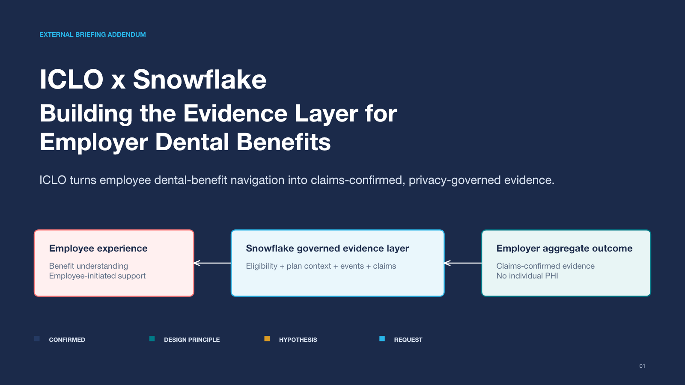{width=full}

**한국어 speaker note**

ICLO를 '치아 사진 AI'로 소개하지 않는다. 앞단은 직원의 치과복지 이해와 이용을 돕는 경험이고, 뒷단은 그 여정을 eligibility와 claims로 확인하는 evidence layer라는 점을 먼저 고정한다. 이번 미팅의 목적은 제품 판매가 아니라 Snowflake 내 sales play, 기술 검증 세션, account-level 검증 경로를 합의하는 것이다.

**권장 설명:** Employee Experience -> Governed Evidence Layer -> Employer Aggregate Outcome의 세 단계를 20초 내에 설명한다.

**Source material:** ICLO U.S. employer oral-health report v2; ICLO Snowflake Korea 3-pager v2; Employer Dashboard demo.

# Slide 2 - The Employee Problem Is Not Coverage Alone

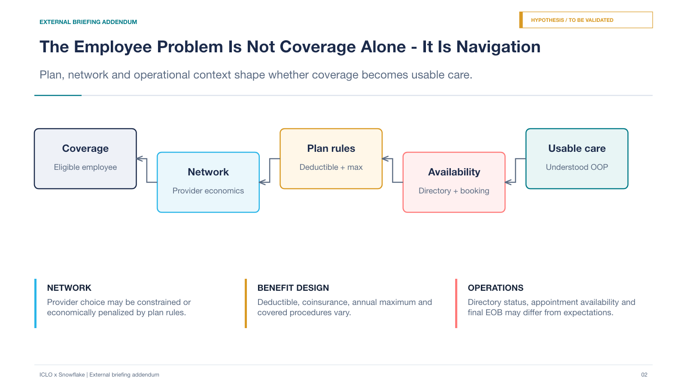{width=full}

**한국어 speaker note**

보험이 있어도 모든 직원에게 동일한 이용경험이 생기는 것은 아니라는 문제를 설명한다. 다만 '계약 치과만 갈 수 있다'처럼 절대화하지 않는다. Provider choice는 network와 plan rule에 따라 제한되거나 경제적으로 불리해질 수 있고, directory와 실제 예약 가능성 및 예상 OOP와 EOB 결과가 다를 수 있다. friction의 크기와 구매 우선순위는 고객 데이터와 인터뷰로 검증해야 하므로 hypothesis로 명시한다.

**권장 diagram:** Coverage -> Network -> Plan rules -> Availability -> Usable care의 employee decision maze.

# Slide 3 - Plan Context to Employee-Initiated Action

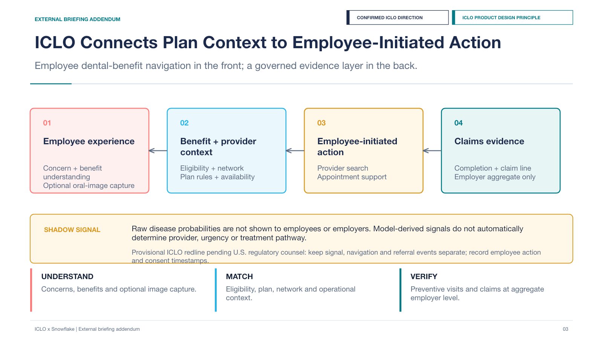{width=full}

**한국어 speaker note**

Employee Experience, Benefit and Provider Context, Action, Claims Evidence의 네 단계를 보여준다. 초기 이미지 모델 출력은 shadow mode에 두고 직원 행동, urgency, provider 또는 treatment pathway를 자동 결정하지 않는다. employee-initiated 또는 human-assisted navigation은 현재 ICLO의 잠정 product redline이며 미국 규제 자문을 거쳐 확정할 사안이다.

**Architecture cue:** signal, navigation, referral event를 분리하고 user action, consent timestamp, model version lineage를 기록한다.

# Slide 4 - J-Curve, Not a Year-One Savings Promise

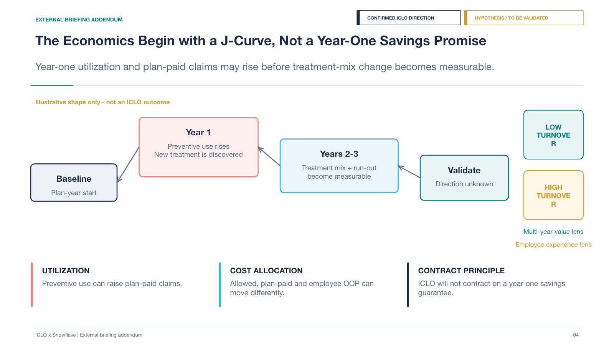{width=full}

**한국어 speaker note**

초기 preventive utilization과 발견 치료가 비용을 올릴 수 있음을 먼저 인정한다. 이후 mix 변화는 가설이며 고객 데이터로 검증해야 한다. Allowed, plan-paid, employee OOP를 분리하고 저이직 기업은 장기 회수 가능성, 고이직 기업은 employee experience와 retention 논리를 별도로 검토한다. 숫자를 실제 ICLO outcome처럼 제시하지 않는다.

**Required sentence:** “Year-one utilization and plan-paid claims may rise before any longer-term change in treatment mix becomes measurable. ICLO will not contract on a year-one savings guarantee.”

# Slide 5 - Snowflake as the Governed Evidence Plane

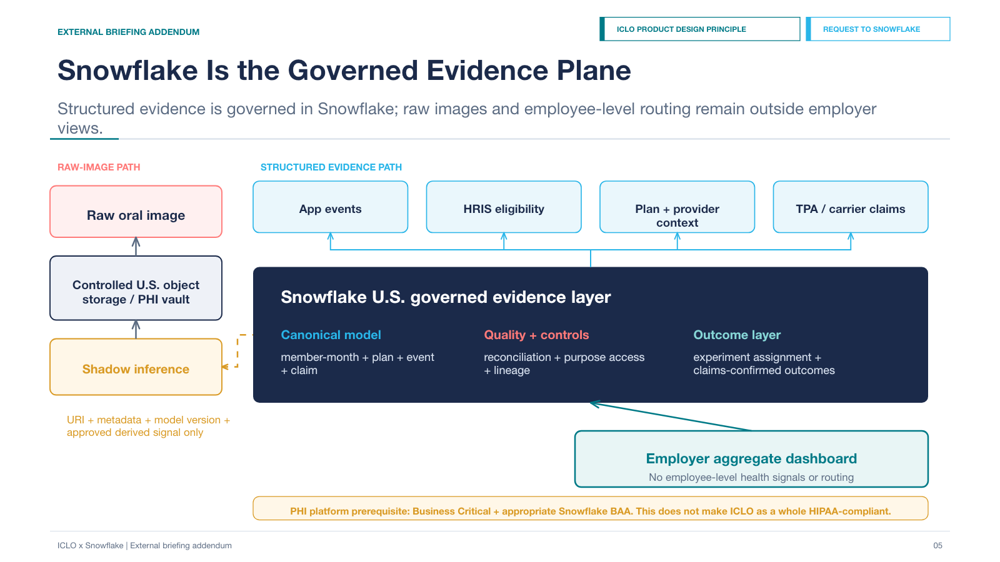{width=full}

**한국어 speaker note**

Snowflake는 database hosting이 아니라 canonical model, data-quality reconciliation, purpose-based access, lineage, outcome calculation과 account collaboration을 담당하는 evidence plane으로 설명한다. Raw oral image는 별도 controlled U.S. object storage 또는 PHI vault에 두고 Snowflake에는 URI, metadata, model version과 승인된 derived signal만 적재하는 경계를 제안한다. Business Critical과 적절한 BAA는 PHI 처리 시 플랫폼 전제이지 ICLO 전체 HIPAA 준수의 완성 조건이 아니다.

**Snowflake scope:** governed storage and compute, canonical data, reconciliation, consent-purpose metadata, experiment assignment, aggregate views, sharing/staging patterns, sizing and unit economics.

**Outside Snowflake scope:** FDA or intended-use determination, consent sufficiency, employer/TPA data rights, raw-image security end to end, model validation, licensure/referral analysis, ICLO-wide incident response, first-year savings validation.

# Slide 6 - Dashboard Proof of Privacy and Data Quality

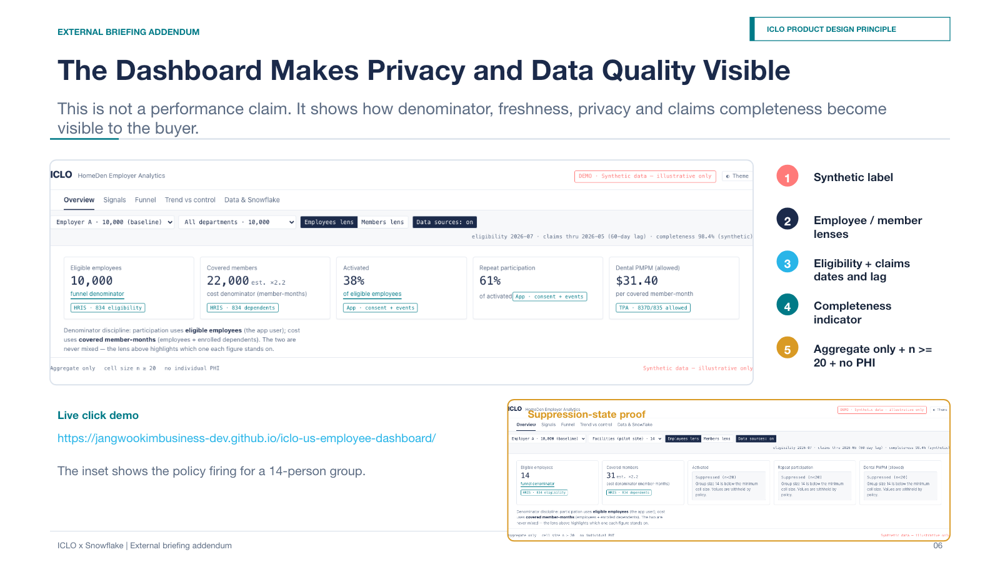{width=full}

**한국어 speaker note**

화면의 수치는 ICLO 성과가 아니라 buyer가 metric 정의와 data quality를 검증하는 방식의 데모다. 직원 기준 참여 분모와 covered member-month 기준 비용 분모를 분리하고, 기준일, claims lag, completeness, suppression을 동시에 노출한다. employer는 개인 PHI나 개인별 routing 정보를 보지 않는다.

**Visible controls:** Synthetic data — illustrative only; Employees / Members lens; eligibility and claims dates; claims lag; completeness; aggregate only; n ≥ 20 suppression; no individual PHI.

**Live demo:** [Open the ICLO Employer Dashboard](https://jangwookimbusiness-dev.github.io/iclo-us-employee-dashboard/)

# Slide 7 - Account-Specific Opportunity

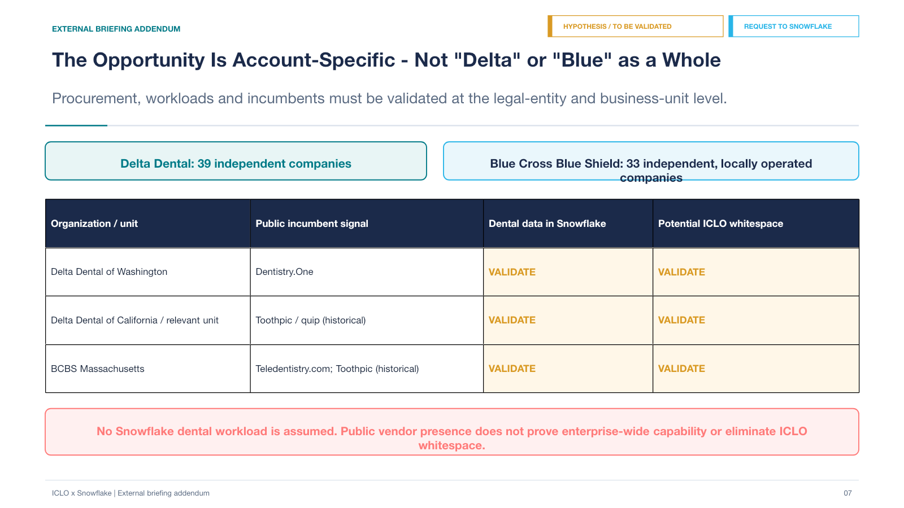{width=full}

**한국어 speaker note**

Delta Dental은 39개 독립 회사, Blue는 33개 독립·지역 운영 회사 구조다. association 또는 parent 관계만으로 실제 procurement, dental workload, region, vendor 관계를 추정하지 않는다. 공개된 incumbent 사례는 account-specific signal일 뿐이며, 기능 범위와 ICLO whitespace는 diligence question으로 남긴다.

**Do not claim:** 모든 Delta 또는 Blue가 동일 vendor를 쓴다; incumbent가 claims analytics를 제공하지 않는다; ICLO가 쉽게 대체할 수 있다; Snowflake에 dental workload가 이미 있다.

**Public account examples:** Dentistry.One at Delta Dental of Washington; Toothpic / quip historically in part of the Delta ecosystem; Teledentistry.com and a historical Toothpic relationship at BCBS Massachusetts.

# Slide 8 - What ICLO Needs from Snowflake GTM

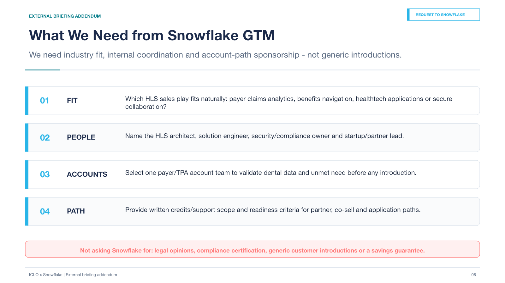{width=full}

**한국어 speaker note**

GTM specialist에게 구현을 맡기는 것이 아니라 industry fit, 내부 조정과 account-path sponsorship을 요청한다. 특히 '고객 소개'를 먼저 요구하지 않는다. 한 payer/TPA account team이 dental eligibility 또는 claim-line data의 실재, architecture 적합성과 unmet need를 확인하는 순서를 요청한다.

**Four asks:** sales-play fit; named internal stakeholders; one account-team validation; written credits/support and partner/co-sell readiness criteria.

# Slide 9 - 90-Day Joint Validation Plan

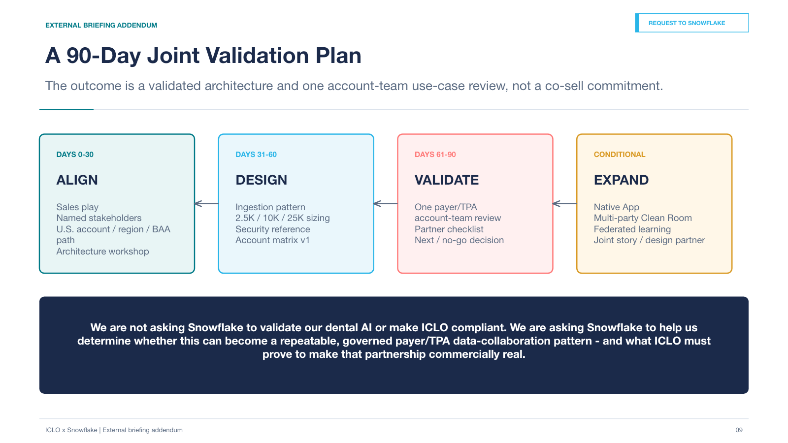{width=full}

**한국어 speaker note**

90일 후 남아야 하는 것은 소개 약속이 아니라 reference architecture, sizing, account matrix, one-account validation과 partner criteria다. Native App, Clean Room, federated learning과 공동 발표는 핵심 ingestion 및 governance 패턴과 고객 증거가 확인된 뒤에만 검토한다.

**Closing sentence:** “We are not asking Snowflake to validate our dental AI or make ICLO compliant. We are asking Snowflake to help us determine whether this can become a repeatable, governed payer/TPA data-collaboration pattern - and what ICLO must prove to make that partnership commercially real.”

# Appendix A - Data and Responsibility Matrix

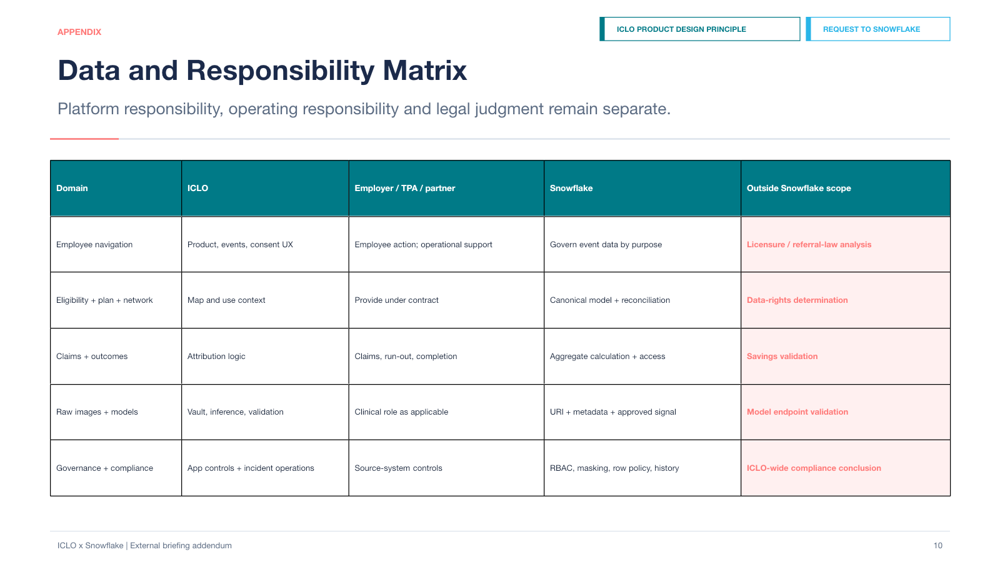{width=full}

**한국어 speaker note**

ICLO, employer/TPA/clinical partner, Snowflake, 외부 법률 및 규제 자문의 책임을 분리한다. Snowflake에 FDA status, consent sufficiency, data rights 또는 ICLO incident response 전체를 요구하지 않는다. Employer는 aggregate output을 소비하며 employee-level health signals나 routing 정보에 접근하지 않는다.

# Appendix B - Detailed Snowflake Technical Questions

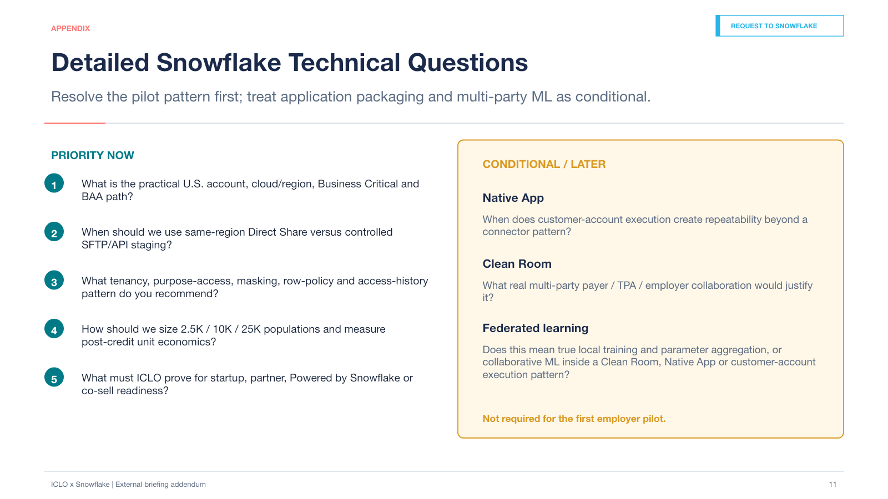{width=full}

**한국어 speaker note**

현재 pilot의 우선순위는 ingestion, canonical data, aggregate views와 반복 가능한 TPA integration이다. Clean Room은 단일 employer/TPA pilot의 기본 구조가 아니며, federated learning도 복수 기관의 이미지 데이터 파트너가 생긴 뒤 검토할 future option이다.

**Exact federated-learning question:** “When Snowflake refers to federated learning for this use case, does it mean true local model training and parameter aggregation across institutions, or collaborative ML inside a Snowflake-controlled environment such as a Clean Room, Native App or customer-account execution pattern?”

**Follow-ups:** Which component is supported today? What must ICLO build? Is it relevant before multiple institutional image-data partners? How would model governance and change control work?

# Appendix C - Employer J-Curve Simulation

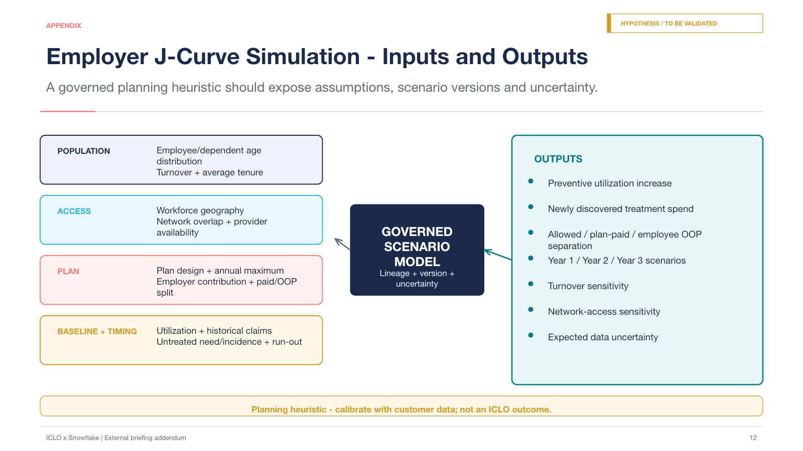{width=full}

**한국어 speaker note**

시뮬레이션은 고객별 planning heuristic이다. 초기 내부 가정이나 고정 상승률을 외부 예측으로 쓰지 않는다. Snowflake에서 입력 lineage, scenario version, uncertainty와 claims run-out을 추적하는 분석 use case로 제안한다.

**Inputs:** age distribution, geography, network overlap, provider availability, turnover, tenure, plan design, contribution, baseline utilization, historical claims, paid/OOP allocation, untreated-need assumptions, run-out and plan timing.

**Outputs:** preventive utilization, newly discovered treatment spend, allowed / plan-paid / OOP separation, year 1-3 scenarios, turnover sensitivity, access sensitivity and uncertainty.

# Appendix D - Named-Account Diligence Template

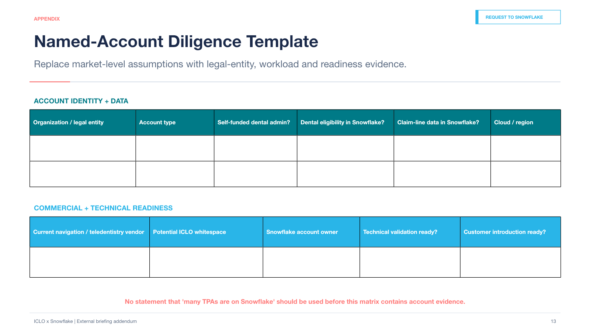{width=full}

**한국어 speaker note**

'Snowflake 고객인 TPA가 많다'는 추정 대신 account evidence를 쌓는 템플릿이다. 데이터 실재와 기술 검증 준비도가 먼저이며 customer introduction readiness는 별도 필드로 둔다.

**Required fields:** legal entity, account type, self-funded dental administration, dental eligibility, claim-line data, cloud and region, incumbent, whitespace, account owner, technical-validation readiness and introduction readiness.

# Self-Review

| Check | Result |
|---|---|
| ICLO does not appear as another teledentistry app. | Yes |
| Snowflake's role is more specific than database hosting. | Yes |
| Employer, TPA, carrier and employee roles are separated. | Yes |
| No first-year savings promise is made. | Yes |
| Turnover and the J-curve connect to a Snowflake analytics use case. | Yes |
| Raw images and structured claims are separated. | Yes |
| Business Critical is not presented as automatic HIPAA compliance. | Yes |
| Federated learning is a conditional future option. | Yes |
| Delta Dental and Blue are not treated as single accounts. | Yes |
| Incumbent presence and whitespace diligence remain separate. | Yes |
| Snowflake GTM asks are feasible sponsor, coordination, evidence and path questions. | Yes |
| Named owners and required outputs are designed into the close. | Yes |

**Review outcome:** 12 / 12 Yes.
