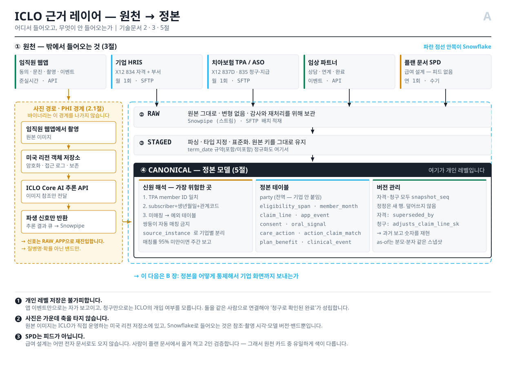
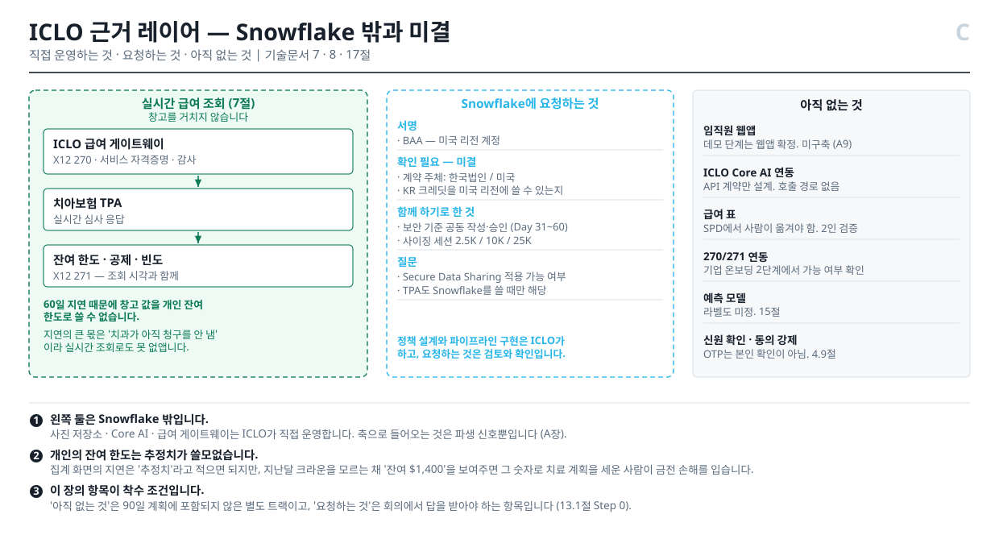

# 근거 레이어 DB 설계 — 임직원 치과복지 증거 데이터

ICLO × Snowflake · 미국 self-funded employer 치아보험 PoC
2026-08-08 · 내부 기술 문서 · v1


---

## 목차

구조 원칙: **무엇을 저장하는가(3~5절) → 언제 기준으로 보는가(6절) → 누가 무엇을 보는가(9~12절) → 어떻게 시작하는가(13~14절)**. 미결 항목은 별도 절에 모으지 않고 각각을 소유한 절 안에 두었습니다.

- **0. 이 문서의 범위와 가정**
- **1. 지표 계약 — 화면에서 역산** — 1.1 참여 지표는 게임될 수 있습니다
- **2. 전체 아키텍처와 신뢰 경계** — 2.1 PHI 경계
- **3. 원천 계약과 수집**
- **4. 사람 · 계정 · 권한** — 4.1 신원 · 4.2 잘못된 전제 세 가지 · 4.3 사람 · 계정 · 기기를 분리 · 4.4 초대 흐름 · 4.5 한 폰을 여럿이 쓰는 경우 · 4.6 보호자가 둘인 아이 · 4.7 플랜에 없는 보호자 · 4.8 계정 생애주기에서 놓치기 쉬운 경계 · 4.9 신원 확인 · 4.10 보호자 권한 · 4.11 기기와 세션 모델이 없습니다
- **5. 정본 도메인 모델** — 5.1 가입 자격과 member-month · 5.2 청구 · 5.3 앱 이벤트 · 동의 · 신호 · 5.4 동의 생애주기 · 5.5 오프라인 촬영과 철회의 시점 경쟁 · 5.6 조치와 청구 연결 · 5.7 실험군 배정 · 5.8 본문에서 참조하는 나머지 객체
- **6. 시간 · 버전 · 이탈 · as-of** — 6.1 이탈 · 6.2 member-month 전개 · 6.3 청구 지연 · 6.4 이탈 · 6.5 26세 도달과 진행 중인 치료
- **7. 임직원 급여 정보 서비스**
- **8. 임직원 웹앱과 Core AI 연동 (계획)** — 8.1 구성 요소 · 8.2 호출 계약 · 8.3 백엔드 적재 · 8.4 이 절이 미치는 범위
- **9. Snowflake 물리 설계**
- **10. 거버넌스 · 개인정보 통제** — 10.1 롤 · 10.2 행 접근 정책 · 10.3 집계 정책 · 10.4 마스킹 · 10.5 접근 이력 · 10.6 관리자 권한과 즉시 차단 경로
- **11. MART · EMPLOYER 의미 계층** — 11.1 대시보드가 실데이터로 바뀔 때
- **12. 데이터 품질**
- **13. 기업 온보딩과 90일 계획** — 13.1 구축 순서 · 13.2 온보딩 단계 · 13.3 순서에서 지켜야 할 것 · 13.4 첫 기업에서 반드시 측정할 것 · 13.5 기업이 물어볼 것
- **14. 합성 데이터와 데모 전환** — 14.1 원칙 · 14.2 모집단과 3년 · 14.3 참여 · 14.4 청구 생성 · 14.5 매칭 난이도 주입 · 14.6 재현성
- **15. 시계열 모델링을 위한 데이터 요구사항** — 15.1 촬영 주기 · 15.2 월 격자로 리샘플링하지 마십시오 · 15.3 결측이 신호입니다 · 15.4 학습은 반드시 as-of 스냅샷으로 · 15.5 라벨이 아직 정의되지 않았습니다 · 15.6 관측 단위와 누수 · 15.7 알고 시작해야 할 편향 · 15.8 아직 없는 것
- **16. 법무 · 계약 게이트 레지스터** — 16.1 계정 · 가족 관련 추가 항목
- **17. 착수 게이트와 미결 기술 결정** — 17.1 우선순위
- **부록 A. 도메인 용어**
- **부록 B. 내부 객체 사전**
- **부록 C. 현재 데모와의 차이**

## 0. 이 문서의 범위와 가정


대시보드가 보여주는 숫자를 실제로 만들어내는 **개인 레벨 데이터베이스**를 어떻게 짓는지 다룹니다. 대상은 ICLO 데이터 엔지니어와 Snowflake HLS 아키텍트입니다.

다루는 것: 원천 수집 · 신원 해석 · 정본 모델 · member-month 전개 · 청구 지연 처리 · PHI 경계 · Snowflake 물리 설계 · 거버넌스 정책 · 기업 화면용 집계.

**다루지 않는 것:** 앱 프론트엔드, 모델 학습·추론 파이프라인, 계약·법무 판단. 마지막 절에 법무 입력이 필요한 항목을 따로 모아두었습니다.


### 가정 (전부 미확정 — 확인 후 갱신 필요)

이 설계는 아래를 가정합니다. **하나라도 틀리면 해당 절을 다시 봐야 합니다.**

| # | 가정 | 틀렸을 때 영향 |
|---|---|---|
| A1 | 첫 파일럿은 계약 기업 1곳, 자격자 약 10,000명 | 규모 가정이 바뀌면 9절 웨어하우스 사이징 |
| A2 | TPA가 837D/835 또는 합의된 청구 추출을 월 1회 제공 | 실시간이면 3·6.3절 전면 재설계 |
| A3 | **기업 또는 benefits administrator** 가 834 가입 자격 파일을 월 1회 SFTP 제공 (2026-08-28 정정 — 정본 `terminology.forbidden` 이 `HRIS 834` 를 금지한다. 인사 시스템이 그 파일을 직접 뱉는 것이 아니다) | 일 단위면 6.2절 member-month 전개 주기 변경 |
| A4 | 원본 구강 이미지는 ICLO 운영 미국 리전 객체 저장소에 보관하고 Snowflake에 넣지 않음 | 2.1절 PHI 경계 전체 |
| A5 | Snowflake **Business Critical**, 미국 리전, BAA 체결 완료 | 미체결 시 PHI 적재 불가 — 착수 전제 |
| A6 | 834·837D 양쪽에 안정적인 member identifier가 있거나, 없으면 subscriber ID + 생년월일 + 관계코드로 매칭 가능 (4.1절 순서) | 없으면 4.1절 신원 해석이 가장 큰 리스크로 승격 |
| A7 | 청구 run-out 90일, 그 이후 재작성은 드묾 | 더 길면 6.3절 스냅샷 정책 |
| A8 | 기업 화면 최소 셀 크기 20 | 법무 판단으로 바뀔 수 있음 (16절) |
| A9 | 임직원용 웹앱은 **아직 만들지 않았음**. 추론은 ICLO Core AI를 API로 호출 | 8절 전체. 계약·일정에 반영 필요 |

가정 A5와 A6이 가장 위험합니다. A5는 착수 자체를 막고, A6은 실패하면 청구와 앱 이용을 연결할 수 없어 "청구로 확인된 완료"라는 제품의 핵심 주장이 성립하지 않습니다.


---

## 1. 지표 계약 — 화면에서 역산


대시보드 지표를 거꾸로 따라가면 필요한 테이블이 나옵니다.

| 화면 지표 | 계산 | 필요한 것 |
|---|---|---|
| Eligible employees | 기준 시점에 플랜 자격이 있는 임직원 수 | 가입 자격 기간(span), 관계코드 |
| Covered members | 임직원 + 등록 가족의 **가입자-월** | span을 월 단위로 전개 |
| Activated 38% | 가입 + 첫 문진 완료 / 자격자 | 앱 이벤트, 동의 시각 |
| Repeat participation 61% | **직전 12개월에 유효 촬영이 2회 이상인 사람 / 같은 12개월에 유효 촬영이 1회 이상인 사람** (정본 `metric_time_contracts`, T14) | 앱 이벤트 시계열 |
| Dental PMPM $31.40 | 허용액 합 / 가입자-월 | 청구 라인 + member-month |
| Signals Low·Moderate·Priority | 유효 촬영의 신호 분포 | 사진 파생 신호, 모델 버전 |
| Open / Completed care actions | 조치 발생·완료 | `care_action` + `action_claim_match` (5.6절) |
| completeness 98.4% | **도착한 허용액 / 예상 최종 허용액** (건수 아님) | 청구 수신 대조 |

**개입군/대조군 추세는 v1에 없습니다.** 대조군이 있어야 성립하는데 실험군 배정이 미해결(5.7절·16절)이라 대시보드에서 `Trend vs control` 탭을 뺐습니다. 배정 설계가 승인되면 돌아옵니다.

**"청구로 확인된 완료"가 이 시스템의 존재 이유입니다.** 앱 이벤트만으로는 자가 보고이고, 청구만으로는 ICLO의 개입 여부를 모릅니다. 둘을 **같은 사람으로 연결**해야 성립하고, 그래서 개인 레벨 저장이 불가피합니다. 집계는 저장하지 않는다는 뜻이 아니라 **기업이 볼 수 있는 것을 제한한다**는 뜻입니다.

### 1.1 참여 지표는 게임될 수 있습니다


보상이 걸리면 같은 날 가족 프로필을 번갈아 선택해 저품질 사진을 수십 번 올리는 것이 가능합니다. `app_event` 수와 촬영 횟수를 그대로 활성·반복참여로 계산하면 **반복 클릭이 기업 성과로 보고**됩니다. 사람·기간별 유효 참여 정의, 품질 통과 조건, 중복 제거, 속도 제한이 필요합니다. 4.6절의 24시간 중복 촬영 규칙은 그 시작이지만 다보호자 가구만 다룹니다.

> **해소됨 (2026-08-14).** 위 네 가지가 `contracts/proposal-package-v11.yml`의
> `dashboard.metric_time_contracts`에 확정되었습니다. **정본이 유일한 기준이며 여기에
> 다시 적지 않습니다** — 두 곳에 쓰면 갈라집니다. 요약하면 유효 촬영은 품질 게이트
> 통과 + 사람·날짜당 1건 + 사람·월당 4건 상한이고, 반복참여는 롤링 12개월,
> 신호 분포는 촬영이 아니라 **사람** 단위로 사람당 최신 1건입니다.
>
> **완료 조치에 시간 계약이 하나 더 붙었습니다.** 분모를 **성숙한 코호트**로
> 한정합니다 — `opened_at + window_days + 청구지연 P90`이 보고일 이전인 조치만.
> 6.3절의 지연 분포(중앙값 45일·롱테일 180일) 때문에 최근 코호트는 완료할 시간
> 자체가 없었고, 그대로 세면 완료율이 낮게 나왔다가 나중에 저절로 오릅니다.
> 6.3절이 청구에 대해 막으려는 것과 같은 사고가 조치 쪽에서 일어나는 것이며,
> **좋아지는 방향이라 오류가 성과로 보입니다.**


---

## 2. 전체 아키텍처와 신뢰 경계


```
RAW        원본 그대로. 변형 없음. 감사·재처리용.
  ↓
STAGED     파싱·타입 지정·표준화. 원본 키 유지.
  ↓
CANONICAL  정본 모델. 신원 해석 완료. 이 문서의 5절.
  ↓
MART       파생 지표. 실험군, member-month 집계.
  ↓
EMPLOYER   기업 노출용. 집계 정책 + 행 접근 정책 적용. 10절.
```

각 레이어는 별도 스키마이고 **권한이 다릅니다.** RAW·STAGED·CANONICAL은 데이터 엔지니어링 롤만, EMPLOYER는 기업 사용자 롤만 접근합니다. 기업 사용자는 CANONICAL을 아예 볼 수 없습니다.

아래 그림이 이 문서 전체의 흐름입니다. 가운데 축이 위 레이어이고, 양옆의 두 레인은 **그 축을 타지 않는 두 경로**입니다. 오른쪽은 사진(2.1절), 왼쪽은 실시간 급여 조회(7절)입니다. 두 개를 축 안에 그려 넣으면 설계를 잘못 이해하게 됩니다.






### 2.1 PHI 경계 — 원본 사진


```
[임직원 웹앱]  ← 8절. 아직 미구축 (가정 A9)
   │ 원본 구강 이미지 업로드
   ↓
[ICLO 운영 미국 리전 객체 저장소]  ← 암호화, 접근 로그, 보존 정책
   │  · 이미지 바이너리는 이 경계를 나가지 않는다
   │  ↓ 이미지 참조만 전달
   │ [ICLO Core AI · 추론 API]  ← 같은 신뢰 경계 안. 8절.
   │  ↑ 파생 신호 + 모델 버전 반환
   ↓ URI + 메타데이터 + 승인된 파생 신호만
[Snowflake canonical.oral_signal]
```

Snowflake에 들어가는 것은 `image_uri`, `captured_at`, `model_version`, `quality_passed`, `signal_band`, 그리고 **`party_sk`·`captured_by_credential_sk`·`employer_id`** 입니다. **바이너리는 들어가지 않습니다.**

뒤의 셋을 빼고 세면 안 됩니다. 이미지와 행위자를 **개인에게 연결하는 것이 바로 그 컬럼들**이고, PHI 인벤토리에서 가장 민감한 항목입니다. "파생 신호만 들어간다"는 표현은 정확하지 않습니다. 정확히는 **"사진 바이너리는 들어가지 않는다"** 입니다.

`image_uri`는 그 자체로는 이미지를 열 수 없어야 합니다. 서명된 임시 URL을 별도 권한으로 발급받아야 접근되는 구조여야 하고, Snowflake 권한만으로는 사진에 도달할 수 없어야 합니다.

**Snowflake 보안 담당자가 가장 먼저 물어볼 지점입니다.** 제안서는 여기를 "Controlled U.S. object storage / PHI vault" 한 줄로 넘겼고, 앱은 "사진은 보존 일정을 따릅니다"라고 썼는데 **그 일정이 없었습니다.** 없는 정책을 있는 것처럼 쓰는 것이 이 문서가 가장 경계하는 종류의 문장이라, 초안을 여기 둡니다.

#### 2.4 사진 보존 — 초안 (미승인)

> **상태: 2026-08-16 에 여섯 항목이 결정됐고, 저장소가 없으므로 아직 아무것도 강제하지 않습니다.** 규칙은 정해졌고 구현이 없습니다. 앱 화면은 계속 "정책은 정해졌고 아직 운영되지 않는다"고 적어야 하며, 시행 중인 것처럼 적으면 안 됩니다.

| | 원본 이미지 | 파생 신호 (`oral_signal`) | 동의 기록 |
|---|---|---|---|
| 어디에 | ICLO 운영 미국 리전 객체 저장소 | Snowflake CANONICAL | Snowflake CANONICAL |
| 기본 보존 | **촬영 후 24개월** | 자격 종료 후 7년 | **영구** |
| 왜 그 기간인가 | 모델 재학습·품질 이의 제기·오귀속 조사에 필요한 창. 그보다 길게 두면 목적 없이 PHI를 쥐고 있는 것이 된다 | 청구 롱테일 180일 + 연간 리포트 재현 + HIPAA 기록 보존 관행 | 아래 참조 |
| 삭제 요청이 오면 | 요청 접수 후 30일 내 파기, 파기 로그만 남김 | 개인 식별 연결을 끊고 집계 기여분은 남김 (7절 rebuild 미정 항목과 연결) | **지우지 않는다** |

**동의 기록을 영구 보존하는 이유가 반직관적이라 적어둡니다.** 삭제 요청이 와도 "우리가 그날 무엇을 할 권한이 있었는가"에는 답할 수 있어야 합니다. 동의 이력을 지우면 그 답이 사라지고, **동의 없이 처리했다는 주장에 반증할 방법이 없어집니다.** 지우는 것은 사진과 그 사람으로의 연결이지 허가의 기록이 아닙니다.

#### 여섯 항목의 결정 (2026-08-16)

**1. 계정 소유자 — ICLO.** 편의가 아니라 두 설계 규정이 다른 선택지를 지웁니다.

- **기업 계정에 두면 사람의 구강 이력이 기업 단위로 쪼개집니다.** 4.1절이 `party`와 `credential` 어디에도 기업을 넣지 않는 이유가 정확히 이것입니다 — 한 사람이 두 기업에 동시에 속할 수 있고(부부가 서로를 부양가족으로 올리는 경우), 이직하면 소속이 바뀝니다. 사진 저장소만 기업 단위로 나누면 **이직한 순간 과거 이력이 옛 기업 계정에 갇힙니다.**
- **기업 계정이면 기업이 임직원 사진에 기술적으로 접근할 수 있습니다.** 7.2절의 신뢰 경계 전체가 "기업은 개인 레벨을 못 본다"인데, 버킷 소유권이 기업에 있으면 그 문장이 계약으로만 참이고 기술로는 거짓이 됩니다.

ICLO 계정으로 두면 ICLO 가 그 데이터에 대해 covered entity 인지 business associate 인지가 16절 1번(HIPAA 역할 규정)의 판정 대상으로 남습니다. **그 판정은 계정 소유자를 바꾼다고 사라지지 않고, 옮기면 위의 둘이 대신 깨집니다.**

**PHI 전용 계정을 따로 둡니다.** 분석 계정(Snowflake)과 사진 계정이 같은 클라우드 계정에 있으면 침해 하나가 둘 다 가져갑니다.

**2. 키 관리 — ICLO 관리 키(CMK), 사람별 데이터 키.** 벤더 관리 키는 파기 증명을 못 하고, 기업 관리 키는 1번과 같은 이유로 안 됩니다.

구조는 **봉투 암호화**입니다. 마스터 키는 KMS 에, 데이터 키는 `party_sk` 마다 하나씩 두고 마스터 키로 감쌉니다. 왜 사람별인지는 5번에서 드러납니다.

**3. 서명 URL — 5분, 1회용, 백엔드만 발급.** 발급 전에 그 요청 시점의 동의를 평가합니다(5.4절 모델). URL 자체가 권한이므로 로그·리퍼러·스크린샷으로 새는 것을 시간으로 막습니다. `image_uri` 는 여전히 그 자체로 아무것도 열지 못합니다.

**4. 사고 대응 — ICLO.** 저장소가 ICLO 계정이므로 탐지·통지 시계·1차 조사가 ICLO 책임입니다. 기업 통지 의무는 HIPAA 역할 판정(16절 1번)에 따라 갈리며, **그 판정 전에도 ICLO 가 먼저 움직인다는 것은 정해져 있습니다.**

**5. 파기 — 삭제가 아니라 키 파기.** 이게 이 절에서 가장 중요한 결정입니다.

**버킷 버전 관리는 켭니다.** 실수 삭제와 랜섬웨어에서 복구할 방법이 그것뿐입니다. 그런데 켜는 순간 **`DELETE` 는 삭제 마커를 하나 놓는 일이고 원본은 그대로 남습니다.** 백업과 교차 리전 복제본까지 세면 "지웠다"고 말할 수 있는 시점이 존재하지 않습니다.

그래서 **파기는 그 사람의 데이터 키를 파기하는 것**으로 정의합니다.

```
삭제 요청 접수
   └─ 30일 내 그 party_sk 의 데이터 키를 KMS 에서 파기
        ├─ 모든 버전          ─┐
        ├─ 모든 백업            ├─ 동시에 복호 불가가 된다
        └─ 모든 복제본        ─┘
   └─ 파기 로그만 남긴다 (누가·언제·무엇을. 사진 내용은 아님)
```

객체는 뒤에서 수명주기 정책으로 치우되, **복구 불가는 키 파기 시점에 이미 성립**합니다. 하나씩 쫓아다니며 지우는 것과 달리 이건 **증명할 수 있습니다** — 키가 없다는 사실 하나로 끝납니다.

> **Object Lock 을 켜면 보존 기간 동안 객체를 지울 수 없습니다.** 규제 보존과 삭제 요청이 정면으로 부딪히는 지점이고, 키 파기 모델은 그 충돌도 함께 풉니다 — 객체는 락에 걸린 채 남고 읽을 수는 없습니다.

**6. 보존 기간 — 위 표대로.** 원본 24개월 · 파생 신호 자격 종료 후 7년 · 동의 기록 영구.

---

**남은 것 하나.** ICLO 가 covered entity 인지 business associate 인지의 판정은 16절 1번에 그대로 있고 **법무 없이는 닫히지 않습니다.** 위 여섯은 그 판정이 어느 쪽으로 나든 성립하도록 골랐습니다 — 판정이 바뀌면 달라지는 것은 계약 문구이지 저장 구조가 아닙니다.


---

## 3. 원천 계약과 수집


| 원천 | 내용 | 형식 | 주기 | 수집 |
|---|---|---|---|---|
| 기업 또는 benefits administrator | 가입 자격 **만** | X12 **834** | 월 1회 (변경분) | SFTP → 스테이징 |
| 기업 HRIS 또는 benefits administrator | 부서 마스터 (11절) | CSV 등 합의 형식 | 월 1회 | SFTP |
| 플랜 문서 | 급여 설계 (SPD) | PDF → **수기 입력** | 연 1회 | 사람이 옮김 (7절) |
| 치아보험 TPA/ASO | 청구 · 지급 | X12 **837D** / **835** 또는 합의 추출 | 월 1회 | SFTP, 가능하면 Secure Data Sharing |
| 임직원 앱 | 동의, 문진, 사진 메타, 이용 이벤트 | JSON | 준실시간 | API 이벤트 스트림 → Snowpipe |
| 임상 파트너 | 상담 결과, 연계, 완료 | JSON | 이벤트 | API |

**첫 두 행의 원천 이름이 `기업 HRIS` 였습니다 (2026-08-28 정정).** 인사 시스템이 이 파일을
직접 뱉는 경우는 드뭅니다 — 통상 benefits administration 플랫폼(bswift·Businessolver·Alight·
Benefitfocus·Workday Benefits·ADP·UKG 등)이나 브로커의 등록 시스템이 만들고, 기업은 그것을
승인하는 plan sponsor 입니다. 정본 `terminology.forbidden` 이 이 표현을 금지하고 있었는데
이 문서가 두 곳에서 쓰고 있었습니다.

**실무 결과가 둘 있습니다.** 요청 상대가 둘이 됩니다 — 데이터 권리는 기업과, 파일 규격·주기·
필드는 벤더와 협의하므로 13절 온보딩 일정에 그 벤더가 들어갑니다. 그리고 **834 에 연락처가
채워져 있는지를 착수 전에 확인해야 합니다.** PER 세그먼트로 전화·이메일을 담을 수 있지만
캐리어가 청구 심사에 그것을 쓰지 않으므로 비어 오는 경우가 흔하고, 비어 있으면 4.9절의
"권위 있는 연락처로만 초대 발송" 이 성립하지 않아 연락처 별도 피드를 추가로 요청해야 합니다.
샘플 파일 한 장으로 판정되는 사실이므로 다른 게이트보다 먼저 물어볼 수 있습니다.

**Secure Data Sharing을 우선 검토해야 합니다.** TPA가 Snowflake를 쓴다면 파일 전송 없이 공유로 받을 수 있고, 사본이 생기지 않아 데이터 권리 협상이 쉬워집니다. 다만 같은 리전이어야 하고 TPA가 Snowflake를 쓰고 있어야 하며, 아니면 SFTP로 갑니다. (가정 A2는 주기·형식만 규정하므로 이 조건은 A2와 별개로 확인해야 합니다.) 이건 Snowflake 아키텍트에게 물어볼 항목입니다.


---

## 4. 사람 · 계정 · 권한


13.2절의 4단계를 "링크 보내고 동의받기"로 적어뒀지만, 그 한 줄 뒤에 이 시스템에서 가장 틀리기 쉬운 설계가 있습니다.

### 4.1 신원 — 가장 어려운 부분


HRIS의 사람, TPA의 가입자, 앱 사용자는 **서로 다른 식별자 체계**를 씁니다. 이걸 하나로 묶는 것이 이 시스템에서 기술적으로 가장 위험한 지점입니다.

```sql
-- 정본 개인. 대리키만 밖으로 나간다.
-- 기업·관계는 여기 두지 않습니다. 사람은 하나인데 소속은 시간에 따라
-- 바뀌고 동시에 둘일 수도 있기 때문입니다 (아래 주의 참조).
CREATE TABLE canonical.party (
  party_sk          NUMBER IDENTITY PRIMARY KEY,
  birth_date        DATE,                      -- 매칭용. 마스킹 대상.
  created_at        TIMESTAMP_NTZ DEFAULT CURRENT_TIMESTAMP()
);

-- 원천별 식별자. 한 사람이 여러 행을 가진다.
CREATE TABLE canonical.party_xref (
  party_sk        NUMBER    NOT NULL REFERENCES canonical.party,
  source_system   VARCHAR   NOT NULL,          -- HRIS | TPA | APP | CLINICAL
  source_instance VARCHAR   NOT NULL,          -- 어느 기업 HRIS·어느 TPA인지. 아래 주의.
  source_id       VARCHAR   NOT NULL,
  match_method    VARCHAR   NOT NULL,          -- DETERMINISTIC | PROBABILISTIC | MANUAL
  match_score     FLOAT,
  matched_at      TIMESTAMP_NTZ,
  PRIMARY KEY (source_system, source_instance, source_id)
);
```

**매칭 규칙 (가정 A6 기준):**

1. **TPA member ID 일치** — 834·837D가 같은 안정적 member identifier를 실으면 이것만 씁니다. 1순위입니다.
2. **결정적 매칭** — 위가 없을 때 `subscriber_id + birth_date + relationship_code` 완전 일치.
3. **미매칭 격리** — 붙지 않은 레코드는 버리지 않고 `canonical.party_match_exception`에 남깁니다. **매칭률은 데이터 품질 지표로 매주 보고합니다.**

#### SSN을 키로 쓸 수 있나 — 쓰지 않습니다

834가 SSN을 싣는 경우가 실제로 있습니다 (`REF*SY`). 과거에는 subscriber ID가 곧 SSN인 플랜도 흔했습니다. 그래서 "가장 확실한 키 아닌가"라는 질문이 나오는데, **키로는 쓰지 않습니다.** 이유가 셋입니다.

1. **매칭이 가장 어려운 곳에서 값이 없습니다.** 자녀는 SSN이 파일에 없는 경우가 많고 배우자도 누락이 잦습니다. 정작 어려운 것은 피부양자 매칭인데 거기서 비어 있으면 키로서 쓸모가 없습니다.
2. **위험 대비 이득이 나쁩니다.** 미국 거의 모든 주의 유출 통지법이 **SSN을 특정해서** 트리거됩니다. 키로 쓰면 조인·인덱스·로그·에러 리포트로 전파되고, 그 순간 사고 시 통지 의무와 배상 범위가 완전히 달라집니다. HIPAA minimum necessary 원칙과도 정면으로 부딪칩니다.
3. **불변 식별자가 아닙니다.** 오타·재발급·도용이 있고, 한 번 잘못 붙으면 A의 청구가 B의 이용으로 집계됩니다 (4.1절 확률적 매칭을 안 쓰는 것과 같은 이유).

**대신 이렇게 씁니다.** SSN이 파일에 있으면 **결정적 매칭의 보조 요소**로만 쓰고, 저장은 원문이 아니라 **비밀키로 서명한 HMAC**으로 합니다.

```sql
ALTER TABLE canonical.party_xref ADD COLUMN
  ssn_hmac VARCHAR;     -- HMAC-SHA256(pepper, SSN). 원문·평문 해시 저장 금지.
```

> **평문 SHA-256은 안 됩니다.** SSN의 경우의 수는 10억 미만이라 전수 대입으로 몇 분이면 역산됩니다. 반드시 **별도 KMS에 둔 비밀키(pepper)로 HMAC**해야 하고, 그 키는 Snowflake 안에 두지 않습니다. 컬럼에는 `R_ENGINEER` 전용 마스킹 정책을 걸고, MART·EMPLOYER에는 절대 내보내지 않습니다.

키는 어디까지나 `party_sk`입니다. SSN은 **후보를 좁히는 힌트**일 뿐, 그 자체로 party를 생성하거나 병합하지 않습니다. 16절 법무 레지스터에 "SSN 수집·보관 근거와 주별 제약" 항목을 추가합니다.

**쌍둥이는 자동 매칭하지 않습니다.** 같은 subscriber 아래 생년월일·성씨·관계코드가 모두 같은 후보가 둘 이상이면 2번 규칙은 반드시 실패로 처리하고 예외로 보냅니다. 성씨·생년월로 범위를 넓히는 보조 규칙은 **쌍둥이를 갈라내지 못하고 오히려 합쳐버리므로 쓰지 않습니다.** 이 경우 member ID 없이는 사람을 구분할 수 없고, 잘못 합치면 두 아이의 청구와 사진이 한 사람으로 집계됩니다. 앱의 가족 선택 화면에도 생년월일만으로는 구분되지 않으므로 안전한 구분자(등록 순번 등)를 함께 보여줘야 합니다.

**관계코드는 매칭 키이면서 동시에 바뀌는 값입니다.** 입양 완료로 stepchild→child, 피부양 자녀가 같은 기업에 입사해 본인 가입자가 되는 경우 모두 코드가 바뀝니다. 코드가 바뀌었다고 새 party를 만들면 그 사람의 과거 사진·동의·청구가 갈라집니다. **관계코드는 `party`가 아니라 `eligibility_span`에 두고**(5.1절), 코드 변경이 감지되면 신규 party 생성 전에 반드시 기존 party와의 병합 후보로 검토합니다.

**한 사람이 두 기업에 동시에 속할 수 있습니다.** 기업 A의 직원이면서 기업 B 직원 배우자의 피부양자인 경우이고, 양쪽 플랜이 모두 ICLO와 계약하면 실제로 발생합니다. `party`를 기업에 묶으면 같은 사람이 두 사람이 됩니다. 그래서 **`party`는 전역이고 기업 소속은 `eligibility_span`의 속성**입니다. 대신 모든 동의·접근·촬영에는 **어느 기업 가입 맥락인지**를 명시적으로 기록해야 하며 (4절), 기업 간 격리는 `party`가 아니라 `member_month`·`claim_line`의 `employer_id` 행 접근 정책이 담당합니다 (10.2절).

**`source_instance`가 없으면 기업이 늘어날 때 신원이 섞입니다.** `party`를 전역으로 만든 대가입니다 — 두 기업 HRIS가 각자 사번 `12345`를 쓰거나 두 TPA가 같은 member ID 체계를 쓰면, `(source_system, source_id)`만으로는 **서로 다른 사람이 같은 키**가 됩니다. Snowflake는 PK도 강제하지 않으므로 충돌 오류조차 나지 않고 두 사람이 한 party로 병합됩니다. 파일럿 1곳에서는 드러나지 않고 **두 번째 기업에서 터집니다.**

확률적 매칭은 **1차에서 쓰지 않습니다.** 잘못 붙으면 A의 청구가 B의 이용으로 집계되고, 그 오류는 집계 화면에서 보이지 않습니다. 매칭률이 낮으면 확률적 매칭을 도입하는 게 아니라 **TPA·HRIS에 공통 키를 요구**하는 것이 옳은 대응입니다.

### 4.2 잘못된 전제 세 가지


| 전제 | 왜 틀렸나 |
|---|---|
| 사람 1명 = 계정 1개 | 미성년 자녀는 계정을 못 만듭니다 |
| 계정 1개 = 기기 1대 | 부부가 한 폰을 씁니다. 자녀 둘이 한 태블릿을 씁니다 |
| 임직원이 가족 동의를 대신할 수 있다 | **성인 가족은 스스로 동의해야 합니다.** 배우자·성인 자녀에 대해 임직원이 대신 동의할 권한은 없습니다 |

세 번째가 법적으로 가장 위험합니다. 편의상 "가족 전체 동의" 체크박스를 임직원 화면에 두면, 배우자 데이터 처리의 동의 근거가 무효가 될 수 있습니다.

### 4.3 사람 · 계정 · 기기를 분리


**기기는 신원이 아닙니다.** 세 층을 따로 둡니다.

```sql
-- 로그인 주체. 사람과 1:1이 아니다.
CREATE TABLE canonical.credential (
  credential_sk  NUMBER IDENTITY PRIMARY KEY,
  contact_ref    VARCHAR NOT NULL,       -- 외부 vault 포인터. 발송은 vault가 한다.
  contact_hash   VARCHAR NOT NULL,       -- 조회·중복 **관찰**용. UNIQUE 를 걸지 않는다.
                                         -- 4.8절 — 같은 연락처에 credential 이 여럿일 수
                                         -- 있고 그것이 정상이다. 차단이 아니라 관찰이다.
  created_at     TIMESTAMP_NTZ NOT NULL,
  disabled_at    TIMESTAMP_NTZ
  -- employer_id를 두지 않습니다. 4.1절과 같은 이유입니다.
);

-- 계정이 어떤 사람을 대신해 행동할 수 있는가. N:M.
CREATE TABLE canonical.profile_access (
  credential_sk  NUMBER  NOT NULL,
  party_sk       NUMBER  NOT NULL,
  access_role    VARCHAR NOT NULL,       -- SELF | GUARDIAN | (성인 가족은 SELF만)
  granted_at     TIMESTAMP_NTZ NOT NULL,
  granted_by_credential_sk NUMBER,       -- 누가 부여했는지. SELF면 NULL. 4.6절.
  revoked_at     TIMESTAMP_NTZ,
  PRIMARY KEY (credential_sk, party_sk, granted_at)
);
```

- 한 계정이 여러 사람을 볼 수 있고 (부모가 자녀 둘)
- 한 사람이 여러 계정에서 접근될 수 있습니다 (배우자가 자기 폰과 공용 태블릿 양쪽)
**해시만으로는 초대를 보낼 수 없습니다.** 4.4절은 성인 가족에게 OTP를 보내는데, 되돌릴 수 없는 해시로는 문자도 이메일도 발송이 불가능합니다. 연락처 **원문은 canonical이 아니라 별도 암호화 vault(또는 IdP)** 에 두고 여기에는 포인터만 둡니다. 같은 이유로 4.4절의 "가족 목록에 이름과 관계를 표시"도 지금 모델로는 못 합니다 — `party`에 이름이 없습니다. **마스킹된 표시용 이름**을 별도로 정의해야 합니다.

#### 표시용 이름 — 설계 (2026-08-28, #63)

`party` 에 이름이 없으므로 4.4절 3단계("화면에 834 기준 가족 목록이 뜬다 — 이름과 관계만")가
지금 모델로 실행 불가입니다. 1차는 임직원 본인만이므로 아직 아무것도 그리지 않고, 가족 흐름과
함께 필요해집니다.

**요구는 사생활이 아니라 구분입니다.** 이 목록을 보는 사람은 그 가족의 임직원이고, 이름은 그가
이미 아는 정보입니다. 마스킹이 그로부터 무언가를 숨기는 것이 아닙니다 — 목적은 **원문 이름을
canonical 에 두지 않는 것**이고, 그 이유는 연락처를 vault 로 뺀 것과 같습니다. canonical 은
개인 레벨이고 MART·EMPLOYER 로 파생이 나가므로, 원문이 거기 있으면 파생마다 그것이 안 새는지
봐야 합니다.

| | |
|---|---|
| 규칙 | 성씨 전체 + 이름 첫 글자 + 마침표. 예: `Reyes, J.` |
| 원천 | 자격 파일(834)이 가족의 이름·생년월일·관계를 준다 (4.4절) |
| 저장 | canonical 이 아니라 연락처와 **같은 vault**. canonical 은 `display_name_ref` 포인터만 |
| 파기 | 2.4절 — 그 사람의 데이터 키를 파기하면 함께 복호 불가가 된다. 별도 삭제 경로를 만들지 않는다 |

**규칙을 규칙으로 적습니다.** "성씨 + 이름 첫 글자" 가 규칙이고, `Reyes, J.` 하나를 보이는 것은
규칙이 아닙니다. 구현이 예시를 보고 짐작하면 로마자 아닌 이름·성이 여러 단어인 이름·이름이 한
글자인 이름에서 갈립니다.

**4.1절 쌍둥이 항목이 이 설계에 요구를 하나 더 얹습니다.** 같은 subscriber 아래 생년월일·성씨·
관계코드가 모두 같은 후보는 자동 매칭하지 않고 예외로 보내는데, 그 절이 이렇게 적습니다 —
*"앱의 가족 선택 화면에도 생년월일만으로는 구분되지 않으므로 안전한 구분자(등록 순번 등)를
함께 보여줘야 합니다."* 표시용 이름 규칙만으로는 쌍둥이 둘이 같은 문자열이 됩니다. 그래서
**표시 단위는 이름 하나가 아니라 (표시용 이름, 관계, 구분자)** 이고, 구분자는 생년월일이 아닙니다.

**남는 미결 하나.** 그 구분자가 무엇인지는 정하지 않았습니다. 등록 순번은 사람이 이해하기
어렵고, member ID 는 화면에 띄우면 그것 자체가 식별자입니다. 이건 가족 흐름을 만들 때 UX 와
함께 정할 문제이며, 여기서 정하는 척하지 않습니다 — 지금 정하는 것은 **원문 이름을 canonical 에
두지 않는다**는 것과 **표시 단위가 셋이라는 것**입니다.

- **성인은 `GUARDIAN`으로 붙일 수 없습니다.** 성인 가족의 `profile_access`는 그 사람 본인의 credential에 `SELF`로만 생깁니다

**`credential`도 기업에 묶지 않습니다.** 4.1절에서 `party`를 전역으로 둔 것과 같은 이유입니다 — 두 계약 기업에 동시에 속한 사람에게 로그인을 두 개 주게 되고, 4.7절의 플랜 밖 보호자는 소속시킬 기업이 아예 없습니다. **기업 맥락은 계정이 아니라 `profile_access`가 가리키는 party의 `eligibility_span`에서 나옵니다.** 다만 이렇게 하면 "이 사람이 지금 어느 기업 맥락에서 행동 중인가"가 계정에 적혀 있지 않으므로, 동의·촬영에는 그 시점의 `eligibility_span_sk`를 함께 기록해야 합니다 (5.4절 미해결 항목).

### 4.4 초대 흐름 — 834에는 가족 연락처가 없다


이게 설계를 규정합니다. 834는 가족의 이름·생년월일·관계는 주지만 **연락처는 대개 없습니다.** 그래서 가족에게 직접 링크를 보낼 수 없고, 임직원을 거쳐야 합니다.

```
1. 기업이 임직원에게 안내 (사내 채널)
2. 임직원이 링크로 진입 → 본인 동의 (capacity=SELF)
3. 화면에 834 기준 가족 목록이 뜬다 — 이름과 관계만, 임직원이 이미 아는 정보
4. 임직원이 가족별로 분기
     미성년 자녀  → 임직원이 그 자리에서 대리 동의 (capacity=GUARDIAN)
     성인 가족    → 임직원이 그 가족의 연락처를 입력하거나 초대 링크를 전달
                     → 가족이 자기 credential로 진입 → 본인 동의 (capacity=SELF)
5. 동의 안 한 사람은 그대로 둔다 — member_month에는 남고 app_event만 없다
```

4단계에서 **성인 가족용 초대를 임직원이 대신 눌러 통과시킬 수 없어야** 합니다. 링크를 전달받은 사람이 별도 인증(문자 OTP 등)을 거쳐야 `capacity=SELF` 동의가 성립합니다.

### 4.4-1 인증 접근 — 결정 (2026-08-28, J. Kim)

**1차 범위는 임직원 본인입니다.** 가족 대리접근은 2차이며 4.9절 신원 확인 게이트가 선행합니다.

| | 내용 |
|---|---|
| 가입 | 자격 파일 매칭 — member ID + 생년월일 + 성 + ZIP |
| 인증 | 관리형 IdP 의 패스워드리스 OTP. 직접 만들지 않습니다 |
| 연락처 | **원문은 IdP 가 보관.** canonical 은 `contact_hash` + `contact_ref` 만 (4.3절) |
| 가족 | 1차 제외. `member_month` 와 청구에는 그대로 있고 앱만 안 씁니다 |

**기업 SSO 를 쓰지 않습니다.** 세 이유가 있고 셋 다 이 문서 안에 있습니다 — 피부양자에게
기업 신원이 없고(4.4절), 기업 IdP 를 거치면 기업이 건강 앱의 로그인 텔레메트리를 보게 되어
7.2절 신뢰 경계가 계약으로만 참이 되며, COBRA·주 continuation 가입자는 기업 디렉터리에
없습니다(4.8절).

**본인만으로 좁히면 4.9절 공격이 1차에 성립하지 않습니다.** 그 공격은 임직원이 *타인*
초대에 자기 연락처를 넣는 것이고, 본인 연락처는 그게 정상 경로입니다. 17.1절이 "1차에서
미성년 대리 동의를 제외하는 것이 가장 값싼 선택지" 라고 적은 것의 한 단계 더 좁은 판입니다 —
4.10·5.5절의 대부분과 함께 4.9절도 2차로 미뤄집니다.

**착수 전에 확인할 것 하나.** 파일럿 기업의 834 에 PER 세그먼트 연락처가 채워져 오는지를
샘플 파일 한 장으로 판정합니다. 1차 진행을 막지 않고 **2차 판단 자료**입니다 — 채워져 오면
4.9절의 "권위 있는 연락처로만 발송" 이 가능하고, 비어 오면 연락처 별도 피드를 요청해야 하며
그건 데이터 권리 요청 범위를 넓힙니다.

**1차에도 남는 것 둘.** 4.8절의 연락처 재사용 — 부부가 같은 회사에 다니고 같은 번호를 쓰면
`contact_hash` 가 충돌하므로 같은 연락처에 복수 credential 을 허용해야 합니다. 그리고
4.3절의 마스킹된 표시용 이름 — `party` 에 이름이 없어서 지금 모델로는 가족 목록 표시가
불가능하고, 1차는 가족을 안 보이므로 2차 전까지 열려 있습니다.

법무는 파라미터로 둡니다. 4.7절 플랜 밖 보호자의 연락처 보관 근거와 16-23 의 CMIA §56.11
authorization 형식 요건이 그것이며, 진행을 그것에 걸지 않고 열린 항목으로 관리합니다.

**IdP 선정 기준 — 한 줄이 걸립니다.** 신원 유일성 규칙을 IdP 가 갖게 되므로, **같은
이메일·전화로 사용자 둘을 만들 수 있어야** 합니다. 많은 IdP 가 이메일 유일을 기본값으로
강제합니다. 막혀 있으면 부부가 같은 회사에 다니고 연락처를 공유할 때 **한 명이 가입 자체를
못 합니다.** 위 4.3절 스키마 쪽은 이미 만족돼 있습니다 — `credential_sk` 가 PK 고
`contact_hash` 에 UNIQUE 가 없습니다. 4.8절이 "허용해야 한다" 고 쓴 것은 요구 추가가 아니라
**하지 말아야 할 실수의 경고**이며, 그 실수를 할 수 있는 자리가 이제 우리 스키마가 아니라
IdP 설정입니다.

| IdP 선정 시 확인 | 왜 |
|---|---|
| 같은 이메일·전화로 사용자 복수 생성 가능 | 4.8절 연락처 재사용. 기본값이 막으면 끌 수 있는지 |
| BAA 체결 가능 티어인가 | 16-1 HIPAA 역할 판정과 무관하게 연락처·인증 로그가 그쪽에 산다 |
| refresh token 회전 + 세션 레지스트리 + global sign-out | 4.11절. 직접 구현할 대상이 아니라 고를 대상이다 |
| 사용자 삭제 시 원문이 실제로 사라지는가 | 2.4절 파기 원칙. canonical 의 hash·ref 는 고아 포인터로 남고 그것이 의도된 상태다 |

---

### 4.5 한 폰을 여럿이 쓰는 경우 — 사진 귀속


말씀하신 조합이 전부 정상 경로입니다.

| 상황 | 처리 |
|---|---|
| 임직원 + 가족 전원이 한 폰 | **기기 1대**. credential은 성인 수만큼. 미성년은 `GUARDIAN` 프로필, 성인 가족은 **같은 기기에서 자기 credential로 로그인**해 `SELF` 동의 |
| 임직원과 가족이 각자 폰 | credential 각각. `profile_access`가 사람별로 붙음 |
| 임직원+A는 폰1, B·C·D는 폰2 | credential 2개, `profile_access` 4행. **프로필은 기기에 매이지 않습니다** |

**진짜 위험은 사진 오귀속입니다.** 폰을 공유하는데 프로필 전환이 느슨하면 B의 사진이 C로 들어가고, 그 오류는 집계 화면에서 절대 보이지 않습니다. `oral_signal`이 오염되면 청구 연결까지 함께 틀어집니다.

방어:

1. **촬영 직전 프로필을 명시적으로 고르게 합니다.** 세션에 걸쳐 기억하지 않습니다.
2. **직전 프로필을 자동 선택하지 않습니다.** 공유 기기에서 가장 흔한 사고 경로입니다.
3. 촬영 화면에 **대상자 이름을 크게** 띄웁니다.
4. 비활동 시 프로필을 해제합니다.
5. `oral_signal.captured_by_credential_sk`를 **대상과 별도로 기록**합니다. 한 credential이 3분 안에 5명분을 촬영하는 패턴을 탐지할 수 있어야 하고, 이건 정상일 수도(가족 검진일) 사고일 수도 있어 자동 차단이 아니라 **품질 지표로 관찰**합니다.

### 4.6 보호자가 둘인 아이 — 엄마 폰, 아빠 폰


아이가 이번엔 엄마 폰으로, 다음엔 아빠 폰으로 검진하는 경우입니다. 흔한 상황이고, **여기서 설계가 무너지면 아이의 기록이 두 개로 쪼개집니다.**

#### 무엇이 잘못될 수 있나

아빠가 앱에 들어와 아이를 **새로 등록**하면 `party`에 아이 행이 하나 더 생깁니다. 그 순간:

- 아이의 신호 이력이 두 party로 나뉘어 어느 쪽도 완전하지 않습니다
- 청구는 834 기준의 원래 party에만 붙으므로 **아빠 폰으로 찍은 것은 청구와 절대 연결되지 않습니다**
- 집계에서는 "자격자 1명, 활성 2명" 같은 형태로 조용히 틀어집니다. 화면에는 아무 이상이 없습니다

**아이는 834에 한 번만 존재합니다.** 앱에서 사람을 새로 만들 수 있게 두면 안 됩니다.

#### 규칙: 보호자 접근은 부여하는 것이지 생성하는 것이 아니다

```
[원칙] app에서 party를 생성하지 않는다. party는 834에서만 생긴다.
       두 번째 보호자는 기존 party에 profile_access 행을 추가할 뿐이다.
```

부여 흐름:

```
1. 아빠는 이미 자기 credential이 있다
     · 아빠도 이 플랜의 피부양자(배우자)라면 → 4.4절의 성인 가족 초대로 SELF 동의 완료
     · 아빠가 이 플랜에 없다면 → 4.7절 참조
2. 엄마(기존 GUARDIAN)가 앱에서 "보호자 추가" → 아빠 연락처 입력
3. 아빠에게 초대 → 본인 인증(OTP)
4. canonical.profile_access 에 (아빠 credential, 아이 party_sk, GUARDIAN) 1행 추가
     ※ 아이 party는 그대로. 새로 만들지 않는다.
```

```sql
-- 아이 한 명, 보호자 둘. party_sk 는 하나뿐이다.
INSERT INTO canonical.profile_access
  (credential_sk, party_sk, access_role, granted_at, granted_by_credential_sk)
VALUES (:dad_credential, :child_party, 'GUARDIAN', CURRENT_TIMESTAMP(), :mom_credential);
```

#### 동의는 한 번, 촬영은 여러 번

아이의 `consent`는 **한 행**입니다. 엄마가 `capacity=GUARDIAN`으로 부여했고, 아빠가 나중에 촬영해도 새 동의가 생기지 않습니다. 아빠는 기존 동의 아래에서 행동합니다.

그래서 5.3절에서 두 필드를 나눠둔 것이 여기서 값을 합니다:

| 필드 | 값 | 의미 |
|---|---|---|
| `consent.granted_by_credential_sk` | 엄마 | 동의를 준 사람 |
| `oral_signal.captured_by_credential_sk` | 아빠 | 이번에 찍은 사람 |
| `oral_signal.party_sk` | 아이 | **어느 폰이든 동일** |

`party_sk`가 기기와 무관하므로 **아이의 신호 이력은 한 줄로 이어집니다.** 이것이 4.3절에서 기기를 신원에서 분리한 이유입니다.

#### 두 기기가 겹칠 때

- **중복 촬영.** 엄마와 아빠가 같은 날 각자 찍으면 같은 party에 두 건이 들어옵니다. 오류가 아니라 실제로 두 번 찍은 것이므로 **삭제하지 않고**, 24시간 내 동일 party 복수 촬영은 최신 것을 대표값으로 쓰고 나머지는 보관합니다.
- **주기 왜곡.** 보호자가 둘이면 14.3절의 개인별 주기 가정보다 촬영이 잦아집니다. 합성 데이터 생성 시 다보호자 가구를 별도 유형으로 두는 것이 현실적입니다.
- **철회 비대칭.** 엄마가 자기 계정을 지워도 아빠의 `profile_access`가 남아 있으면 아이의 동의는 유효합니다. **모든 보호자 접근이 사라진 시점**에 아이 동의를 만료 처리해야 하며, 이 판정을 배치로 돌려야 합니다.

### 4.7 플랜에 없는 보호자


아빠가 다른 회사 보험을 쓰고 있어 이 플랜의 피부양자가 아닐 수 있습니다. 그러면 아빠에게는 `party_sk`가 없습니다. 자격도 청구도 없는 사람입니다.

현재 모델은 `credential`이 `SELF` 프로필 없이 존재하는 것을 막지 않으므로 기술적으로는 가능합니다. 아빠는 자기 데이터가 없는 채로 아이 프로필만 접근합니다.

다만 **법무 확인이 필요합니다.** 플랜 밖의 사람에게 계정을 발급하는 것이 기업–ICLO 계약 범위 안인지, 그 사람의 연락처를 보관할 근거가 무엇인지가 정리되어야 합니다. 1차에서는 **플랜 내 성인 피부양자만 두 번째 보호자가 될 수 있도록 제한**하는 것이 안전하고, 그렇게 하면 이혼·별거 가구 일부가 단일 보호자로 남습니다. 그건 결함이 아니라 의도된 범위 축소로 기록해야 합니다.

### 4.8 계정 생애주기에서 놓치기 쉬운 경계


- **자녀가 18세가 되는 순간.** 부양 자격은 보통 26세까지 가는데 동의 자격은 18세에 넘어옵니다. 생일이 지나면 부모의 `GUARDIAN` 접근을 끊고 본인 동의를 새로 받아야 합니다. **자격 기간 안에서 조용히 발생하므로 배치로 감지**해야 합니다.
- **연락처 재사용.** 자녀 계정에 부모 전화번호를 쓰면 `contact_hash`가 충돌합니다. credential은 연락처가 아니라 대리키로 식별하고, 같은 연락처에 복수 credential을 허용해야 합니다.
- **임직원 퇴사.** 가족 자격이 함께 끊긴다고 가정하면 안 됩니다. **COBRA·주 continuation으로 가족이 같은 플랜에 남습니다.** 기간은 18개월 고정이 아닙니다 — qualifying event 종류와 장애 연장에 따라 29개월·36개월이 되고, 주 continuation은 또 별도입니다. **퇴사한 직원 본인도 독립적으로 선택할 수 있습니다.** 임직원 상태를 보고 가족 계정을 일괄 비활성화하면 유효한 가입자의 접근·member-month·청구 연결을 잘못 끊습니다. 접근 여부는 임직원이 아니라 **각자의 `eligibility_span`**으로 판정합니다 (5.1절 `continuation_type`). 그리고 배우자의 동의와 데이터는 배우자의 것이므로, 계정 비활성화와 데이터 삭제는 별개 결정이며 16절 보존 정책에 걸립니다.
- **이혼·분리.** 전 배우자의 `profile_access`를 임직원 계정에서 제거해야 하는데, 834에서 관계 종료가 늦게 반영될 수 있습니다. 자세한 처리는 6.4절.
- **동의 철회가 가족 단위가 아닙니다.** 임직원이 철회해도 성인 배우자의 동의는 유효합니다. 반대도 마찬가지입니다.
- **계정이 아예 없는 사람.** 14.3절 NEVER 62%가 여기 해당합니다. 이 사람들도 `member_month`와 청구는 있으므로 **계정 없음이 정상 상태**여야 하고, 온보딩 완료율을 100%로 잡는 설계를 하면 안 됩니다.

### 4.9 신원 확인 — OTP는 본인 확인이 아닙니다


4.4절 초대는 연락처 OTP로 성인 가족을 인증합니다. **OTP가 증명하는 것은 그 연락처를 통제한다는 사실뿐**이고, 로그인한 사람이 834의 그 사람이라는 것은 증명하지 않습니다. 임직원이 배우자 초대에 자기 보조 이메일을 넣고 배우자인 척 `SELF` 동의를 완료할 수 있습니다. 그러면 배우자의 동의와 이후 청구 연결이 전부 무효입니다.

필요한 것: 성인 초대는 **권위 있는 연락처**(HRIS·TPA가 보유한 것)로만 보내거나, OTP에 더해 생년월일·member ID 같은 **독립 요소**로 당사자를 검증. 초대 링크는 **단일 party·1회 사용·짧은 만료**에 묶어야 합니다. 가족 채팅방에 공유된 링크를 다른 가족이 먼저 열면 엉뚱한 credential에 `SELF` 접근이 부여됩니다.

### 4.10 보호자 권한 — `GUARDIAN` 한 값으로는 부족합니다


`profile_access.access_role`이 `SELF | GUARDIAN` 두 값뿐이라 다음이 전부 같은 권한이 됩니다: 친권자, 위탁 부모, 아직 입양 전인 계부모, 촬영만 도와주는 사람. 실제로는 권한의 **종류**(조회·촬영·보호자 추가·동의 부여/철회)와 **근거**(친권·법원 명령·위임장)와 **유효기간**이 다릅니다.

세부 문제 셋:
- **기존 보호자가 새 보호자를 스스로 만들어냅니다.** 지금 흐름은 엄마의 초대와 OTP만으로 제3자에게 아이 접근권과 촬영권을 줍니다. 법적 관계 검증도, 플랜 관리자 승인도 없습니다.
- **한 보호자의 동의가 모든 보호자에게 확장됩니다.** 4.6절은 아이 동의를 한 행으로 두는데, 나중에 추가된 보호자가 그 동의 아래 촬영하고 원래 보호자만 철회하는 경우 누구의 의사가 남는지 규칙이 없습니다.
- **분쟁 시 규칙이 없습니다.** 이혼 중인 부모가 서로의 접근권 제거를 요청하고 상반된 법원 문서를 내면, 지금은 먼저 요청한 쪽이 이깁니다.

필요한 것: 권한을 capability로 쪼개고 근거 문서·유효기간을 가진 별도 authority 레코드로 관리. 분쟁 상태에서는 변경을 **동결**하고 법무 검토 큐로 보냅니다.

### 4.11 기기와 세션 모델이 없습니다


4.3절은 기기를 신원에서 분리한다고만 하고, `device`·`session`·refresh token 레코드를 정의하지 않습니다. 가족 공용폰을 팔거나 잃어버렸을 때 **원격 로그아웃할 대상이 없습니다.** 토큰이 남아 있으면 새 소유자가 아이 프로필에 접근합니다. 공용 기기를 전제로 설계한 시스템에서 이건 선택 사항이 아닙니다.

함께: `captured_by_credential_sk`는 **계정**만 기록하므로 부모 계정으로 로그인된 상태에서 16세 자녀가 촬영하면 감사 기록상 부모가 찍은 것이 됩니다. 촬영 직전 step-up 인증으로 실제 행위자를 확인해야 합니다.


---

## 5. 정본 도메인 모델


### 5.1 가입 자격과 member-month


```sql
-- 자격 기간. 834에서 온다. 기업·플랜·관계는 사람이 아니라 여기 붙는다.
CREATE TABLE canonical.eligibility_span (
  eligibility_span_sk NUMBER IDENTITY PRIMARY KEY,
  party_sk        NUMBER   NOT NULL,
  employer_id     VARCHAR  NOT NULL,
  plan_id         VARCHAR  NOT NULL,
  subscriber_party_sk NUMBER NOT NULL,         -- 이 사람이 누구 밑에 붙는지
  relationship_code VARCHAR NOT NULL,          -- 18=본인, 01=배우자, 19=자녀
  effective_date  DATE     NOT NULL,
  term_date       DATE,                        -- NULL = 현재 유효. 아래 규칙 참조.
  coverage_tier   VARCHAR,                     -- EE | EE+SP | EE+CH | FAMILY
  continuation_type VARCHAR,                   -- NULL | COBRA | STATE_CONTINUATION
  qualifying_event  VARCHAR,                   -- TERMINATION | DIVORCE | DEATH | AGE_OUT ...
  continuation_end  DATE,                      -- 사유·장애연장에 따라 18/29/36개월
  source_file_id  VARCHAR  NOT NULL
);

-- 비용 분모의 grain. span을 월 단위로 전개.
CREATE TABLE canonical.member_month (
  party_sk        NUMBER   NOT NULL,
  employer_id     VARCHAR  NOT NULL,
  plan_id         VARCHAR  NOT NULL,
  eligibility_span_sk NUMBER NOT NULL,         -- 어느 span에서 나왔는지
  month_start     DATE     NOT NULL,
  covered_days    NUMBER   NOT NULL,           -- 부분 월 처리
  is_subscriber   BOOLEAN  NOT NULL
  -- PK는 (party_sk, month_start)가 아닙니다. 아래 참조.
);
```

**한 사람이 한 달에 여러 행을 가질 수 있습니다.** 연중 플랜을 바꾸거나, 같은 달에 퇴사 후 재입사하거나, 두 기업에 동시에 속하면 겹치는 span이 생깁니다. `(party_sk, month_start)`를 유일키로 잡으면 이 사람들을 표현할 수 없습니다. 그래서 grain은 **`(eligibility_span_sk, month_start)`**이고, 사람 단위로 셀 때는 `COUNT(DISTINCT party_sk)`를 씁니다 — 행 수를 그대로 세면 겹친 달이 두 번 계산됩니다.

> **Snowflake는 PRIMARY KEY를 강제하지 않습니다.** 선언은 메타데이터일 뿐이라 중복이 들어와도 오류 없이 적재됩니다. 그러면 member-month 분모가 부풀고 PMPM이 **실제보다 낮게** 나오는데, 화면에는 아무 이상이 없어 보입니다. 그래서 12절 데이터 품질 검사에 `(eligibility_span_sk, month_start)` 중복 건수를 **매 적재마다 0인지 확인하는 항목**을 둡니다. 제약조건에 의존하면 안 됩니다.

**`term_date`가 마지막 보장일인지 첫 미보장일인지 송신자마다 다릅니다.** 아래 `covered_days` 식은 **포함(inclusive, 그날까지 보장)** 으로 계산합니다. 송신자가 exclusive로 보내면 종료자 전원이 매달 하루씩 더 계산되고, 1일 종료자는 0일이어야 할 달에 1일이 잡힙니다. **기업 온보딩 2단계에서 TPA에 어느 규약인지 서면 확인**하고, exclusive면 적재 시 하루를 빼서 정규화합니다. 이건 파일럿 첫 파일에서 반드시 확인할 항목입니다.

**부분 월을 어떻게 셀지 먼저 정해야 합니다.** 15일에 입사한 사람이 그 달에 1.0 member-month인지 0.5인지에 따라 PMPM이 달라집니다. 권장은 `covered_days`를 저장하고 집계 시점에 규칙을 적용하는 것입니다 — 규칙이 바뀌어도 재적재가 필요 없습니다.

`Eligible employees` = 해당 월 member_month 중 `is_subscriber = TRUE`인 사람 수.
`Covered members` = 해당 월 member_month 전체 (본인 + 가족).

### 5.2 청구


```sql
CREATE TABLE canonical.claim_line (
  claim_line_sk    NUMBER IDENTITY PRIMARY KEY,
  party_sk         NUMBER   NOT NULL,
  employer_id      VARCHAR  NOT NULL,
  claim_id         VARCHAR  NOT NULL,
  line_number      NUMBER   NOT NULL,
  service_date     DATE     NOT NULL,          -- 발생일 (incurred)
  paid_date        DATE,                       -- 지급일
  received_date    DATE     NOT NULL,          -- 우리가 받은 날 — 지연 계산용
  cdt_code         VARCHAR  NOT NULL,          -- D1110 등
  billing_npi      VARCHAR,               -- 청구 주체
  rendering_npi    VARCHAR,               -- 실제 진료 의사
  service_facility_npi VARCHAR,           -- 진료 장소
  allowed_amount   NUMBER(12,2),
  plan_paid_amount NUMBER(12,2),
  member_resp_within_allowed NUMBER(12,2),   -- allowed 안쪽 본인부담
  noncovered_amount NUMBER(12,2),            -- 비보장액
  other_payer_amount NUMBER(12,2),           -- 타보험 지급
  provider_writeoff NUMBER(12,2),            -- 제공자 감액
  member_oop_amount NUMBER(12,2),            -- 위 항목들의 합계(참고용)
  claim_status     VARCHAR  NOT NULL,          -- PAID | DENIED | REVERSED | ADJUSTED
  adjusts_claim_line_sk NUMBER,                -- 재작성 체인
  adjudication_version NUMBER NOT NULL,        -- 같은 라인의 몇 번째 판정인지
  adjustment_basis VARCHAR,                    -- REPLACEMENT | DELTA. TPA 확인 필요.
  snapshot_id      VARCHAR  NOT NULL,          -- 6.3절. 사람이 읽는 라벨.
  snapshot_seq     NUMBER   NOT NULL           -- 6.3절. 비교는 항상 이걸로.
);
```

`allowed` / `plan_paid` / `member_oop`를 **분리해서 저장**합니다. 제안서가 "세 값이 서로 다르게 움직일 수 있다"고 말하는 근거가 여기입니다. 하나로 합치면 그 주장을 데이터로 보일 수 없습니다.

`claim_status`와 `adjusts_claim_line_sk`가 재작성을 다룹니다. **취소·조정된 청구를 덮어쓰지 않고 새 행으로 쌓습니다.** 덮어쓰면 과거에 보고한 숫자를 재현할 수 없습니다.

**그래서 유일성 검사를 `claim_id + line_number`로 걸면 안 됩니다.** 조정 행은 같은 payer claim control number와 같은 라인 번호를 그대로 유지한 채 들어오는 경우가 많아서, 그 조합을 유일키로 잡으면 **정상적인 조정이 중복으로 판정되어 적재가 멈춥니다.** `adjudication_version`을 함께 넣어야 append-only와 중복 검사가 양립합니다 (12절).

**`ADJUSTED` 금액이 대체값인지 증감분인지 TPA마다 다릅니다.** 대체값을 증감분으로 읽으면 금액이 두 배가 되고 반대면 조정이 사라집니다. 온보딩 2단계에서 서면 확인할 항목이며, 확인 전에는 조정 건을 격리합니다.

### 5.3 앱 이벤트 · 동의 · 신호


```sql
CREATE TABLE canonical.app_event (
  event_sk     NUMBER IDENTITY PRIMARY KEY,
  party_sk     NUMBER      NOT NULL,
  employer_id  VARCHAR     NOT NULL,
  event_type   VARCHAR     NOT NULL,  -- REGISTERED | QUESTIONNAIRE | PHOTO_CAPTURE
                                      -- | SUPPORT_REQUESTED
                                      -- 예약은 세 단계다. 2026-08-15, 아래 주의 참조.
                                      -- | BOOKING_HANDOFF        앱이 넘겼다
                                      -- | BOOKING_SELF_REPORTED  본인이 잡았다고 말했다
                                      -- | APPOINTMENT_BOOKED     예약 시스템이 확인했다
  occurred_at  TIMESTAMP_NTZ NOT NULL,
  payload      VARIANT
);

-- 동의는 이벤트와 분리한다. 철회 이력이 남아야 한다.
CREATE TABLE canonical.consent (
  party_sk         NUMBER      NOT NULL,   -- 동의의 대상이 되는 사람
  consent_type     VARCHAR     NOT NULL,   -- DATA_PROCESSING | PHOTO | CLAIMS_LINKAGE
  consent_version  VARCHAR     NOT NULL,
  granted_at       TIMESTAMP_NTZ NOT NULL,
  revoked_at       TIMESTAMP_NTZ,
  -- 4절. 누가 어떤 자격으로 동의했는지가 대상과 다를 수 있다.
  granted_by_credential_sk NUMBER NOT NULL,
  capacity         VARCHAR     NOT NULL,   -- SELF | GUARDIAN
  employer_id      VARCHAR     NOT NULL,   -- 어느 기업 가입 맥락의 동의인지 (4.1)
  eligibility_span_sk NUMBER,              -- 어느 가입 에피소드인지 (5.4절 미해결)
  PRIMARY KEY (party_sk, consent_type, granted_at)
);

-- 사진 파생 신호. 원본 사진은 여기 없다. 2.1절.
CREATE TABLE canonical.oral_signal (
  party_sk        NUMBER      NOT NULL,
  captured_at     TIMESTAMP_NTZ NOT NULL,
  image_uri       VARCHAR     NOT NULL,   -- 외부 저장소 포인터
  model_version   VARCHAR     NOT NULL,   -- 재현성. 필수.
  quality_passed  BOOLEAN     NOT NULL,
  signal_band     VARCHAR,                -- LOW | MODERATE | PRIORITY
  captured_by_credential_sk NUMBER NOT NULL,  -- 4.5절. 대상과 다를 수 있다.
  employer_id     VARCHAR     NOT NULL,   -- 어느 기업 가입 맥락인지 (4.1)
  request_id      VARCHAR     NOT NULL,   -- 8.2절 멱등키. 중복 적재 방지.
  inference_id    VARCHAR,                -- 8.2절 응답. 추론 추적용.
  PRIMARY KEY (party_sk, captured_at, model_version)
);
```

> **`APPOINTMENT_BOOKED` 하나로는 세 가지 다른 사실을 구별할 수 없었습니다 (2026-08-15).**
> 앱이 아는 것과 실제로 일어난 것이 다릅니다.
>
> | 값 | 앱이 실제로 관찰한 것 | 강도 |
> |---|---|---|
> | `BOOKING_HANDOFF` | 전화 버튼이나 치과 사이트 링크를 눌렀다 | 관찰됨. 예약 여부는 모름 |
> | `BOOKING_SELF_REPORTED` | "예약했다"고 눌렀다 | 자가 보고 |
> | `APPOINTMENT_BOOKED` | 예약 계층이 실제 예약을 확인해줬다 | 시스템 확인 |
>
> 지금 앱(`app.html`)은 **첫 두 개까지만 만들 수 있습니다.** 치과 일정표에 연결돼 있지 않아서
> 전화 저편을 못 봅니다. 셋째는 예약 계층을 붙여야 생깁니다.
>
> **연동 순서와 판단 기준 (2026-08-28).** 넷으로 나눕니다.
>
> | 단계 | 무엇 | 언제 |
> |---|---|---|
> | 1 | 앞의 두 이벤트로 **마찰 비율 측정** | 지금. 연동 0 |
> | 2 | 임상 파트너 소수와 API 연동 → `APPOINTMENT_BOOKED` | 파트너 확보 후 |
> | 3 | 예약 애그리게이터로 넓히기 (NexHealth 유형 — 로컬 에이전트로 온프레미스 PMS 에 붙는다) | 1단계가 마찰이 예약에 있다고 말할 때 |
> | 4 | PMS 직결 (Open Dental 은 이 카테고리에서 유일하게 열린 API) | DSO 한 곳과 깊게 갈 때만 |
>
> **1단계가 생각보다 많이 줍니다.** 자가보고 대비 청구확인 비율은 **연동 없이 837D 로
> 검증됩니다** — "예약했다" 고 누른 사람의 그 창에 청구가 있는지 보면 됩니다. 즉
> `APPOINTMENT_BOOKED` 없이도 예약 자가보고의 진위를 압니다. 못 얻는 것은 예약했으나 아직
> 안 간 사람과 예약 자체를 안 한 사람의 구분(위 `NO_SHOW` 판정)입니다.
>
> **그래서 연동의 값어치는 측정이 아니라 전환입니다.** 청구가 진실이고 예약은 중간
> 단계이므로, 청구 확인이 되면 `APPOINTMENT_BOOKED` 의 측정 가치는 작습니다. 붙이는 이유는
> 앱에서 바로 예약돼서 마찰이 줄어드는 것 — UX 투자이고 측정 투자가 아닙니다. 이 구분을
> 흐리면 측정을 이유로 UX 예산을 쓰게 됩니다.
>
> **4단계를 지금 안 하는 이유, 그리고 나중에 할 때의 수락 기준 (2026-08-28).**
> 1단계가 2026-08-28 에 섰습니다 (`BOOKING_HANDOFF`·`BOOKING_SELF_REPORTED`).
> 2~4단계는 **1단계가 낸 숫자를 조건으로 걸고 있고 그 숫자가 아직 없습니다.**
>
> Open Dental 부터 붙이는 것이 이 업계의 관행이고 이유는 그 API 가 실제로 열려 있다는
> 것입니다 — 문서화된 REST, 개발자 키 + 진료소별 고객 API 키. 며칠 안에 동작하는 것이
> 나옵니다. **그런데 데모 가치와 파일럿 가치가 다릅니다.**
>
> | | |
> |---|---|
> | 증명됨 | 우리가 치과 시스템에 붙을 수 있다 |
> | 증명 안 됨 | **임직원이 다니는 치과에 닿는다** |
>
> 진료소 한 곳의 API 키로 도는 것은 확장의 증명이 아니고, Open Dental 점유율은 Dentrix
> 보다 훨씬 작아서 파일럿 기업 임직원이 가는 치과가 그것을 쓸 확률이 낮으며, 온프레미스라
> 실물은 그 진료소가 노출 설정을 해줘야 합니다.
>
> **맞는 용도는 세일즈 자산 하나입니다** — 파트너 진료소 후보에게 "당신 시스템에 붙습니다"
> 를 보이는 것. 그 목적에는 정확히 맞습니다. 파일럿을 막고 있는 것이 데모 가능성이 아니므로
> 지금은 안 하고, 필요해질 때 아래 셋을 지킵니다.
>
> 1. 데모가 **화면에** 진료소 1곳·API 키 1개라고 적는다
> 2. 그것에서 집계나 기업용 숫자를 만들지 않는다
> 3. 어떤 게이트나 지표의 의존이 되지 않는다
>
> 셋의 공통점은 하나입니다 — **대역을 실물로 읽히게 두지 않는 것.** 이 저장소가 세 번
> 겪은 실패가 그것이고, 데모는 그 실패가 가장 싸게 일어나는 자리입니다.
>
> **치과 상호운용성은 의료보다 확실히 나쁩니다.** 의미 있는 치과 FHIR 생태계가 없고,
> 치과 PMS 는 ONC certified EHR 프로그램 밖이라 API 를 열 법적 이유가 없습니다. 그리고
> 대부분 온프레미스라 클라우드에서 닿으려면 로컬 에이전트가 필요합니다 — 애그리게이터가
> 존재하는 이유가 그 에이전트를 그들이 배포한다는 것입니다. **연동 단위가 벤더가 아니라
> 진료소**이므로(Open Dental 도 진료소마다 고객 API 키가 필요합니다) 임직원이 아무 데나
> 가는 복리후생 제품에는 진료소별 온보딩이 확장성이 나쁩니다. 2단계를 임상 파트너로 두는
> 것이 그 이유입니다.
>
> **이 구별이 참여 지표를 지킵니다.** 셋을 하나로 세면 "예약률"이 실제로는 *버튼을 누른 비율*이
> 되고, 1.1절이 경고한 **반복 클릭이 기업 성과로 보고되는** 그 형태가 됩니다. 그리고 넘김 대비
> 자가보고 대비 청구확인의 비율이야말로 **예약 마찰에 돈을 쓸 가치가 있는지**를 말해주는
> 유일한 측정입니다.

`consent`를 이벤트에서 분리한 이유: **동의 상태를 시점별로 조회할 수 있어야** 하기 때문입니다. ("소급 적용"이라고 쓰면 과거 데이터를 지운다는 뜻으로 읽히는데, **그 범위는 아직 정해지지 않았습니다**. 5.4절 참조.) 동의를 철회한 사람의 데이터를 이후 집계에서 제외하려면 동의 상태를 시점별로 조회할 수 있어야 하고, 이벤트 스트림에 섞어두면 그게 어렵습니다.

`model_version`은 선택이 아닙니다. 모델이 바뀌면 같은 사진이 다른 밴드로 분류될 수 있고, 버전 없이는 과거 분포를 재현할 수 없습니다.

`signal_band`는 **저장하되 기업 화면에는 개인 단위로 절대 노출하지 않습니다.** 10절 정책이 이를 강제합니다.

### 5.4 동의 생애주기 — 컬럼은 있으나 강제가 없습니다


`consent`에 `consent_type`·`consent_version`·`revoked_at`이 있지만, 이 값들을 **런타임에 강제하는 규칙**이 없습니다.

- **작업별 필수 동의 매트릭스가 없습니다.** 사진 촬영에는 동의하고 청구 연결은 거부한 사람에게, 단일 "동의 완료" 판정으로 둘 다 진행될 수 있습니다.
- **활성 버전 개념이 없습니다.** 약관이 v3로 바뀌어도 v2 동의 레코드가 존재한다는 이유로 처리가 계속됩니다.
- **동의가 가입 에피소드에 묶여 있지 않습니다.** 자격이 끊겼다 돌아오거나 기업이 TPA를 바꾸면, 계약도 데이터 범위도 달라졌는데 이전 동의가 `revoked_at IS NULL`이라는 이유로 재사용됩니다.
- **소급 무효를 표현할 수 없습니다.** 보호자라고 주장한 사람의 권한이 나중에 없었던 것으로 확인되면 `revoked_at`으로는 "처음부터 무효"를 나타낼 수 없고, 이미 만들어진 신호·집계를 어떻게 할지도 정의되지 않았습니다.
- **철회 효력의 범위가 모호합니다.** 5.3절과 13.5절 모두 "이후 집계에서 제외"라고 하는데, **이미 배포된 보고서**와 **이미 생성된 추론 결과**를 재작성하는지 그대로 두는지는 어디에도 없습니다. 감사에서 같은 질문에 두 번 다른 답을 하게 됩니다.

필요한 것: 목적별 활성 버전·유효기간, 요청 시점 동의 검증, `VOID_AB_INITIO` 상태와 파생 데이터 격리 워크플로, 그리고 철회 효력을 한 문장으로 확정.

### 5.5 오프라인 촬영과 철회의 시점 경쟁


오전 9시에 오프라인으로 촬영, 10시에 다른 보호자가 철회, 오후 3시에 동기화·추론. **촬영 시점·업로드 시점·추론 시점 중 어느 동의를 보는지** 정해져 있지 않습니다. 정하지 않으면 철회 후 처리하거나, 유효할 때 찍은 데이터를 근거 없이 버리게 됩니다. 권장은 촬영 시점의 단기 authorization을 함께 저장하고 업로드·추론 시 현재 상태도 재검사해 불일치 건은 격리하는 것입니다.

### 5.6 조치와 청구 연결 — "청구로 확인된 완료"


1절에서 이것이 **시스템의 존재 이유**라고 했는데, 여기까지 그 테이블이 없었습니다. `app_event`에는 등록·문진·촬영·지원요청·예약만 있고 조치 자체가 없습니다. 이대로 두면 구현할 때 **"나중에 청구가 있으면 완료"**로 붙이게 되는데, 그러면 ICLO와 무관한 진료가 전부 성과로 잡힙니다.

```sql
-- 앱이 연 조치. 무엇을 기대하는지가 여기 적혀야 청구와 대조할 수 있다.
CREATE TABLE canonical.care_action (
  care_action_sk  NUMBER IDENTITY PRIMARY KEY,
  party_sk        NUMBER   NOT NULL,
  employer_id     VARCHAR  NOT NULL,
  opened_at       TIMESTAMP_NTZ NOT NULL,
  trigger_source  VARCHAR  NOT NULL,   -- SIGNAL | QUESTIONNAIRE | SELF_REQUEST
  oral_signal_ref VARCHAR,             -- 신호에서 시작했으면 그 신호
  target_category VARCHAR  NOT NULL,   -- PREVENTIVE | RESTORATIVE | PERIO | URGENT
  expected_cdt    ARRAY,               -- 이 조치가 기대하는 CDT 집합
  window_days     NUMBER   NOT NULL,   -- 이 기간 안의 청구만 인정
  closed_at       TIMESTAMP_NTZ,
  -- 2026-08-15 확장. 아래 주의 참조.
  close_reason    VARCHAR              -- CLAIM_CONFIRMED | VISITED_NOT_COMPLETED
                                       -- | NO_SHOW | SELF_REPORTED | EXPIRED | DECLINED
);

-- 조치와 청구의 매칭. 판정을 데이터로 남긴다.
CREATE TABLE canonical.action_claim_match (
  care_action_sk  NUMBER   NOT NULL,
  claim_line_sk   NUMBER   NOT NULL,
  match_method    VARCHAR  NOT NULL,   -- CDT_IN_WINDOW | MANUAL_REVIEW
  confidence      VARCHAR  NOT NULL,   -- HIGH | MEDIUM | LOW
  reviewed_by     VARCHAR,
  PRIMARY KEY (care_action_sk, claim_line_sk)
);
```

> **`close_reason` 넷으로는 "안 됐다"의 이유를 구별할 수 없었습니다 (2026-08-15).** 원래 값은
> `CLAIM_CONFIRMED | SELF_REPORTED | EXPIRED | DECLINED` 였는데, 여기서 **`EXPIRED` 가 전부를
>삼킵니다.** 예약을 안 한 사람, 예약하고 안 간 사람, 가서 그 진료는 안 한 사람이 전부 같은 값으로
> 닫힙니다. 개입이 서로 다른데 데이터가 같습니다.
>
> | 값 | 무엇인가 | 어디서 아는가 |
> |---|---|---|
> | `CLAIM_CONFIRMED` | 기대한 CDT 가 창 안에 도착 | 청구 |
> | `VISITED_NOT_COMPLETED` | **창 안에 청구는 있는데 `expected_cdt` 와 안 맞음** | **청구만으로 판정 가능** |
> | `NO_SHOW` | 예약은 있었는데 창 안에 아무 청구도 없음 | 예약 계층 또는 자가 보고 |
> | `SELF_REPORTED` | 본인이 했다고 말했고 아직 청구로 확인 안 됨 | 앱 |
> | `EXPIRED` | 위 어느 것도 아닌 채 창이 지남 | — |
> | `DECLINED` | 애초에 안 하겠다고 함 | 앱 |
>
> **`VISITED_NOT_COMPLETED` 가 이 중 가장 값집니다. 그리고 치과 시스템 연동이 필요 없습니다.**
> 창 안에 그 사람의 청구가 있는데(예: 검진 D0120) `expected_cdt` 에 맞는 것이 없으면, 그 사람은
> **갔고 그 진료는 안 한 것**입니다. TPA 피드만으로 판정됩니다.
>
> 여기서 멈춘 것도 명시합니다. **치과가 무엇을 권고했는지는 이 값들이 말하지 않습니다.** 그것은
> 임상 판단이고 PMS 안에 있으며, 적재하면 8.2절이 "Core AI 는 밴드만 반환합니다" 로 그은 경계가
> 무너집니다. `VISITED_NOT_COMPLETED` 는 *기대한 것이 안 일어났다* 까지만 말하고 *대신 무엇이
> 권고됐는지* 는 말하지 않습니다. 그 선을 넘는 것은 데이터 결정이 아니라 회사가 무엇인지에 대한
> 결정입니다.

**`expected_cdt`와 `window_days`가 이 주장의 전부입니다.** 이 두 값이 없으면 "청구로 확인"은 "같은 사람에게 나중에 아무 청구나 있었다"와 구별되지 않습니다. 그리고 그 구별이 안 되면 화면의 `Completed care actions`는 근거 없는 숫자입니다.

**`confidence`를 저장하는 이유:** 예방 조치를 열었는데 D1110이 들어오면 명확하지만, 치주 조치에 D4341이 들어온 것이 그 조치 때문인지 원래 예정된 치료인지는 데이터로 단정할 수 없습니다. **단정하지 말고 등급을 남기고**, 기업 화면에는 `HIGH`만 "청구로 확인"으로 셉니다. 나머지는 별도 구간입니다.

### 5.7 실험군 배정


```sql
CREATE TABLE canonical.experiment_assignment (
  party_sk        NUMBER   NOT NULL,
  experiment_id   VARCHAR  NOT NULL,
  arm             VARCHAR  NOT NULL,   -- INTERVENTION | CONTROL
  assigned_at     TIMESTAMP_NTZ NOT NULL,
  assignment_seed VARCHAR  NOT NULL,   -- 재현용
  PRIMARY KEY (party_sk, experiment_id)
);
```

> **경고.** 이 테이블은 제안서 QA 체크리스트에 **"ICLO 판단 필요 — 미해결"**로 올라가 있는 항목입니다. 임직원을 복지 프로그램의 개입군·대조군으로 배정하는 것은 동의 근거, 배정 공정성, 복지 차별 금지, 프로토콜 승인이 정리되기 전에는 구현하면 안 됩니다. 스키마는 여기 두되 **파일럿 1차에서는 만들지 않는 것을 권합니다.**

### 5.8 본문에서 참조하는 나머지 객체


아래는 다른 절의 SQL이 이름으로 참조하는데 정의가 없던 것들입니다. 없으면 그 절의 쿼리를 구현할 수 없습니다.

```sql
-- 4.1절. 붙지 않은 원천 레코드. 버리지 않고 여기 남긴다.
CREATE TABLE canonical.party_match_exception (
  exception_sk    NUMBER IDENTITY PRIMARY KEY,
  source_system   VARCHAR NOT NULL,
  source_instance VARCHAR NOT NULL,
  source_id       VARCHAR NOT NULL,
  employer_id     VARCHAR NOT NULL,
  reason          VARCHAR NOT NULL,   -- NO_CANDIDATE | AMBIGUOUS_TWIN | REVERSED_SPAN ...
  candidate_party_sks ARRAY,          -- 후보가 여럿이면 전부. 자동 선택 금지.
  raw_payload     VARIANT NOT NULL,
  detected_at     TIMESTAMP_NTZ NOT NULL,
  resolved_at     TIMESTAMP_NTZ,
  resolved_by     VARCHAR
);

-- 6.3절. 지연 곡선의 학습 원천. 서비스월 × 경과월 grain.
CREATE TABLE mart.claim_lag_history (
  employer_id          VARCHAR NOT NULL,
  service_month        DATE    NOT NULL,
  months_since_service NUMBER  NOT NULL,
  cum_pct              FLOAT   NOT NULL,   -- 0~1. 금액 기준.
  PRIMARY KEY (employer_id, service_month, months_since_service)
);

-- 6.3절. 완결성 쿼리의 입력. 서비스월 grain.
CREATE FUNCTION mart.claims_by_service_month(as_of_seq NUMBER)
RETURNS TABLE (employer_id VARCHAR, service_month DATE, allowed_amount NUMBER(14,2))
AS
$$
SELECT employer_id, DATE_TRUNC('MONTH', service_date), SUM(allowed_amount)
FROM TABLE(mart.claims_as_of(as_of_seq))       -- 조정 해석을 한 곳에서만 한다
GROUP BY 1, 2
$$;

-- 3절·10.1절이 언급하는 임상 파트너 원천.
CREATE TABLE canonical.clinical_event (
  clinical_event_sk NUMBER IDENTITY PRIMARY KEY,
  party_sk        NUMBER   NOT NULL,
  employer_id     VARCHAR  NOT NULL,
  care_action_sk  NUMBER,              -- 5.6절 조치와 연결
  event_type      VARCHAR  NOT NULL,   -- CONSULT | REFERRAL | COMPLETION
  occurred_at     TIMESTAMP_NTZ NOT NULL,
  outcome         VARCHAR
);
```

**`claim_line`을 직접 합산하면 안 됩니다.** `PAID`와 `ADJUSTED`를 그냥 더하면 원본 $100 뒤에 대체 $80이 오는 순간 $180이 됩니다. 반대로 `adjustment_basis = DELTA`인 행만 보면 −$20만 남습니다. **조정 의미를 해석하는 곳은 `claims_as_of` 한 곳뿐**이어야 하고, PMPM·완결성·care-action 매칭이 전부 그것을 거쳐야 합니다. `claims_as_of`도 `adjustment_basis`를 읽어 REPLACEMENT면 원본을 제외하고 DELTA면 합산하도록 구현해야 하며, 현재 SQL은 REPLACEMENT만 다룹니다.

`claim_lag_history.cum_pct`는 **금액 기준**입니다 (6.3절 완결성 계산과 단위를 맞춥니다). `party_match_exception.candidate_party_sks`를 배열로 두는 이유는 4.1절 쌍둥이 규칙 때문입니다. 후보가 둘이면 **하나를 고르지 않고 둘 다 남깁니다.**


---

## 6. 시간 · 버전 · 이탈 · as-of

앞 절들이 '무엇을 저장하는가'였다면 여기는 **'언제 기준으로 보는가'**입니다. 자격 정정, 청구 조정, 사람의 이탈이 모두 이미 보고한 숫자를 건드리기 때문에 한 절로 묶었습니다.

### 6.1 이탈 — 사람이 빠질 때


퇴사, 이혼, 사별, 26세 도달, 기업 계약 종료. 이탈은 예외가 아니라 **연 12~28%가 겪는 정상 경로**입니다 (14절 이직률). 그런데 이탈은 신규 가입보다 다루기 어렵습니다. 신규는 없던 데이터가 생기지만, 이탈은 **이미 보고한 숫자를 건드리기** 때문입니다.

**원칙 하나: 이탈은 삭제가 아니라 `term_date`를 채우는 일입니다.** 행을 지우면 그 사람의 과거 member-month가 함께 사라져 **작년 PMPM의 분모가 오늘 줄어듭니다.** 6.3절이 청구에 대해 막으려는 것과 정확히 같은 사고가 자격 쪽에서 일어납니다. 어떤 이탈 사유에서도 `eligibility_span`·`member_month`·`claim_line` 행은 지우지 않습니다.

#### 소급 종료 — 지난달 분모가 이번 달에 줄어듭니다

834는 **종료일을 소급해서 보냅니다.** 퇴사 처리가 HRIS에 늦게 들어가면 30~60일 backdate된 종료가 그대로 옵니다. 이게 6.3절이 다루지 않은 구멍입니다. 6.3절은 `claim_line`에만 `snapshot_seq`를 붙였고 **자격에는 아무 버전도 없습니다.** 그래서 지금 설계로는 7월에 보고한 6월 PMPM을 8월에 다시 조회하면 분모가 줄어 다른 값이 나오고, **왜 달라졌는지 설명할 수 없습니다.** 문서 6.3절 첫 문장이 막겠다고 한 바로 그 상황입니다.

자격도 청구와 같은 방식으로 버전을 답니다.

```sql
ALTER TABLE canonical.eligibility_span ADD COLUMN
  snapshot_seq   NUMBER  NOT NULL,               -- 이 버전이 들어온 적재 회차
  superseded_by  NUMBER,                         -- 정정한 span의 sk. NULL = 현행.
  change_reason  VARCHAR,                        -- TERM | RETRO_TERM | REINSTATE | CORRECTION
  eligibility_episode_id VARCHAR;                -- 정정을 거쳐도 유지되는 안정 ID. 11절 as-of.
```

정정이 오면 기존 행을 **UPDATE하지 않고** 새 행을 넣은 뒤 이전 행의 `superseded_by`를 채웁니다. as-of 조회는 청구와 똑같이 `snapshot_seq <= :as_of`로 하고, **분모와 분자가 같은 스냅샷을 보게** 맞춥니다. 서로 다른 스냅샷을 섞으면 존재하지 않는 PMPM이 나옵니다.

`change_reason`을 남기는 이유는 **소급 종료와 사후 취소를 구분**하기 위해서입니다. 전자는 자격이 원래 없었던 것이고 후자는 있다가 없어진 것인데, 집계 처리가 다릅니다.

#### 청구 run-out — 사람이 나가도 청구는 몇 달 더 옵니다

퇴사자의 청구는 퇴사 후에도 계속 도착합니다. 보장 기간 안의 진료를 늦게 청구한 것이므로 **그 진료가 일어난 달에 정상 귀속**됩니다. `member_month` 행을 지우지 않아야 하는 실무적 이유가 이것입니다. 지우면 분자만 남고 분모가 없어져 그 달 PMPM이 폭발합니다.

문제는 **`term_date` 이후 서비스일의 청구**입니다. 이건 두 가지 경우에 생깁니다.

| 경우 | 판단 | 처리 |
|---|---|---|
| 소급 종료로 **사후에** 무자격이 된 진료 | 그때는 유효한 자격이었음 | PMPM에서 제외. **건수와 금액은 별도 보고** — 이게 소급 종료의 실제 비용입니다 |
| 종료 후 실제로 발생한 진료 | 애초에 무자격 | 예외 격리. 분자·분모 어디에도 넣지 않음 |

12절의 "청구–자격 정합" 검사는 둘을 모두 격리하는데, **격리는 판단이 아닙니다.** 위 표대로 나눠서 처리해야 하고, 첫 번째 유형이 많으면 그건 데이터 오류가 아니라 **HRIS 퇴사 처리 지연**이라는 운영 신호입니다.

#### 사망 — `term_date`와 사망일은 다릅니다

보장은 사망한 달의 말일까지 가는 경우가 많은데 사람은 중순에 죽었습니다. `term_date`만 보면 `covered_days`가 **사망 이후 날짜를 셉니다.** 분모가 조금 부풀 뿐이지만, 더 중요한 것은 **이 사람이 살아 있다고 시스템이 믿는다는 것**입니다. 6.4절의 알림 문제가 여기서 나옵니다.

```sql
ALTER TABLE canonical.party ADD COLUMN
  deceased_date  DATE,                           -- 확인된 사망일. 없으면 NULL.
  deceased_source VARCHAR;                       -- HRIS | 834 | 가족 신고 | 기타
```

`party`에 두는 이유는 사망이 **기업 소속과 무관한 사람의 속성**이기 때문입니다 (4.1절).

**단, `deceased_date`를 비용 분모의 상한으로 쓰면 안 됩니다.** 보장이 법적으로 월말까지 유효했다면 그 달은 온전한 member-month입니다. 생존일까지로 줄이면 분모가 작아져 **PMPM이 실제보다 높게** 나오고, 기업이 TPA로부터 받는 enrollment 보고와도 숫자가 달라집니다. 비용 분모는 정규화된 자격 종료일만 따릅니다. `deceased_date`의 용도는 **알림 정지와 계정 통제**이며 (6.4절), 그것이 이 컬럼이 필요한 이유의 전부입니다.

사망은 834로 오지 않는 경우가 많습니다. 관계 종료로만 표시되거나 아예 늦게 옵니다. **가족의 신고를 받는 경로**가 필요하고, 그 경로는 월간 파일을 기다리지 않아야 합니다 (10.6절 즉시 차단 채널과 같은 채널).

#### 되살아나는 경우

종료를 보낸 뒤 정정으로 취소하는 일이 실제로 있습니다. 퇴사 철회, 휴직 오분류, 단순 오류. 그래서 **종료 시점에 계단식 삭제나 되돌릴 수 없는 비활성화를 하면 안 됩니다.** 계정·동의·접근권은 모두 "종료됨" 상태로 표시만 하고, 복구 가능한 형태로 둡니다. 삭제는 16절 보존 기간이 지난 뒤 별도 절차로만 합니다.

### 6.2 member-month 전개


```sql
-- span → 월. 부분 월은 일수로 남긴다.
-- INSERT가 아니라 전체 재구축입니다. 아래 주의 참조.
CREATE OR REPLACE TABLE canonical.member_month AS
SELECT
    s.party_sk,
    s.employer_id,
    s.plan_id,
    s.eligibility_span_sk,
    DATE_TRUNC('MONTH', d.month_date)                       AS month_start,
    GREATEST(DATEDIFF('day',
        GREATEST(s.effective_date, DATE_TRUNC('MONTH', d.month_date)),
        LEAST(COALESCE(s.term_date, '9999-12-31'::DATE),
              LAST_DAY(d.month_date))) + 1, 0)              AS covered_days,
    s.relationship_code = '18'                              AS is_subscriber
FROM canonical.eligibility_span s
JOIN util.month_spine d
  ON d.month_date BETWEEN DATE_TRUNC('MONTH', s.effective_date)
                      AND COALESCE(s.term_date, CURRENT_DATE())
WHERE s.superseded_by IS NULL                     -- 현행 버전만. 아래 주의.
  AND (s.term_date IS NULL OR s.term_date >= s.effective_date);
```

> **`superseded_by IS NULL`을 빼면 분모가 조용히 두 배가 됩니다.** 6.1절에서 자격 정정을 UPDATE가 아니라 새 행으로 쌓기로 했으므로, 필터가 없으면 **구버전 span과 신버전 span이 모두 전개**됩니다. 그리고 두 행의 `eligibility_span_sk`가 다르기 때문에 12절의 `(eligibility_span_sk, month_start)` 중복 검사는 **통과합니다.** 검사를 통과하면서 PMPM 분모만 부풀어 오르는 조합이라 눈으로도 검사로도 잡히지 않습니다. 그래서 12절 중복 검사를 **`eligibility_episode_id` 기준**으로 함께 겁니다. 단순히 `(party, employer, plan, month)` 중복을 금지하면 안 됩니다 — 5.1절이 정상이라고 한 **같은 달 퇴사 후 재입사**가 바로 그 형태이기 때문입니다. 같은 에피소드의 두 버전만 오류입니다.
>
> **`INSERT`로 두면 재실행할 때마다 데이터가 배로 늘어납니다.** 자격은 매달 과거분까지 정정되어 들어오므로 이 변환은 **반복 실행이 전제**입니다. `INSERT`는 멱등이 아니라서 재적재·재처리 한 번에 분모가 두 배가 되고, 그 상태로도 쿼리는 정상 실행됩니다. 전체 재구축(`CREATE OR REPLACE TABLE ... AS`)이 이 규모(1만 명 × 36개월 ≈ 80만 행)에서 가장 안전하고 충분히 빠릅니다. 증분이 필요해지면 `INSERT`가 아니라 `MERGE`로 갑니다.
>
> **as-of 재현은 이 테이블로 할 수 없습니다.** `member_month`는 현행 버전만 담는 파생 테이블입니다. 과거 스냅샷 기준 분모를 재현하려면 `eligibility_span`을 `snapshot_seq <= :as_of`로 직접 전개하는 별도 경로가 필요하며, **분자(청구)와 반드시 같은 스냅샷을 써야 합니다.** 6.3절 as-of 조회와 짝을 맞추지 않으면 존재한 적 없는 PMPM이 나옵니다.

`util.month_spine`은 월 달력 테이블입니다. 이렇게 하면 자격이 중간에 끊긴 사람도 정확히 처리됩니다.

**2026-08-16 추가 — 이 테이블은 여기서 쓰이기만 하고 어디에도 정의돼 있지 않았습니다.** 그 탓에 11.2 절이 이 테이블의 컬럼을 `month_start` 로 잘못 적었고(실제는 `month_date`), 참조만 있고 선언이 없으니 아무 검사도 그걸 볼 수 없었습니다. 정의를 여기 둡니다.

```sql
-- 한 행이 한 달. month_date 는 그 달의 1일이다.
-- 위 8.1 절 쿼리의 DATE_TRUNC('MONTH', d.month_date) 는 그래서 방어적 표현이고,
-- 일 단위 달력으로 바뀌면 member_month 가 달마다 30배로 늘어난다 — 이 테이블의
-- 입도(粒度)가 분모 전체를 결정한다.
CREATE TABLE util.month_spine (
  month_date  DATE  NOT NULL PRIMARY KEY
);
```

`GREATEST(..., 0)`과 `WHERE` 절은 **역전된 span**을 막습니다. 834 정정 파일에서 종료일이 시작일보다 앞선 행이 실제로 들어오는데, 이걸 그대로 계산하면 `covered_days`가 음수가 되어 분모를 갉아먹습니다. 오류로 터지지 않고 조용히 PMPM을 부풀리기 때문에 위험합니다. 걸러낸 행은 12절 예외 테이블로 보냅니다.

### 6.3 청구 지연 — 화면의 `60-day lag`가 나오는 곳


치과 청구는 진료 후 몇 달 뒤에 들어오고, 들어온 뒤에도 조정됩니다. 이걸 처리하지 않으면 **지난달에 보고한 숫자가 이번 달에 달라지는데 왜 달라졌는지 설명할 수 없습니다.**

> **`60일`은 고정 상수가 아니라 데모 표시값입니다.** 실제 지연은 **분포**입니다 — 14.4절 합성 데이터가 중앙값 45일에 롱테일 180일로 잡아둔 것이 그 이유입니다. 그리고 그 분포는 TPA마다, 치과마다 (전자청구를 쓰는 대형 그룹은 며칠, 소규모 단독 의원은 몇 주), 시술 종류마다 (사전 심사가 붙는 대형 치료는 훨씬 김), 시기마다 (연말 한도 소진 러시) 다릅니다. **화면에 단일 숫자를 쓰려면 그것이 어느 분위수인지 명시해야 하고**, 파일럿 첫 6개월은 실측 전이므로 숫자 대신 "청구 수신 기준일"만 표시하는 것이 정직합니다.
>
> **270/271로 이 지연을 우회할 수 있는가 — 절반만 가능합니다.** 7절 실시간 조회는 **잔여 한도·공제 충족 같은 accumulator**를 지금 시점 값으로 줍니다. 그러나 두 가지 한계가 있습니다.
>
> 1. **271은 청구 라인을 주지 않습니다.** CDT 코드·진료일·제공자·allowed/paid 분해가 없으므로 PMPM·예방진료 이용률·"청구로 확인된 완료"는 **여전히 837D/835 피드에 의존**합니다. 우회되는 것은 개인 화면의 잔여 한도뿐입니다.
> 2. **지연의 큰 몫은 우리 쪽이 아닙니다.** 전체 지연은 〈치과가 청구를 낼 때까지〉 + 〈TPA 심사〉 + 〈파일 전송·우리 처리〉로 나뉘는데, **270/271이 없애주는 것은 마지막 조각뿐**입니다. 치과가 아직 청구를 넣지 않았으면 TPA도 모르므로 271에도 안 나옵니다. 지난주에 받은 크라운은 실시간 조회로도 보이지 않습니다.
>
> 즉 "실시간"이라는 말이 **"지연이 사라진다"로 읽히면 안 됩니다.** 사라지는 것은 우리 파이프라인 지연이고, 진료–청구 사이의 지연은 그대로입니다.

#### 스냅샷 방식


매 적재마다 `snapshot_id`를 부여하고, 보고는 항상 **"어느 스냅샷 기준"**인지 명시합니다.

```sql
-- VIEW가 아니라 테이블 함수입니다. 아래 주의 참조.
CREATE FUNCTION mart.claims_as_of(as_of_seq NUMBER)
RETURNS TABLE (claim_line_sk NUMBER, party_sk NUMBER, employer_id VARCHAR,
               service_date DATE, cdt_code VARCHAR, allowed_amount NUMBER(12,2),
               plan_paid_amount NUMBER(12,2), member_oop_amount NUMBER(12,2))
AS
$$
SELECT c.claim_line_sk, c.party_sk, c.employer_id, c.service_date, c.cdt_code,
       c.allowed_amount, c.plan_paid_amount, c.member_oop_amount
FROM canonical.claim_line c
WHERE c.snapshot_seq <= as_of_seq                  -- 문자열이 아니라 정수로 비교
  AND c.claim_status IN ('PAID','ADJUSTED')        -- DENIED·REVERSED 자체를 제외
  AND NOT EXISTS (                                 -- 취소된 원본도 함께 제외
        SELECT 1 FROM canonical.claim_line r
        WHERE r.adjusts_claim_line_sk = c.claim_line_sk
          AND r.claim_status IN ('REVERSED','ADJUSTED')
          AND r.snapshot_seq <= as_of_seq)
$$;
```

**VIEW로 만들면 안 됩니다.** 영구 VIEW는 조회할 때 `:as_of_snapshot_seq` 같은 실행 시점 인자를 받지 못합니다. 그대로 두면 DDL이 컴파일되지 않거나, 생성 시점의 바인드 값으로 **고정된 뷰**가 되어 as-of 조회가 아예 성립하지 않습니다. 호출은 `FROM TABLE(mart.claims_as_of(:seq))` 형태입니다.

**취소 행만 빼면 돈이 남습니다.** `claim_status <> 'REVERSED'`는 취소 *행*을 지울 뿐이고, 그 행이 취소한 **원본 PAID 행은 그대로 남아** 금액이 계속 집계됩니다. 취소가 실제로 반영되려면 위처럼 `adjusts_claim_line_sk`를 타고 올라가 **원본도 같이 제외**해야 합니다. `DENIED`도 마찬가지로 명시적으로 빼야 하는데, 부결 청구에도 `allowed_amount`가 실려 오는 경우가 있어 그냥 두면 지급하지 않은 돈이 PMPM에 들어갑니다.

**스냅샷 식별자는 정렬 가능한 정수여야 합니다.** VARCHAR `snapshot_id`를 `<=`로 비교하면 사전순이라 `snap-10 <= snap-9`가 참이 됩니다. 10번째 적재 이후로는 as-of 조회가 조용히 틀린 집합을 반환하고, 오류가 나지 않으므로 아무도 모릅니다. 그래서 정렬용 `snapshot_seq NUMBER`를 따로 두고 비교는 항상 이 컬럼으로 합니다. 사람이 읽는 `snapshot_id`는 표시용으로만 씁니다.

#### 완결성 추정


화면의 `completeness 98.4%`는 이렇게 나옵니다:

```sql
-- 서비스월별로 "지금까지 도착한 비율"을 과거 지연 곡선과 비교
WITH lag_curve AS (          -- 과거 실적에서 학습한 누적 도착 곡선
  SELECT months_since_service, AVG(cum_pct) AS expected_pct
  FROM mart.claim_lag_history GROUP BY 1
)
SELECT
    c.service_month,
    SUM(c.allowed_amount)                                   AS received,
    SUM(c.allowed_amount) / NULLIF(l.expected_pct, 0)       AS projected_ultimate,
    CASE WHEN l.expected_pct IS NOT NULL THEN l.expected_pct
         WHEN DATEDIFF('month', c.service_month, CURRENT_DATE()) > :curve_max_months
           THEN 1.0                                         -- 곡선 범위를 넘은 오래된 달
         ELSE NULL END                                      AS completeness  -- 그 외는 UNKNOWN
FROM mart.claims_by_service_month c
LEFT JOIN lag_curve l                                       -- INNER면 오래된 달이 사라진다
  ON l.months_since_service = DATEDIFF('month', c.service_month, CURRENT_DATE())
GROUP BY c.service_month, l.expected_pct;
```

`LEFT JOIN`이어야 합니다. 지연 곡선은 유한한 개월 수까지만 있어서, 곡선의 최대 개월을 넘어선 오래된 서비스월은 `INNER JOIN`이면 **결과에서 통째로 사라집니다.** 완결성 보고서에서 행이 빠지는 것은 "완결됐다"가 아니라 "안 보인다"인데 화면상 구분이 안 됩니다.

**다만 매칭 실패를 전부 100%로 채우면 반대 방향으로 틀립니다.** 곡선이 아직 없는 **최근** 달도 매칭에 실패하는데, 이걸 100%로 표시하면 **가장 불완전한 달이 가장 완결된 것처럼** 보입니다. 곡선 최대 개월을 **넘은** 달만 100%로 보고, 나머지 미매칭은 `NULL`(= 알 수 없음)로 두어 화면에서 숫자 대신 "추정 불가"를 띄웁니다.

> **가정 A7 종속.** 지연 곡선은 최소 12~18개월의 실적이 있어야 신뢰할 수 있습니다. **파일럿 1년차에는 이 곡선이 없습니다.** 1차에는 TPA가 제공하는 업계 표준 곡선을 쓰거나, 완결성을 추정하지 말고 **"청구 수신 기준일"만 표시**하는 것이 정직합니다. 화면의 98.4%는 합성 데모 값이며, 실데이터에서 이 숫자를 내려면 곡선의 출처를 밝혀야 합니다.

### 6.4 이탈 — 계정 · 접근 · 알림


6.1절이 데이터를 다뤘다면 여기는 **사람 쪽**입니다. 두 축을 헷갈리면 안 됩니다.

- **플랜 자격** — 834가 결정합니다. 집계와 청구 연결의 근거입니다.
- **보호자 권한** — 법적 관계가 결정합니다. **834와 무관합니다.**

이혼이 이 둘을 정확히 갈라놓습니다. 전 배우자가 플랜에서 빠져도 **아이의 부모라는 사실은 그대로**입니다. 플랜 이탈을 이유로 보호자 접근을 끊으면 시스템이 법적 관계를 잘못 판정하는 것입니다. 반대로 그냥 두면 플랜 밖 사람이 계속 접근합니다. 1차에서는 4.7절 제약(플랜 내 성인만 보호자)을 적용해 **전 배우자의 접근을 종료하고, 그 가구는 단일 보호자로 남깁니다.** 축소된 범위이지 올바른 해법이 아니라는 점을 기록해 둡니다. 올바른 해법은 4.10절 authority 레코드입니다.

| 이탈 유형 | 플랜 자격 | 앱 접근 | 알림 | 데이터 |
|---|---|---|---|---|
| 임직원 퇴사 | 종료. 가족은 COBRA 확인 후 개별 판정 (4.2 `continuation_type`) | 유예 후 종료 | 즉시 중단 | 보존 (16절) |
| 이혼 — 전 배우자 | 종료 | 본인 프로필 유예 후 종료 · 아이 접근은 위 참조 | 즉시 중단 | 본인 것. 별도 결정 |
| 사별 — 임직원 사망 | 가족은 survivor·COBRA로 유지 가능 | 가족 계정 유지 | **즉시 전면 중단** | 보존 |
| 사별 — 가족 사망 | 종료 | 해당 프로필만 종료 | **즉시 전면 중단** | 보존 |
| 26세 도달 | 종료 | **미정 (6.5절에서 결정 필요)** | 사전 안내 후 중단 | 본인 것 |
| 기업 계약 종료 | 전원 종료 | 전원 종료 | 사전 안내 후 중단 | 16절 반환·삭제 조항 |

**사별에서 가장 먼저 꺼야 하는 것은 알림입니다.** "이번 달 촬영할 시간입니다"가 유족에게 가는 것은 회복할 수 없는 종류의 실패이고, 다른 어떤 데이터 오류보다 먼저 막아야 합니다. 834는 월 1회라 늦고 사망을 아예 싣지 않는 경우도 많습니다. 그래서 **가족 신고 · HR 통보로 즉시 정지하는 경로**가 필요합니다 — 10.6절 kill switch와 같은 채널을 씁니다. 정지는 party 단위가 아니라 **가구 단위**로 걸어야 합니다. 아이가 사망했는데 부모에게 다른 자녀 알림이 계속 가는 것도 같은 문제입니다.

**사망자의 데이터는 계속 PHI입니다.** HIPAA는 사후 50년간 보호하며, 동의 철회 주체는 본인이 아니라 유산관리인 또는 법이 정한 대리인입니다. `revoked_at`을 누가 채울 수 있는지 지금 설계에 없습니다 (5.4절).

**퇴사자 본인의 접근은 결정이 필요합니다.** 기업과의 계약은 끝났지만 구강 기록은 그 사람의 건강 정보입니다. 즉시 차단하면 자기 데이터에 접근할 수 없게 되고, 그대로 두면 계약 밖 사람에게 서비스를 계속 제공하는 것입니다. **권장은 읽기 전용 유예기간 + 내보내기 제공 후 종료**이고, 유예 길이와 비용 부담 주체는 16절 계약 항목으로 올려야 합니다.

**모든 종료는 되돌릴 수 있어야 합니다.** 6.1절 마지막 항목과 같습니다 — 퇴사 철회·오분류 정정이 실제로 오므로 계정 종료는 상태 표시일 뿐 삭제가 아닙니다.

### 6.5 26세 도달과 진행 중인 치료


자녀 자격은 대개 26세에 끝나는데 (※ **치과는 ACA excepted benefit이라 age-26 규칙이 그대로 적용되지 않을 수 있습니다.** 실제 종료 연령은 SPD에서 읽어야 하며 `plan_benefit.age_limit`이 그 자리입니다) 교정·치주 치료는 생일 이후에도 몇 달 계속됩니다. 즉시 차단하면 치료 이력이 끊기고, 계속 허용하면 무자격 기간의 청구를 성과로 계산합니다. **조회·치료 완료 기록·신규 촬영 각각의 유예기간**과 성과 귀속 window를 따로 정해야 합니다. 4.8절의 18세 전환과 달리 이건 자격 자체가 끝나므로 별개 규칙입니다.


---

## 7. 임직원 급여 정보 서비스


self-funded 치아보험 가입자가 실제로 모르는 것은 구강 상태가 아니라 **자기 급여**입니다. 연간 한도가 얼마인지, 스케일링이 몇 번 남았는지, 이 치과가 네트워크인지. 이건 ICLO가 이미 가진 데이터와 가까운 곳에 있고, **재방문을 만드는 기능**이기도 합니다. 14.3절의 ONE_SHOT 12%가 이탈하는 이유는 사진을 한 번 찍고 나면 다시 열 이유가 없기 때문입니다.

#### 먼저: 잔여 한도를 우리 청구 창고에서 계산하면 안 됩니다

이 기능 전체에서 가장 중요한 제약입니다. 6.3절이 다룬 **60일 청구 지연**이 여기서 사용자 피해로 바뀝니다. 지난달 크라운을 우리는 아직 모릅니다. `claim_line`을 합산해 "잔여 $1,400"이라고 보여줬는데 실제로 $400이면, 그 숫자를 믿고 치료 계획을 세운 사람이 **직접 금전 손해**를 입습니다. 집계 화면의 지연은 "추정치"라고 적으면 되지만, 개인의 잔여 한도는 추정치가 쓸모없습니다.

올바른 경로는 **X12 270/271 실시간 자격·급여 조회**입니다. 270으로 묻고 271로 받으며, 대부분의 TPA·carrier가 accumulator(누적 사용액·공제 충족·빈도 카운터)를 실시간으로 돌려줍니다. **271 응답을 조회 시각과 함께 표시하고 캐시하지 않습니다.**

**270/271을 못 붙이면 잔여 한도는 표시하지 않습니다.** TPA 조회 링크만 두고 비워둡니다. 틀린 숫자보다 없는 편이 낫습니다. 이건 타협 항목이 아닙니다.

#### 급여 게이트웨이 — 앱이 TPA에 직접 묻지 않습니다

270/271을 **웹앱이 직접 호출하게 두면 안 됩니다.** 그림 1 왼쪽에 `ICLO 급여 게이트웨이`가 있는 이유이고, 서버 쪽 컴포넌트 하나가 반드시 필요합니다.

| 왜 필요한가 | 없으면 |
|---|---|
| **자격증명 보관** | 270 조회에는 trading partner 자격증명이 필요합니다. 클라이언트가 들고 있으면 **누구나 아무의 자격을 조회**할 수 있습니다 |
| **권한 판정** | 앱 사용자가 자녀·배우자 한도를 물을 수 있으므로 `profile_access`(4.3절)를 확인해야 합니다. 클라이언트에 맡길 수 없습니다 |
| **감사** | "누가 누구에 대해 언제 조회했는가"는 PHI 접근 이벤트입니다. 10.5절 `ACCESS_HISTORY`는 Snowflake 안만 보므로 이 경로는 **아무 기록도 남지 않습니다** |
| **프로토콜** | X12는 브라우저용이 아닙니다. 실무에서는 clearinghouse API나 SOAP/AS2를 거칩니다 |
| **기업별 정규화** | 기업마다 TPA가 다르고 companion guide도 다릅니다. 한 곳에서 흡수해야 앱이 단순해집니다 |

이 절이 정한 두 규칙(**캐시 금지**와 **271에 accumulator가 없으면 표시하지 않음**)도 게이트웨이에 둡니다. 클라이언트에 두면 앱 버전마다 규칙이 갈립니다. **조회 속도 제한**도 여기입니다. 없으면 앱으로 남의 자격 유무를 반복 조회해 캐낼 수 있습니다.

**미구축입니다.** 17절 미결 목록과 13.2절 온보딩 2단계의 "270/271 조회 가능 여부 타진"이 이것의 선행 조건입니다.

> **이 절의 요구는 accumulator 다. 대안을 제안하기 전에 그것을 충족하는지 먼저 본다.**
> 필요한 것은 청구 이력이 아니라 **지금 시점의** 누적 사용액·공제 충족·빈도 카운터입니다.
> 그 구별을 놓치면 청구를 합산해 잔여를 계산하는 안으로 돌아가게 되고, 위 문단과 11절이
> 같은 이유로 그것을 금지합니다 — 지난달 스케일링이 아직 도착하지 않았으면 "1회 남음" 이
> 틀립니다.
>
> **기각 (2026-08-28) — FHIR Patient Access 는 이 절의 대안이 아니다.** 같은 날 이 자리에
> "세 번째 경로인가" 라는 미결로 들어왔고, 검증하니 성립하지 않았으므로 기각으로 바꿉니다.
> 기각 근거 둘이며 첫째가 결정적입니다.
>
> 1. **accumulator 를 주지 않습니다.** FHIR Patient Access 가 노출하는 것은
>    `ExplanationOfBenefit`, 즉 payer 가 **심사를 마친 청구 이력**입니다. 거기서 잔여
>    한도를 얻으려면 합산해야 하는데 그것이 위에서 금지한 그 계산입니다. 원천이 우리
>    창고에서 payer 로 바뀌었을 뿐 **지연은 그대로**입니다 — 치과가 청구를 아직 넣지
>    않았으면 payer 의 EOB 에도 없습니다. 270/271 이 필요한 이유는 원천이 아니라
>    **실시간성**이었습니다.
> 2. **규제 범위 밖입니다.** CMS Interoperability & Patient Access rule 의 대상은
>    Medicare Advantage · Medicaid/CHIP managed care · 연방 거래소 QHP 입니다.
>    **self-funded 기업 플랜과 standalone dental carrier 는 대상이 아닙니다** — 이
>    파일럿이 정확히 그 구간이므로, 해당 payer 에게 그 API 가 있을 법적 이유조차 없습니다.
>
> 부수 마찰 둘도 남습니다. 임직원이 치과 TPA 회원 포털 계정을 갖고 OAuth 를 통과해야
> 하는데 대부분 그 비밀번호를 모릅니다. 그리고 CARIN Blue Button IG 는 의료 청구·EOB 를
> 잘 덮지만 치과 쪽은 약합니다.
>
> **그래서 위 "타협 항목이 아니다" 는 유효합니다.** 2026-08-28 에 이 자리가 한 번
> "그 판단은 경로가 둘일 때 내린 것" 이라고 적었는데, 그 문장이 틀렸습니다 — 경로는
> 하나였고 지금도 하나입니다.
>
> **감시 항목으로만 남깁니다** (경로 후보가 아닙니다). Da Vinci **PCT**(Patient Cost
> Transparency · Advanced EOB)가 사전 비용 추정이라 accumulator 에 가장 가깝고,
> **CMS-0057-F** 의 Prior Authorization API 가 FHIR 기반입니다. 둘 다 지금은 우리가
> 필요한 것과 다르고 dental 적용도 불확실합니다. 이 둘이 dental 로 넓어지는지를 보되,
> 넓어졌다는 사실만으로 경로가 되지는 않습니다 — **accumulator 를 실시간으로 주는가**가
> 유일한 판정 기준입니다.

#### 줄 수 있는 것 — 원천별

| 정보 | 원천 | 1차 가능 여부 |
|---|---|---|
| 연간 최대한도 · 공제액 | 플랜 문서(SPD) 수동 적재 | **가능** |
| 급여 구분별 부담률 (예방 100% · 기본 80% · 주요 50% 등) | SPD | **가능** |
| 빈도 제한 (스케일링 연 2회, bitewing 연 1회, 실란트 연령) | SPD | **가능** |
| 교정 평생한도 · 연령 제한 | SPD | **가능** |
| 대기기간 · missing tooth 조항 | SPD | **가능** |
| **잔여 한도 · 공제 충족 · 빈도 잔여** | **270/271 실시간 조회** | 연동 시에만 |
| 마지막 **확인된** 진료일 | 837D | 가능. ※ **"다음 가능일"로 단정하면 안 됨** — 미도착 청구가 있을 수 있습니다 |
| 네트워크 치과 | carrier 디렉터리 | 링크 권장 (아래) |
| 진료별 급여 구분 안내 | SPD + CDT 매핑 | **가능** |
| 사전 심사(predetermination) 안내 | 없음 — 안내 문구만 | **가능** |

플랜 설계 정보는 **어떤 피드로도 오지 않습니다.** 834는 자격 파일이라 급여 설계를 싣지 않습니다. SPD PDF에서 사람이 옮겨야 하고, 그래서 기업 온보딩 2단계(13절)에 **SPD 수령과 급여 표 입력**을 항목으로 추가해야 합니다. 플랜당 1회 입력에 plan year마다 1회 갱신이지만, **틀리면 그 기업 전 직원에게 틀린 정보가 갑니다.** 입력은 2인 검증으로 하고 원본 SPD 페이지를 함께 보관합니다.

```sql
CREATE TABLE canonical.plan_benefit (
  plan_id          VARCHAR NOT NULL,
  plan_year        NUMBER  NOT NULL,
  benefit_class    VARCHAR NOT NULL,   -- PREVENTIVE | BASIC | MAJOR | ORTHO
  coinsurance_pct  NUMBER,             -- 플랜 부담률
  annual_max       NUMBER(10,2),
  deductible_ind   NUMBER(10,2),
  deductible_fam   NUMBER(10,2),
  deductible_waived BOOLEAN,           -- 예방진료 공제 면제가 흔함
  lifetime_max     NUMBER(10,2),       -- 교정
  age_limit        NUMBER,
  source_document  VARCHAR NOT NULL,   -- SPD 파일·페이지. 근거 없는 값 금지.
  entered_by       VARCHAR NOT NULL,
  verified_by      VARCHAR,            -- 2인 검증
  PRIMARY KEY (plan_id, plan_year, benefit_class)
);

CREATE TABLE canonical.benefit_frequency (
  plan_id          VARCHAR NOT NULL,
  plan_year        NUMBER  NOT NULL,
  cdt_code_group   VARCHAR NOT NULL,   -- D1110 등 또는 그룹
  limit_count      NUMBER  NOT NULL,
  limit_period     VARCHAR NOT NULL,   -- CALENDAR_YEAR | MONTHS_12 | MONTHS_36
  age_max          NUMBER,
  source_document  VARCHAR NOT NULL
);
```

#### 네트워크 치과 — 미러링하지 않기를 권합니다

치과 네트워크 디렉터리는 **정확도가 업계 고질 문제**입니다. 이미 그만둔 의사, 신규 환자를 안 받는 의원, 틀린 주소가 흔합니다. 우리가 디렉터리를 복제해 앱에 넣으면 **ICLO가 틀린 정보의 출처**가 되고, 직원이 헛걸음한 뒤 청구가 out-of-network로 처리되면 금전 손해로 이어집니다.

1차 권장은 **carrier 디렉터리로 링크**하는 것입니다. 미러링한다면 갱신일을 화면에 표시하고 "방문 전 네트워크 여부 확인"을 안내에 넣습니다. 우리가 가진 837D의 `service_facility_npi`(없으면 `billing_npi`)로 **"이 기업 직원들이 실제로 청구를 낸 적 있는 치과"**를 보여주는 것은 디렉터리보다 정확하지만, 그건 다른 직원들의 진료 이력에서 파생된 정보이므로 **10.3절 최소 셀 규칙을 적용**하고 개별 이용 사실이 드러나지 않게 해야 합니다.

#### 금액보다 구분이 안전합니다

우리가 가진 청구에서 CDT별 allowed amount 분포는 낼 수 있습니다. 하지만 본인부담액은 부담률·공제 충족·잔여 한도에 전부 달려 있어서, 270/271 없이 금액을 보여주면 **정확해 보이지만 틀린 숫자**가 됩니다.

1차 권장은 금액 대신 구분입니다. *"스케일링은 예방 구분이고 이 플랜에서 100% 보장입니다."* 이건 SPD만으로 만들 수 있고, 금액보다 안전하면서 실제 행동에 더 도움이 됩니다.

**"올해 2회 중 1회 사용" 같은 잔여 횟수는 여기 넣지 않습니다.** 위에서 잔여 한도를 창고에서 계산하지 말라고 한 것과 **정확히 같은 이유**입니다 — 지난달 스케일링이 아직 도착하지 않았으면 "1회 남음"이 틀립니다. 잔여 횟수도 271 accumulator가 있을 때만 표시하고, 창고 데이터로 말할 수 있는 것은 **"수신 기준일까지 확인된 진료"**까지입니다. 271이 항상 accumulator를 싣는 것도 아니므로, 없으면 표시하지 않습니다.

**사전 심사 안내는 데이터 없이 줄 수 있는 가치입니다.** 큰 치료 전에 치과가 TPA에 predetermination을 넣어 예상 급여를 미리 받을 수 있다는 사실 자체를 모르는 가입자가 많습니다. 안내 문구만으로 충분합니다.

#### 넣지 말아야 할 것

- **우리 청구 창고에서 계산한 잔여 한도.** 위에 쓴 이유.
- **특정 치과 추천.** 네트워크 여부와 거리까지만. 추천은 자기거래·리베이트 의심을 부르고, 제안서가 "자동 라우팅 안 함"이라고 한 것과 충돌합니다.
- **"이 치료를 받으세요" 형태의 권고.** 임상 판단이며 Core AI는 밴드만 반환합니다 (8.2절).
- **다른 직원과의 비교·순위.** 직원 화면에 회사 평균이 들어가는 순간 "회사가 내 치아를 본다"가 됩니다.

> **법적 지위가 달라집니다 — 착수 전 확인.** 지금 앱은 웰니스·스크리닝 도구입니다. 급여 잔량과 본인부담을 안내하기 시작하면 **benefits administration에 가까워지고**, QA 체크리스트에 미결로 올라 있는 **HIPAA role determination**(business associate인지 아닌지)과 **ERISA 경계**에 직접 영향을 줍니다. 플랜 급여를 안내하는 행위가 fiduciary 행위인지, 틀린 잔여 한도로 발생한 금전 손해의 책임이 누구인지를 **면책 문구가 아니라 계약으로** 정리해야 합니다. 16절에 항목을 추가합니다.


---

## 8. 임직원 웹앱과 Core AI 연동 (계획)


> **가정 A9.** 이 절은 **아직 만들지 않은 것**에 대한 설계입니다. 외부 자료에서 이 구조를 현재형으로 설명하면 안 됩니다.
>
> **2026-08-16 정정.** 이 문장은 "웹앱도 Core AI 호출 경로도 현재 존재하지 않으며" 라고 썼는데, `app.html` 은 2026-08-14 부터 있고 정본 `surfaces.employee_app` 이 그것을 등록하고 있습니다. 없는 것은 **웹앱 뒤의 전부** 입니다 — 인증, 백엔드, 서버 측 동의 강제, 사진 저장소, Core AI 호출. 화면은 그것들을 대역으로 채웁니다. 이 절이 설계하는 것은 그 대역을 실물로 바꾸는 일입니다.

### 8.1 구성 요소


| 구성 | 역할 | 이 문서와의 관계 |
|---|---|---|
| **임직원 웹앱** (데모 단계 확정) | 동의, 문진, 사진 촬영, 급여 조회, 치과 탐색, 지원 요청 | `app_event` · `consent`의 원천 |
| **ICLO Core AI** | 구강 이미지 추론. **API로 호출** | `oral_signal`의 원천 |
| 근거 레이어 백엔드 | 이 문서 앞부분 전체 | 세 원천을 정본 모델로 |

**데모 단계는 웹앱으로 확정합니다.** 설치 장벽이 없어 초대 링크 하나로 온보딩이 끝나고(4.4절), 기업별 파일럿마다 앱스토어 심사를 기다리지 않아도 됩니다.

> **다만 유효 촬영률을 측정 항목으로 잡아야 합니다.** 구강 내 촬영은 카메라 제어·조명·초점이 품질을 좌우하는데 웹은 네이티브보다 이 제어가 약합니다. 데모 화면의 유효 촬영 28%가 **웹 제약 때문인지 사용자 때문인지 구분되지 않으면** 네이티브 전환 판단 근거가 생기지 않습니다. 13.4절 파일럿 측정 항목에 "기기·브라우저별 유효 촬영률"을 추가하고, 이것이 네이티브 전환의 트리거 지표입니다.

Core AI를 앱에 내장하지 않고 **API 뒤에 두는 것이 PHI 경계에 유리합니다.** 이미지가 클라이언트를 떠나 통제된 저장소로만 가고, 추론은 그 경계 안에서 일어나며, 밖으로 나가는 것은 파생 신호뿐입니다. 2.1절 다이어그램이 이 구조입니다.

### 8.2 호출 계약


```
POST /v1/oral-signal
  Authorization: <service credential>
  {
    "image_ref":     "s3://iclo-phi-us/…",   // 바이너리 아님. 참조만.
    "captured_at":   "2026-08-08T04:12:00Z",
    "consent_ref":   "…",                    // 동의 없으면 거부
    "request_id":    "…"                     // 멱등키
  }

200
  {
    "model_version":  "core-ai-2026.07.3",   // 필수. 재현성.
    "quality_passed": true,
    "signal_band":    "MODERATE",            // LOW | MODERATE | PRIORITY
    "inference_id":   "…"
  }
```

설계상 지켜야 할 것:

- **원본 이미지를 요청 본문에 담지 않습니다.** 참조만 보냅니다. 로그·APM·에러 리포트에 이미지가 실려 나가는 사고를 구조적으로 막습니다.
- **`model_version`은 응답 필수 필드입니다.** 5.3절에서 이미 저장 대상으로 잡아뒀습니다. 없으면 과거 신호 분포를 재현할 수 없습니다.
- **`consent_ref` 없이는 추론하지 않습니다.** 동의 확인을 앱이 아니라 API에서 강제해야 앱 우회 시에도 유지됩니다.
- **응답에 질병명·확률을 담지 않습니다.** 밴드만 반환합니다. 제안서가 "원시 질병 확률을 노출하지 않는다"고 말하는 근거가 API 계약에 있어야 합니다.
- **멱등키**로 재시도 시 중복 신호가 쌓이지 않게 합니다.

### 8.3 백엔드 적재


```
웹앱 이벤트  → API 이벤트 스트림 → Snowpipe → RAW_APP     → canonical.app_event
Core AI 응답 → 추론 결과 큐      → Snowpipe → RAW_APP     → canonical.oral_signal
```

Core AI 응답을 앱이 직접 Snowflake에 쓰지 않고 **큐를 거칩니다.** 추론은 비동기이고 실패·재시도가 있으므로, 앱 세션 수명과 적재를 분리해야 유실이 생기지 않습니다.

### 8.4 이 절이 미치는 범위


- **16절 법무 항목이 늘어납니다.** Core AI가 별도 서비스라면 그 자체가 BAA 체인에 들어가는 주체인지 판정이 필요합니다. 자체 운영이면 내부 통제로, 외부 위탁이면 subcontractor BAA로 갑니다.
- **13.1절 일정에 웹앱 구축이 없습니다.** 90일 계획은 데이터 레이어만 다룹니다. 웹앱과 Core AI 연동은 별도 트랙이며, 두 일정의 의존 관계를 정리해야 합니다 — 앱이 없으면 `app_event`가 비어 있고, 그러면 참여율·퍼널·"청구로 확인된 완료"가 전부 계산되지 않습니다.


---

## 9. Snowflake 물리 설계


```
계정: 미국 리전 · Business Critical · BAA 체결 (가정 A5)

DATABASE  ICLO_EVIDENCE
  ├── RAW_HRIS / RAW_TPA / RAW_APP / RAW_CLINICAL
  ├── STAGED
  ├── CANONICAL
  ├── MART
  └── EMPLOYER            ← 기업 노출 전용. 뷰만 존재.

WAREHOUSE
  WH_INGEST     XS  자동정지 60초   월배치 적재
  WH_TRANSFORM  S   자동정지 60초   정본 변환
  WH_BI         XS  자동정지 60초   대시보드 조회
```

**웨어하우스 사이징 (가정 A1 = 1만 명 기준):** 월 member_month 약 22,000행, 연간 청구 라인 약 25,000~40,000행. 데이터량 자체는 작습니다. 이 규모에서 비용은 데이터 크기가 아니라 **웨어하우스 가동 시간**에서 나오므로 자동정지를 짧게 두는 것이 핵심입니다. 제안서의 2.5K/10K/25K 사이징 세션에서 Snowflake SE와 확정할 항목입니다.

### 9.1 운영비 — 추정 (2026-08-25)

**전부 추정이고 실측은 하나도 없습니다.** 계정이 아직 없으므로 실행 시간을 재본 적이 없고, 아래 시간 열은 산정 근거가 아니라 가정입니다. 계정이 서면 이 표를 실측으로 교체하고 그때 이 문장을 지웁니다.

단가는 AWS 미국 리전 온디맨드 목록가입니다 — Standard $2 · **Enterprise $3** · Business Critical $4 / 크레딧, 스토리지 약 $23/TB·월. XS = 시간당 1크레딧, S = 시간당 2크레딧. A3 는 Enterprise 이므로 $3 을 씁니다.

**A3 정상 상태 (3사 합성, 월 1회 적재·변환)**

| 웨어하우스 | 크기 | 가정한 월 가동 | 크레딧 | 비고 |
|---|---|---:|---:|---|
| `WH_INGEST` | XS | 5분 | 0.08 | 160MB CSV 8종 COPY INTO |
| `WH_TRANSFORM` | S | 20분 | 0.67 | member_month 약 298만 행 전체 재구축 |
| `WH_BI` | XS | 10분 | 0.17 | 기업별 내보내기 쿼리 3건 |
| `WH_BI` (사람) | XS | 4시간 | **4.00** | Snowsight 탐색·시연·개발 |
| **합계** | | | **약 4.9** | **월 약 $15** |

초기 36개월 백필은 1회성으로 `WH_INGEST` 15분 + `WH_TRANSFORM` 1시간 ≈ 2.3크레딧 ≈ $7. 스토리지는 압축 후 100MB 미만이라 $0.01 아래이고 계산에서 뺐습니다.

**이 표가 말하는 것은 총액이 작다는 것이 아닙니다.** 지배 항목이 파이프라인이 아니라 **사람이 Snowsight 를 켜 둔 시간**이라는 것입니다. 4.9크레딧 중 4.0이 마지막 줄입니다.

**그래서 자동정지 60초가 A3 에서는 거의 아무것도 안 합니다.** 자동정지는 대화형 조회가 있을 때 값어치가 생기는 통제인데, A3 는 §1.1 결정대로 정적 JSON 을 내보내고 화면은 그 파일을 읽습니다. **대시보드가 Snowflake 에 쿼리를 던지지 않으므로 재개(resume)가 거의 일어나지 않습니다.** 통제가 틀린 것이 아니라, 막으려는 비용이 이 단계의 아키텍처에 아직 없습니다.

자동정지가 실제로 무는 것은 **최소 과금 단위** 때문입니다. 재개할 때마다 60초가 청구되고 그 뒤부터 초당입니다. 5초짜리 쿼리 하나를 위해 깨우면 60초를 냅니다. 그래서 대화형 부하에서는 재개 횟수가 곧 비용이 되고, 자동정지를 짧게 잡는 것과 길게 잡는 것이 정반대로 작동합니다 — 짧으면 재개가 늘고 길면 유휴가 늘어서, 조회 간격 분포를 알아야 최적값이 나옵니다. **그 분포는 A2 에서 처음 생깁니다.**

**A2 는 자릿수가 다르고 아직 못 셉니다.** 실데이터·다중 기업·대화형 조회가 붙고 에디션이 Business Critical($4)로 올라갑니다. 조회 빈도와 동시성을 모르는 상태에서 범위를 쓰면 그 숫자가 인용되므로 쓰지 않습니다. A2 착수 시점에 재산정합니다. 다만 방향은 분명합니다 — 위 표에서 사람이 지배하던 자리를 `WH_BI` 의 재개 횟수가 대신합니다.

<sub>산정: CEO 계획 T7 · 엔지니어링 리뷰 S7 · 이슈 #12. 단가 확인 2026-08-25. 실행 시간은 미실측.</sub>

멀티 테넌시는 **행 단위 분리**로 갑니다. 기업마다 계정이나 DB를 나누지 않고 `employer_id`로 분리하며, 10절 행 접근 정책이 이를 강제합니다. 기업 수가 늘어도 운영이 선형으로 증가하지 않습니다.


---

## 10. 거버넌스 · 개인정보 통제


제안서와 부스 덱이 "기업 화면에는 집계만, n ≥ 20"이라고 말합니다. **현재 데모는 이걸 JavaScript로 구현하고 있습니다. 실제 시스템에서는 DB가 강제해야 합니다.** 애플리케이션 통제는 애플리케이션을 우회하면 무너지지만, 정책 통제는 어떤 쿼리 경로로 와도 적용됩니다.

### 10.1 롤


| 롤 | 접근 | 용도 |
|---|---|---|
| `R_ENGINEER` | RAW · STAGED · CANONICAL | 파이프라인 개발·운영 |
| `R_ANALYST` | CANONICAL(마스킹) · MART | 내부 분석 |
| `R_EMPLOYER_<id>` | EMPLOYER 뷰만 | 기업 사용자 |
| `R_CLINICAL` | oral_signal · 임상 이벤트 | 임상 검토 |
| `R_AUDIT` | ACCESS_HISTORY | 감사 |

기업 사용자는 CANONICAL에 **어떤 권한도 없습니다.** EMPLOYER 스키마의 뷰만 봅니다.

### 10.2 행 접근 정책 — 기업 간 격리


```sql
CREATE ROW ACCESS POLICY gov.employer_isolation
  AS (employer_id VARCHAR) RETURNS BOOLEAN ->
     CURRENT_ROLE() IN ('R_ENGINEER','R_ANALYST')
     OR employer_id = SYSTEM$GET_TAG('gov.employer_id', CURRENT_ROLE(), 'ROLE');

ALTER TABLE canonical.member_month
  ADD ROW ACCESS POLICY gov.employer_isolation ON (employer_id);
ALTER TABLE canonical.claim_line
  ADD ROW ACCESS POLICY gov.employer_isolation ON (employer_id);
ALTER TABLE canonical.app_event
  ADD ROW ACCESS POLICY gov.employer_isolation ON (employer_id);
ALTER TABLE canonical.oral_signal
  ADD ROW ACCESS POLICY gov.employer_isolation ON (employer_id);
ALTER TABLE canonical.consent
  ADD ROW ACCESS POLICY gov.employer_isolation ON (employer_id);

-- 2026-08-14 추가. 아래 셋이 빠져 있었고 Completed actions 가 전부 여기 달려 있다.
ALTER TABLE canonical.care_action
  ADD ROW ACCESS POLICY gov.employer_isolation ON (employer_id);
ALTER TABLE mart.party_department
  ADD ROW ACCESS POLICY gov.employer_isolation ON (employer_id);

-- action_claim_match 에는 employer_id 가 아예 없었다. 정책을 걸 컬럼이 없으면
-- 정책을 걸 수 없다. claim_line·app_event·oral_signal 이 이미 쓰는 것과 같은
-- 비정규화를 따른다 — 부모를 조인해서 판정하게 두면 조인을 안 하는 경로가 샌다.
ALTER TABLE canonical.action_claim_match ADD COLUMN employer_id VARCHAR NOT NULL;
ALTER TABLE canonical.action_claim_match
  ADD ROW ACCESS POLICY gov.employer_isolation ON (employer_id);
```

> **왜 빠져 있었는가.** 위 다섯은 "개인 레벨 관측치"라는 한 덩어리로 보고 걸었고,
> `care_action`·`party_department`·`action_claim_match` 는 파생·차원으로 보여 목록에서
> 빠졌습니다. 그런데 화면의 **Open / Completed care actions 가 정확히 그 셋에 달려
> 있고**, `party_department` 는 부서 필터와 `n≥20` 억제 시연 전체를 떠받칩니다.
> 정책이 안 걸린 차원 테이블 하나로 기업 A 가 기업 B 의 부서 목록을 볼 수 있습니다.

**`employer_id`를 가진 모든 테이블에 같은 정책을 겁니다.** 처음에는 `member_month`·`claim_line`만 걸었는데, 4.1절에서 `party`를 전역으로 바꾼 뒤로는 그것으로 부족합니다 — 두 기업에 동시에 속한 사람의 동의·촬영·이벤트가 어느 쪽에도 걸리지 않은 채 남습니다. 기업 사용자는 CANONICAL을 못 보지만(10.1절), **앱 백엔드와 내부 분석 경로는 이 테이블들을 직접 읽습니다.**

**태그를 먼저 만들어야 정책이 동작합니다.** 아래 DDL이 빠지면 `SYSTEM$GET_TAG`가 NULL을 반환해 기업 화면이 **빈 결과**가 됩니다. 오류가 아니라 빈 화면이라 원인을 찾기 어렵습니다.

```sql
CREATE TAG gov.employer_id;
ALTER ROLE R_EMPLOYER_ACME SET TAG gov.employer_id = 'ACME';
```

### 10.3 집계 정책 — n ≥ 20을 DB가 강제


Snowflake **aggregation policy**가 최소 그룹 크기를 쿼리 엔진 차원에서 강제합니다. 이게 이 설계에서 가장 중요한 한 조각입니다.

```sql
CREATE AGGREGATION POLICY gov.min_cell_20
  AS () RETURNS AGGREGATION_CONSTRAINT ->
     CASE
       WHEN CURRENT_ROLE() IN ('R_ENGINEER','R_ANALYST')
         THEN NO_AGGREGATION_CONSTRAINT()
       ELSE AGGREGATION_CONSTRAINT(MIN_GROUP_SIZE => 20)
     END;

-- ENTITY KEY가 없으면 "20명"이 아니라 "20행"을 셉니다. 아래 주의 참조.
ALTER TABLE canonical.member_month  SET AGGREGATION POLICY gov.min_cell_20 ENTITY KEY (party_sk);
ALTER TABLE canonical.claim_line    SET AGGREGATION POLICY gov.min_cell_20 ENTITY KEY (party_sk);
ALTER TABLE canonical.oral_signal   SET AGGREGATION POLICY gov.min_cell_20 ENTITY KEY (party_sk);
ALTER TABLE canonical.app_event     SET AGGREGATION POLICY gov.min_cell_20 ENTITY KEY (party_sk);

-- 2026-08-14: 기업 롤이 실제로 조회하는 것은 아래 한 곳이다. 11절 정정 참조.
-- 2026-08-15: 정의 없이 ALTER 만 있었다. R_ENGINEER 가 만들고, 정책이 붙을 수
-- 있도록 party_sk 를 남긴다. 여기서 윈도우 함수를 다 쓰고 기업 롤에는 SUM·COUNT
-- 만 남긴다 — 그것이 이 테이블이 존재하는 이유다.
CREATE OR REPLACE TABLE mart.person_month_fact AS
SELECT
    e.party_sk,                    -- ENTITY KEY. 이 컬럼이 없으면 사람이 아니라 행을 센다
    e.employer_id,
    m.month_start,
    COALESCE(d.department, 'UNMATCHED')                     AS department,
    SUM(m.covered_days / DAY(LAST_DAY(m.month_start)))      AS member_months,
    SUM(IFF(m.is_subscriber, 1, 0))                         AS subscriber_rows,
    SUM(COALESCE(c.allowed, 0))                             AS allowed
FROM canonical.member_month m
JOIN (   -- 논리 span 별 최신 버전 하나. 윈도우 함수는 여기서만 쓴다.
    SELECT * FROM (
      SELECT s.*, ROW_NUMBER() OVER (
               PARTITION BY s.eligibility_episode_id ORDER BY s.snapshot_seq DESC) AS rn
      FROM canonical.eligibility_span s
      WHERE s.snapshot_seq <= :as_of_seq
    ) WHERE rn = 1
) e ON e.eligibility_span_sk = m.eligibility_span_sk
LEFT JOIN mart.party_department d
       ON d.party_sk = m.party_sk AND d.employer_id = m.employer_id
      AND m.month_start >= d.effective_date
      AND m.month_start <  COALESCE(d.end_date, '9999-12-31'::DATE)
LEFT JOIN (  -- 청구를 사람·기업·월로 먼저 접는다. 1274·1278 절 참조.
    SELECT party_sk, employer_id, DATE_TRUNC('MONTH', service_date) AS month_start,
           SUM(allowed_amount) AS allowed
    FROM TABLE(mart.claims_as_of(:as_of_seq)) GROUP BY 1, 2, 3
) c ON c.party_sk = m.party_sk AND c.employer_id = m.employer_id
   AND c.month_start = m.month_start
GROUP BY 1, 2, 3, 4;

-- R_ENGINEER 가 버전 선택과 grain 접기를 끝내고 party_sk 를 남긴 테이블.
ALTER TABLE mart.person_month_fact  SET AGGREGATION POLICY gov.min_cell_20 ENTITY KEY (party_sk);

-- 2026-08-16 추가. 집계 정책만 붙어 있었다. 두 정책은 서로 다른 일을 하고 하나가
-- 다른 하나를 대신하지 못한다 — 집계 정책은 "그룹이 20명 미만이면 내주지 마라"이고,
-- 행 접근 정책은 "애초에 남의 회사 행을 보지 마라"이다. 집계 정책만 있으면 A사 롤이
-- B사 사람 40명을 한 그룹으로 묶어 최소 그룹 크기를 통과시킬 수 있다.
ALTER TABLE mart.person_month_fact
  ADD ROW ACCESS POLICY gov.employer_isolation ON (employer_id);
```

> **`ENTITY KEY`가 이 설계 전체에서 가장 중요한 한 줄입니다.** `MIN_GROUP_SIZE`는 기본적으로 **행 수**를 셉니다. `claim_line`·`app_event`·`oral_signal`은 한 사람이 여러 행을 가지므로, **한 사람이 청구 라인 20개만 만들어도 그룹 크기 20을 충족**합니다. 그러면 기업 화면에 실제로는 1명짜리 집계가 나오고, 제안서와 부스 덱이 내건 "최소 20명" 약속이 **DDL 수준에서 성립하지 않습니다.** `ENTITY KEY (party_sk)`를 지정해야 distinct 사람 수로 셉니다.
>
> 이건 데모에서는 절대 드러나지 않습니다 — 데모의 JavaScript 억제는 사람 수로 판정하기 때문입니다. 실데이터로 옮기는 순간 조용히 약해지는 종류의 결함이라 **파일럿 개통 전 두 기업 데이터로 반드시 시험**해야 합니다 (13.1절).

효과: `R_EMPLOYER_*` 롤이 어떤 쿼리를 던지든 **서로 다른 사람 20명 미만인 그룹은 결과로 나오지 않습니다.** 개별 행 조회도 막힙니다.

**알아둘 동작:** 정책 위반 시 오류가 아니라 작은 그룹들을 **remainder group**으로 합치고 GROUP BY 컬럼을 NULL로 반환합니다. 화면은 이 NULL 그룹을 "억제됨"으로 표시해야 하며, 지금 데모처럼 자체 판정하지 않습니다.

**제약** (Snowflake 문서 기준): 외부 테이블 불가, `GROUP BY ROLLUP/CUBE/GROUPING SETS` 불가, 윈도우 함수 불가, 대부분의 집합 연산 불가, **Enterprise 이상** 필요. 우리는 Business Critical이므로 에디션 조건은 충족합니다. 다만 윈도우 함수 금지는 추세 계산에 영향을 주므로, **추세는 MART에서 미리 계산해 EMPLOYER 뷰에 노출**하는 방식으로 설계해야 합니다.

### 10.4 마스킹


```sql
CREATE MASKING POLICY gov.mask_birth_date AS (val DATE) RETURNS DATE ->
  CASE WHEN CURRENT_ROLE() IN ('R_ENGINEER') THEN val ELSE NULL END;

ALTER TABLE canonical.party
  MODIFY COLUMN birth_date SET MASKING POLICY gov.mask_birth_date;
```

`party_sk`는 대리키라 그 자체로는 개인을 식별하지 않지만, **기업 사용자에게는 어차피 노출되지 않습니다** (10.1절). 분석가에게도 필요 없으면 EMPLOYER·MART 뷰에서 제외합니다.

### 10.5 접근 이력


`SNOWFLAKE.ACCOUNT_USAGE.ACCESS_HISTORY`를 그대로 두면 되고, `R_AUDIT`에 조회 권한을 줍니다. **누가 어떤 테이블의 어떤 컬럼을 언제 조회했는지**가 남습니다.

**다만 이것만으로 감사 요건이 충족된다고 말하면 안 됩니다.** `ACCESS_HISTORY`는 Snowflake 안의 조회만 봅니다. **원본 사진 저장소 접근, 서명 URL 발급, Core AI 호출, 앱의 프로필 전환, 관리자 kill switch(10.6절)는 아무것도 남지 않습니다** — 그리고 PHI에 가장 가까운 것은 오히려 그쪽입니다. Snowflake·객체 저장소·API·인증·관리자 이벤트를 **공통 요청 ID로 묶는 감사 모델**과 보존 기간이 별도로 필요하며, 지금 설계에 없습니다.

### 10.6 관리자 권한과 즉시 차단 경로


834는 월 1회입니다. 2월 초 법원이 양육권을 박탈해도 반영된 파일은 3월에 옵니다. 그 사이 최대 한 달간 무권한 접근이 가능합니다. **월간 파일과 무관한 즉시 접근 차단 채널**(관리자 kill switch)이 필요하고, 나중에 도착한 834와의 소급 조정 규칙도 함께 정해야 합니다.

그리고 **HR 담당자가 동시에 플랜 가입자인 경우**가 흔한데, 지금은 소비자 계정과 `R_EMPLOYER` 역할의 분리·세션 전환 규칙이 없습니다. 같은 SSO로 두 시스템을 쓰면 잘못된 세션에서 권한이 섞일 수 있습니다.


---

## 11. MART · EMPLOYER 의미 계층


```sql
-- 뷰가 아니라 MART 스냅샷 테이블입니다. 아래 주의 참조.
CREATE OR REPLACE TABLE mart.employer_overview AS
WITH
-- 분자: 이 리포트 스냅샷 기준 청구. 사람·기업·월로 먼저 접는다.
claims_pm AS (
  SELECT party_sk, employer_id,
         DATE_TRUNC('MONTH', service_date) AS month_start,
         SUM(allowed_amount) AS allowed
  FROM TABLE(mart.claims_as_of(:as_of_seq)) GROUP BY 1, 2, 3
),
-- 분모: 같은 스냅샷 기준 자격. 논리 span별 최신 버전 하나만 고른다.
elig AS (
  SELECT * FROM (
    SELECT s.*, ROW_NUMBER() OVER (
             PARTITION BY s.eligibility_episode_id ORDER BY s.snapshot_seq DESC) AS rn
    FROM canonical.eligibility_span s
    WHERE s.snapshot_seq <= :as_of_seq
  ) WHERE rn = 1
),
mm AS (
  SELECT m.party_sk, m.employer_id, m.month_start,
         SUM(m.covered_days) AS covered_days,
         SUM(IFF(m.is_subscriber, 1, 0)) AS subscriber_rows   -- BOOLOR_AGG 금지. 아래 참조.
  FROM canonical.member_month m
  JOIN elig e ON e.eligibility_span_sk = m.eligibility_span_sk
  GROUP BY 1, 2, 3
)
SELECT
    :as_of_seq                                                  AS report_snapshot_seq,
    mm.employer_id,
    mm.month_start,
    COALESCE(dept.department, 'UNMATCHED') AS department,
    COUNT(DISTINCT IFF(mm.subscriber_rows > 0, mm.party_sk, NULL)) AS eligible_employees,
    COUNT(DISTINCT mm.party_sk)                                     AS covered_members,
    SUM(mm.covered_days / DAY(LAST_DAY(mm.month_start)))            AS member_months,
    SUM(c.allowed)
      / NULLIF(SUM(mm.covered_days / DAY(LAST_DAY(mm.month_start))), 0) AS dental_pmpm
FROM mm
LEFT JOIN mart.party_department dept
       ON dept.party_sk = mm.party_sk
      AND dept.employer_id = mm.employer_id
      AND mm.month_start >= dept.effective_date
      AND mm.month_start <  COALESCE(dept.end_date, '9999-12-31'::DATE)
LEFT JOIN claims_pm c
       ON c.party_sk = mm.party_sk
      AND c.employer_id = mm.employer_id
      AND c.month_start = mm.month_start
GROUP BY 1, 2, 3, 4;
```

**뷰로 만들면 안 되는 이유가 `claims_as_of`와 똑같습니다.** 영구 뷰는 `:as_of_seq`를 실행 시점에 받지 못합니다. 생성 시 바인드하면 그 값에 고정되고, 안 하면 생성이 실패합니다. **리포트 스냅샷마다 물리 테이블을 만들고 `report_snapshot_seq`를 키로 두는 것**이 가장 단순하며, 기업 화면은 그 테이블을 조회합니다. 함수로 만들 수도 있지만 집계 정책과의 상호작용을 매번 재검증해야 해서 테이블 쪽이 안전합니다.

> **분자와 분모가 같은 스냅샷을 봐야 합니다.** as-of 청구를 현행 `member_month`와 붙이면, 소급 종료가 들어온 순간 **과거 시점의 분자와 오늘의 분모**가 섞여 존재한 적 없는 PMPM이 나옵니다. 위 `elig` CTE가 그것을 막습니다.
>
> `snapshot_seq <= :as_of` 만으로는 부족합니다 — 그 조건은 **그 시점까지의 모든 버전**을 통과시킵니다. 논리적으로 같은 span의 여러 버전 중 **마지막 하나**를 골라야 하므로 `eligibility_episode_id`(정정을 거쳐도 유지되는 안정 ID)로 파티션해 최신 버전을 뽑습니다. 이 컬럼을 6.1절 스키마에 추가해야 합니다.

> **집계 정책이 걸린 테이블에서는 쓸 수 있는 집계 함수가 제한됩니다.** Snowflake aggregation-constrained 쿼리는 `AVG`·`COUNT`·`SUM`·`HLL` 정도만 허용하므로 `BOOLOR_AGG`·`MAX` 같은 함수는 기업 롤에서 쿼리 자체가 실패합니다. 위처럼 `SUM(IFF(...))`으로 바꿔야 합니다. 이 테이블은 `R_ENGINEER`가 만들고 **집계 정책은 산출물인 `mart.employer_overview`에 겁니다** — 원본 테이블에 걸어둔 채 기업 롤이 조인·가공하게 두면 허용 함수 제약이 계속 발목을 잡습니다.

> **정정 (2026-08-14).** 위 문장과 10.3절(1166–1169행)이 서로 다른 위치를 지시했고, **확인해보니 둘 다 그대로는 안 됩니다.**
>
> - **`mart.employer_overview`에 걸 수 없습니다.** 이 테이블의 출력 컬럼에 **`party_sk`가 없습니다.** `ENTITY KEY (party_sk)`는 정책이 걸린 테이블에 그 컬럼이 있어야 성립합니다. 빼고 걸면 10.3절이 경고한 대로 사람이 아니라 **행**을 세는데, 이 테이블은 이미 (기업·월·부서)로 집계되어 있어 행 하나가 곧 그룹입니다. 최소 20이 무의미해집니다
> - **원본 `canonical`에만 걸어도 안 됩니다.** 바로 위 `elig` CTE가 `ROW_NUMBER() OVER (...)`를 씁니다. 10.3절 제약 목록에 **윈도우 함수 불가**가 있으므로, 기업 롤이 정책 걸린 원본에 이 쿼리를 던지면 실패합니다. 이 문단이 "발목을 잡는다"고 쓴 것이 정확히 그 상황입니다
>
> **결정: 사람 grain 중간 테이블에 겁니다.** `R_ENGINEER`가 버전 선택(`ROW_NUMBER`)과 grain 접기를 끝내 **`party_sk`를 보유한** `mart.person_month_fact`를 만들고, 집계 정책과 `ENTITY KEY (party_sk)`는 거기 겁니다. 기업 롤은 그 테이블에 `SUM`·`COUNT`만 던지므로 허용 함수 안에 머뭅니다.
>
> 이렇게 하면 10.3절의 직관(정책은 `party_sk`가 사는 곳에)과 이 문단의 직관(기업 롤에 복잡한 가공을 시키지 말 것)이 둘 다 성립합니다. `mart.employer_overview`는 `R_ENGINEER`용 산출물로 남고 **기업 노출 경로가 아닙니다.**

**양쪽을 다 접어야 합니다.** 5.1절에서 `member_month`의 grain을 `(eligibility_span_sk, month_start)`로 바꿨기 때문에, 연중 플랜을 바꾼 사람은 같은 달에 행이 둘입니다. 여기에 사람·월 단위인 `claims_pm`을 조인하면 **청구 한 건이 두 행에 매칭되어 분자가 두 배**가 됩니다. 청구를 접는 것만으로는 부족하고 `member_month`도 사람·기업·월로 접어야 양쪽 grain이 맞습니다.

**`30.4`로 나누면 달력 길이가 추세를 흔듭니다.** 31일 전월 가입자가 1.0197 member-month, 2월 전월 가입자가 0.92가 되어 **아무 변화가 없어도 월별 PMPM이 3% 진동**합니다. 실제 해당 월 일수로 나누면 완전 가입자는 항상 정확히 1.0입니다.

**`claims_pm`에 `employer_id`가 빠지면 기업이 섞입니다.** 두 계약 기업에 동시에 속한 사람(4.1절)의 청구가 사람·월로만 접히면, 기업 A의 화면에 기업 B의 청구 금액이 더해집니다. 행 접근 정책은 `mm` 쪽만 걸러주므로 이 경로는 막지 못합니다.

**청구를 미리 접지 않으면 분모가 부풀어 오릅니다.** `member_month`에 `claim_line`을 바로 조인하면 청구 라인 하나마다 member-month 행이 복제되고, `SUM(mm.covered_days)`는 그 복제된 횟수만큼 더해집니다. 청구가 많은 달일수록 분모가 커지므로 **PMPM이 실제보다 낮게** 나오고, 청구가 늘수록 더 낮아지는 방향이라 오류가 좋은 소식처럼 보입니다. `COUNT(DISTINCT)`는 이 복제에 영향받지 않아 사람 수는 정상으로 보이고, 그래서 눈으로는 잡히지 않습니다.

#### `mart.party_department` — 부서는 834에 없습니다


화면의 부서 필터와 n≥20 억제 시연이 모두 이 테이블에 달려 있는데, **부서는 자격 파일에서 오지 않습니다.** 834는 보험 자격 파일이라 조직 구조를 싣지 않습니다. 별도 원천이 필요합니다.

```sql
CREATE TABLE mart.party_department (
  party_sk       NUMBER  NOT NULL,
  employer_id    VARCHAR NOT NULL,
  department     VARCHAR NOT NULL,
  effective_date DATE    NOT NULL,             -- 부서는 바뀐다. 이력으로 둔다.
  end_date       DATE,
  source_file_id VARCHAR NOT NULL
);
```

- **원천은 HRIS 직원 마스터**이며, 834와 **별도 파일로** 받아야 합니다 (온보딩 2단계에 항목 추가).
- **가입자만 부서를 가집니다.** 가족은 부서가 없으므로 부서별 화면은 `is_subscriber = TRUE`로 한정하거나, 가족을 가입자의 부서에 귀속시킬지 명시적으로 정해야 합니다. 정하지 않으면 같은 화면의 두 숫자가 다른 모집단을 세게 됩니다.
- **부서 이동이 있습니다.** 시점 없는 부서 값을 쓰면 과거 보고서가 재조회할 때마다 바뀝니다. 위 조인처럼 **해당 월에 유효했던 부서**로 붙입니다.
- **미매칭은 NULL이 아니라 명시적인 `'UNMATCHED'` 값**으로 둡니다. 이유가 하나 더 있습니다 — 10.3절 집계 정책의 **remainder group도 GROUP BY 값을 NULL로 반환**합니다. 부서 미매칭을 NULL로 두면 화면에서 **"부서를 모르는 사람들"과 "20명 미만이라 억제된 부서"가 똑같은 NULL로 보여 구분할 수 없습니다.** 두 개는 전혀 다른 의미이고, 후자만 "억제됨"으로 표시해야 합니다.

이 뷰를 `R_EMPLOYER_*`가 조회하면 집계 정책이 자동 적용되어 20명 미만 부서·구간은 remainder group으로 빠집니다. **뷰에 억제 로직을 쓰지 않았는데도 억제됩니다.** 그게 정책 통제의 요점입니다.

### 11.1 대시보드가 실데이터로 바뀔 때


현재 대시보드는 브라우저 안에서 합성 숫자를 만듭니다. 실데이터로 전환하면 **표시 계층은 그대로 두고 데이터 공급만 바뀝니다.** 화면은 정본을 빌드 시점에 읽으므로(`test_build_reads_canon.py` 가 변조→빌드→렌더로 이를 강제 — 2026-08-30 정정: `test_single_source.py` 라 적고 있었고 그 파일은 #49 에서 지워졌습니다), 그 블록을 EMPLOYER 뷰 조회 결과로 교체하는 것이 전환의 골자입니다.

**단, `v_overview` 하나로는 부족합니다.** 11절 뷰가 주는 것은 eligible · covered · member-months · PMPM 넷뿐이고, 화면에는 Activated · Repeat participation · 신호 분포 · care action · completeness가 더 있습니다. 이들은 grain이 서로 달라서(사람 단위 / 촬영 단위 / 서비스월 단위) 한 뷰에 담을 수 없습니다. **지표군별로 뷰를 나누고 각각 집계 정책을 걸어야** 하며, 그 목록이 전환 작업의 실제 범위입니다.

**단, 억제는 함께 옮겨야 합니다.** 지금 데모는 n≥20을 JavaScript로 판정하는데, 실데이터에서는 10.3절 집계 정책이 이를 대신하고 화면은 remainder group(NULL)을 "억제됨"으로 표시만 합니다. 두 곳에 판정 로직을 두면 언젠가 어긋납니다.

**표시 계층에 남아 있는 부채 두 가지는 전환 때 같이 들고 가면 안 됩니다.** 데모를 디자인 감사한 결과입니다.

- **탭 ARIA가 불완전합니다.** 버튼에 `role="tab"`은 있는데 `aria-controls`가 없고, 내용 영역에 `role="tabpanel"`·`aria-labelledby`가 없으며, 화살표 키 이동도 없습니다. 화면을 다시 그릴 때 `innerHTML`만 바꾸므로 스크린리더에 아무 것도 알려주지 않습니다. 기업 사용자 중 보조기술 사용자가 있으면 탭 전환 자체를 인지하지 못합니다.
- **원천 칩의 ingestion 경로가 `title` 속성에만 있습니다.** 마우스 호버로만 보이므로 키보드·터치 사용자는 도달할 수 없습니다. 이 정보는 "어느 숫자가 어디서 왔는가"를 말해주는 것이라 제안의 핵심 주장과 직결됩니다 — 호버 뒤에 숨겨둘 내용이 아닙니다.

둘 다 데모에서는 넘어갈 수 있지만, **기업에 계정을 발급하는 순간(13.2절 5단계)은 접근성 요구가 붙는 실제 제품**입니다.


---

### 11.2 EMPLOYER 스키마 — 기업 롤이 실제로 여는 것

7.2절과 10.1절이 "기업 사용자는 EMPLOYER 뷰만 본다"고 규정해 놓고 **그 뷰의 DDL이 이 문서에 없었습니다.** 2026-08-16 까지 노출 경로는 문장으로만 존재했고, 그래서 "기업별 롤이 각각 내보내기"는 실행 가능한 설계가 아니었습니다. 여기서 닫습니다.

**뷰가 미리 집계하지 않습니다.** 이게 반직관적이라 먼저 적습니다. 집계 정책은 **쿼리를 던지는 롤**에 걸리므로, 뷰가 이미 `GROUP BY`를 끝내 놓으면 기업 롤이 보는 것은 이미 만들어진 행이고 최소 그룹 크기가 개입할 자리가 없습니다. 뷰는 **사람·월 grain을 그대로 통과**시키고, `GROUP BY`는 기업 롤이 직접 던집니다. 그때 `party_sk`를 `ENTITY KEY`로 세는 정책이 작동합니다.

바꿔 말하면 **이 뷰들은 데이터를 줄이는 장치가 아니라 컬럼을 제한하는 장치**입니다. 줄이는 일은 정책이 합니다.

```sql
CREATE SCHEMA IF NOT EXISTS employer;

-- SECURE 인 이유 둘. 뷰 정의가 기업 사용자에게 보이지 않아야 하고, 비-secure 뷰는
-- 옵티마이저가 술어를 뷰 안쪽으로 밀어 넣으면서 행 존재 여부를 오류 메시지·타이밍
-- 으로 흘릴 수 있다. 거버넌스 경계에 놓는 뷰는 secure 로 만든다.
CREATE OR REPLACE SECURE VIEW employer.v_person_month AS
SELECT
    f.party_sk,          -- ENTITY KEY 로만 쓰인다. 아래 마스킹 참조
    f.employer_id,
    f.month_start,
    f.department,
    f.member_months,
    f.subscriber_rows,
    f.allowed
FROM mart.person_month_fact f;
-- 정책은 기반 테이블에 붙어 있고 뷰를 통해서도 적용된다. 뷰에 다시 걸지 않는다 —
-- 두 곳에 걸면 어느 쪽이 유효한지가 사고 시점에 헷갈린다.

-- 신호는 사람·보고월 grain 이다. 정본 metric_time_contracts.signal_distribution 이
-- "사람당 그 창의 최신 유효 촬영 1건, 롤링 12개월" 으로 규정하므로, 그 선택을
-- 여기서 끝낸다. 기업 롤은 윈도우 함수를 못 쓰므로 기업 롤에게 시킬 수 없다.
--
-- 2026-08-16 정정 두 번. 첫 판은 s.window_start 와 s.band 를 읽었는데
-- canonical.oral_signal 에 둘 다 없다. 고치면서 m.month_start 를 썼는데
-- util.month_spine 의 컬럼은 month_date 다 — 컬럼 이름 둘을 고치는 김에 세
-- 번째를 새로 넣었다.
--
-- 이 문서의 SQL 은 아직 한 줄도 실행된 적이 없다. 그래서 컬럼 이름이 틀려도
-- 아무것도 항의하지 않고, 눈으로 읽는 검토는 이 종류를 세 번 연속 놓쳤다.
-- 1단계에서 가장 먼저 할 일은 이 DDL 을 합성 데이터에 그대로 돌려보는 것이다.
CREATE OR REPLACE TABLE mart.person_signal_fact AS
SELECT party_sk, employer_id, report_month, department, signal_band, model_version
FROM (
  -- month_spine 을 CTE 로 한 번 감싸지 않고 직접 조인한다. 감싸면 별칭이
  -- 파생 테이블에 묶여 test_tech_sql.py 가 이 참조를 해석하지 못하고 건너뛴다 —
  -- 그러면 여기서 컬럼 이름을 또 틀려도 아무도 모른다.
  SELECT s.party_sk, s.employer_id, m.month_date AS report_month,
         COALESCE(d.department, 'UNMATCHED') AS department,
         s.signal_band, s.model_version,
         ROW_NUMBER() OVER (PARTITION BY s.party_sk, m.month_date
                            ORDER BY s.captured_at DESC) AS rn
  FROM util.month_spine m
  JOIN canonical.oral_signal s
    ON s.captured_at >= DATEADD('month', -12, m.month_date)
   AND s.captured_at <  DATEADD('month',   1, m.month_date)
  LEFT JOIN mart.party_department d
         ON d.party_sk = s.party_sk AND d.employer_id = s.employer_id
        AND m.month_date >= d.effective_date
        AND m.month_date <  COALESCE(d.end_date, '9999-12-31'::DATE)
  WHERE s.quality_passed
) WHERE rn = 1;

ALTER TABLE mart.person_signal_fact SET AGGREGATION POLICY gov.min_cell_20 ENTITY KEY (party_sk);
ALTER TABLE mart.person_signal_fact ADD ROW ACCESS POLICY gov.employer_isolation ON (employer_id);

CREATE OR REPLACE SECURE VIEW employer.v_person_signal AS
SELECT party_sk, employer_id, report_month, department, signal_band, model_version
FROM mart.person_signal_fact;

-- 부서 카탈로그. 아래 11.2.1 을 먼저 읽을 것 — 이 뷰는 정책을 우회하는 것이
-- 아니라, 우회가 필요한 지점을 명시적으로 좁혀 만든 예외다.
CREATE OR REPLACE TABLE mart.department_size AS
SELECT employer_id, department, month_start, COUNT(DISTINCT party_sk) AS n
FROM mart.person_month_fact
GROUP BY 1, 2, 3;

-- 행 접근 정책은 건다. 집계 정책은 걸지 않는다. 그 차이가 11.2.1 의 내용이다.
ALTER TABLE mart.department_size ADD ROW ACCESS POLICY gov.employer_isolation ON (employer_id);

CREATE OR REPLACE SECURE VIEW employer.v_department AS
SELECT employer_id, department, month_start, n FROM mart.department_size;

GRANT USAGE ON SCHEMA employer TO ROLE R_EMPLOYER_ACME;
GRANT SELECT ON ALL VIEWS IN SCHEMA employer TO ROLE R_EMPLOYER_ACME;
-- CANONICAL·MART 에는 어떤 권한도 주지 않는다. 10.1 절 표가 그것이다.
```

**`party_sk` 를 왜 뷰에 남기는가.** `ENTITY KEY` 가 성립하려면 정책이 걸린 객체에 그 컬럼이 있어야 합니다. 다만 기업 롤이 그 값을 **읽을** 이유는 없으므로 마스킹 정책을 겁니다 — 세는 데는 쓰이고 보이지는 않습니다.

```sql
CREATE MASKING POLICY gov.mask_party_sk AS (v VARCHAR) RETURNS VARCHAR ->
  CASE WHEN CURRENT_ROLE() IN ('R_ENGINEER','R_ANALYST') THEN v ELSE NULL END;

ALTER TABLE mart.person_month_fact  MODIFY COLUMN party_sk SET MASKING POLICY gov.mask_party_sk;
ALTER TABLE mart.person_signal_fact MODIFY COLUMN party_sk SET MASKING POLICY gov.mask_party_sk;
```

> **개통 전에 확인할 것.** 마스킹된 컬럼이 `ENTITY KEY` 로서 여전히 distinct 사람 수를 세는지. 마스킹이 `NULL` 을 돌려주면 모든 행의 키가 같아져 그룹 크기가 1로 붕괴할 수 있고, 그러면 **정반대 방향으로 조용히 고장** 납니다 — 억제가 과하게 걸려 화면이 텅 비는 쪽입니다. 13.1절의 두 기업 시험에 이 케이스를 포함합니다. 문서로 판단하지 말고 쿼리로 확인합니다.

#### 11.2.1 분모는 최소 셀 아래에서도 나와야 한다 — 정책과 충돌한다

**이 충돌은 2026-08-16 까지 아무 곳에도 등록돼 있지 않았습니다.** 화면은 이렇게 동작합니다:

```
Facilities (pilot site) · 14      ← 부서 선택 드롭다운. 14 가 보인다
  Eligible employees      14      ← 분모. 보인다
  Activated          Suppressed   ← 지표. 가려진다
```

그리고 정본이 이것을 의도로 규정합니다 — **"분모는 남는다. 그룹 크기는 억제 문구가 어차피 밝히는 정보"** 이고, `test_build_reads_canon.py` 의 억제 하한 단언도 분모를 명시적으로 예외 처리합니다 (2026-08-30 정정: `test_suppression.py` 의 `DENOMINATOR_LABELS` 라 적고 있었고 그 파일은 #49 에서 지워졌습니다. 예외 처리의 근거는 같습니다 — 분모는 기업이 이미 아는 자기 인원수입니다).

**그런데 집계 정책 아래에서는 저 14 가 돌아오지 않습니다.** `MIN_GROUP_SIZE => 20` 은 무엇을 세든 그룹이 작으면 NULL 키 remainder 로 접습니다. `COUNT(*)` 도 예외가 아닙니다. 즉 **A3 로 옮기는 순간 화면의 억제 표시가 현재 모양으로 재현되지 않습니다** — 부서 이름조차 드롭다운에서 사라지고, "이 부서는 14명이라 가렸습니다" 라는 문장을 만들 근거가 없어집니다.

**해결은 `mart.department_size` 를 집계 정책 밖에 두는 것입니다.** 대신 그 예외를 최대한 좁힙니다.

| | |
|---|---|
| 나가는 컬럼 | `employer_id · department · month_start · n` **넷뿐** |
| 안 걸리는 것 | 집계 정책 |
| 걸리는 것 | 행 접근 정책 (기업 간 격리는 그대로) |
| 왜 안전한가 | `n` 은 억제 문구가 어차피 말하는 값이다. 여기서 새로 새는 정보가 없다 |
| 왜 위험한가 | **11.3 절 차분 공격의 재료다.** 부서 규모의 월별 변화를 자유롭게 볼 수 있으면 소규모 부서의 입·퇴사가 드러난다 |

**마지막 줄을 지우지 않습니다.** 이건 해결이 아니라 **한 위험을 다른 위험으로 옮긴 것**이고, 옮겨간 쪽이 11.3 절의 열린 항목입니다. `department_size` 는 11.3 의 방어 설계가 정해질 때 **가장 먼저 다시 볼 객체**입니다.

> **대안으로 검토했으나 택하지 않은 것:** `n` 을 구간으로 반올림해서 내보내기(예: `10-19`, `20-49`). 차분 공격 재료를 줄이지만, 억제 문구가 "이 셀은 최소 20 미만" 이라고 이미 말하고 있어 **구간이 주는 보호가 문구가 이미 준 정보를 넘지 못합니다.** 정확한 값을 숨기는 대신 화면이 부정확해지기만 합니다. 11.3 이 정해지면 다시 판단합니다.

### 11.3 차분 공격 — n ≥ 20 만으로는 부족합니다

16절 5번 항목이 "20은 관행적 값이지 법적 기준이 아니고, 차분 공격 방어까지 고려하면 쿼리 이력 기반 통제가 추가로 필요할 수 있다"고 등록해 두었습니다. 그 통제가 어디에도 설계돼 있지 않았습니다.

**공격은 이렇게 성립합니다.** 최소 그룹 크기는 *한 쿼리 안*에서만 성립합니다. 두 번 나눠 던지면 뺄셈이 남습니다.

```
쿼리 1:  영업부 전체 24명 · Priority 6명
쿼리 2:  영업부 중 입사 2년 이상 23명 · Priority 5명
         ─────────────────────────────────────────
차이:    1명. 그 1명이 누구인지는 담당자가 압니다.
```

두 쿼리 모두 최소 그룹 크기를 통과합니다. 정책은 위반되지 않았고, 개인이 특정됐습니다.

**막는 방법 넷.** 완전한 방어는 없고, 넷을 겹쳐서 비용을 올립니다.

| | 무엇 | 왜 이것만으로는 부족한가 |
|---|---|---|
| 1 | **필터 축을 고정한다.** 기업 롤이 던질 수 있는 술어를 부서·월로 제한하고, 임의 필터를 허용하지 않는다 | 부서×월 조합만으로도 차분이 가능하다 |
| 2 | **인접 그룹 차이가 임계 미만이면 둘 다 억제한다** (complementary suppression) | 어떤 그룹이 인접인지 정의해야 하고, 그 정의를 벗어나는 축이 남는다 |
| 3 | **쿼리 이력을 본다.** 같은 롤이 짧은 창 안에 던진 술어 집합이 포함 관계를 이루면 뒤엣것을 거부한다 | 롤을 나눠 쓰거나 창을 넓히면 우회된다 |
| 4 | **한도를 건다.** 롤·기간당 서로 다른 술어 조합 수에 상한을 두고, 넘으면 사람이 검토한다 | 정상 사용을 막을 수 있어 임계 조정이 필요하다 |

3번이 `ACCESS_HISTORY` 를 필요로 하는 항목이고 **Enterprise 이상**입니다. 9절 가정 A5 의 에디션 판단에 이 항목을 포함시켜야 합니다.

**2026-08-16: 넷 다 설계합니다.** 필요 없다고 판명되면 그때 빼는 편이, 필요한 걸 나중에 발견하는 것보다 낫습니다 — 이 종류는 발견되는 시점이 대개 보안 검토 도중입니다.

#### 11.3.1 축 고정 — 이미 성립

기업 롤에 임의 SQL 을 주지 않습니다. 노출은 `employer.*` 뷰 넷과 **부서·보고월 두 축**뿐이고, 대시보드는 그 축만 UI 로 엽니다. 재직기간·연령·직급 같은 축은 애초에 존재하지 않으므로 앞의 예시 공격은 이 경로로는 만들 수 없습니다.

**한계:** 부서 × 월 조합만으로도 차분이 가능합니다. 부서 A 의 3월과 4월을 빼면 그 달의 변화가 나오고, 소규모 부서에서는 그 변화가 한 사람입니다.

#### 11.3.2 인접 억제 — 이웃이 위험하면 같이 가린다

**인접의 정의를 먼저 못박습니다.** 두 셀은 축 하나만 한 칸 다르면 인접입니다.

```
(부서 D, 월 M)  ↔  (부서 D, 월 M±1)          시간 인접
(부서 D, 월 M)  ↔  (전사,   월 M)            포함 인접
```

**규칙:** 인접한 두 셀의 **고유 인물 수 차이가 `MIN_CELL` 미만**이면 둘 다 억제합니다. 여기서는 20 입니다.

```sql
-- 내보내기 시점에 R_ENGINEER 가 계산한다. 기업 롤은 결과만 본다.
CREATE OR REPLACE TABLE mart.cell_suppression AS
WITH cells AS (
  SELECT employer_id, department, month_start, n FROM mart.department_size
),
neighbours AS (
  SELECT a.employer_id, a.department, a.month_start, ABS(a.n - b.n) AS gap
  FROM cells a
  JOIN cells b
    ON  b.employer_id = a.employer_id
    AND b.department  = a.department
    AND b.month_start = DATEADD('month', 1, a.month_start)
  UNION ALL
  SELECT a.employer_id, a.department, a.month_start, ABS(a.n - t.n) AS gap
  FROM cells a
  JOIN cells t
    ON  t.employer_id = a.employer_id
    AND t.month_start = a.month_start
    AND t.department  = 'All departments'
  WHERE a.department <> 'All departments'
)
SELECT employer_id, department, month_start,
       MIN(gap) < 20 AS suppressed_by_neighbour
FROM neighbours
GROUP BY 1, 2, 3;
```

**대가를 적어둡니다.** 이 규칙은 **억제를 전염시킵니다.** 한 셀이 가려지면 그 이웃도 가려지고, 작은 기업에서는 화면 대부분이 비게 됩니다. 250명 하한(제안서 §7.3)이 여기서도 다시 나옵니다.

#### 11.3.3 쿼리 이력 — 포함 관계면 뒤엣것을 거부

**이것이 `ACCESS_HISTORY` 를 요구하는 항목이고 Enterprise 이상입니다.** 9절 가정 A5 의 에디션 판단에 이 항목을 넣습니다.

공격의 형태는 **술어 집합의 포함 관계**입니다. 같은 롤이 짧은 창 안에 `{부서=영업}` 과 `{부서=영업, 재직≥2년}` 을 던지면 뒤엣것은 앞엣것의 부분집합이고, 차이가 답입니다.

```sql
CREATE OR REPLACE VIEW gov.recent_predicates AS
SELECT user_name, query_id, start_time,
       -- 접근한 (뷰, 컬럼) 집합. 술어 자체가 아니라 접근면을 본다 —
       -- ACCESS_HISTORY 는 WHERE 절을 주지 않는다.
       ARRAY_AGG(DISTINCT base.value:"objectName"::VARCHAR) AS objects,
       ARRAY_AGG(DISTINCT col.value:"columnName"::VARCHAR)  AS columns
FROM snowflake.account_usage.access_history,
     LATERAL FLATTEN(base_objects_accessed)            base,
     LATERAL FLATTEN(base.value:"columns")             col
WHERE start_time > DATEADD('hour', -24, CURRENT_TIMESTAMP())
GROUP BY 1, 2, 3;
```

> **여기서 정직해야 하는 부분:** `ACCESS_HISTORY` 는 **무슨 객체·컬럼을 읽었는지**를 주지 컬럼 값 조건을 주지 않습니다. 그래서 이 뷰만으로는 `{영업}` 과 `{영업, 2년}` 을 구별하지 못합니다. **술어를 알려면 우리가 남겨야 합니다.**

그래서 실제 통제는 **내보내기 계층에서 겁니다.** 기업이 라이브로 쿼리하지 않고 A3 가 기업 롤별 내보내기를 만드는 구조이므로(11.1절), 어떤 (부서, 월) 조합이 언제 누구에게 나갔는지는 **우리가 기록할 수 있고 기록해야 합니다.**

```sql
CREATE TABLE gov.export_request (
  request_id    VARCHAR   NOT NULL,
  employer_id   VARCHAR   NOT NULL,
  requested_by  VARCHAR   NOT NULL,
  requested_at  TIMESTAMP_NTZ NOT NULL,
  cells         VARIANT   NOT NULL,          -- 이 요청이 포함한 (부서, 월) 목록
  granted       BOOLEAN   NOT NULL,
  refused_why   VARCHAR
);
```

**규칙:** 같은 `employer_id` 의 24시간 내 요청 중, 새 요청의 셀 집합이 이전 요청의 **진부분집합이거나 진상위집합**이면 거부하고 `refused_why` 에 남깁니다. `ACCESS_HISTORY` 는 이 기록을 **교차 검증**하는 용도로 씁니다 — 우리 기록에 없는 조회가 있었는지.

#### 11.3.4 조합 한도 — 세고, 넘으면 사람이 본다

```
롤·30일당 서로 다른 (부서, 월) 조합 200개까지
넘으면 자동 거부가 아니라 보류 + 검토
```

**자동 거부가 아닌 이유:** 정상 사용과 구별이 안 됩니다. 12개월 × 6부서를 분기마다 훑으면 288 이고, 그건 담당자가 할 법한 일입니다. 임계는 **차단선이 아니라 관찰선**이고, 200 은 시작값이지 근거 있는 값이 아닙니다 — 파일럿 첫 분기의 실제 사용량으로 다시 잡습니다.

#### 11.3.5 넷을 합치면

| | 무엇을 막나 | 비용 |
|---|---|---|
| 1 축 고정 | 존재하지 않는 축으로의 차분 | 없음. 이미 성립 |
| 2 인접 억제 | 시간·포함 방향의 한 걸음 차분 | **억제가 전염된다.** 작은 기업에서 화면이 빈다 |
| 3 이력 거부 | 포함 관계 반복 요청 | 내보내기에 기록 계층이 필요. Enterprise |
| 4 조합 한도 | 넓게 훑는 탐색 | 오탐. 사람이 봐야 한다 |

**완전한 방어가 아닙니다.** 넷을 겹쳐도 시간을 들여 조금씩 다르게 요청하면 정보는 샙니다. 이 설계가 하는 일은 **공격 비용을 올리고 흔적을 남기는 것**이지 불가능하게 만드는 것이 아닙니다. 대외 문서에 그렇게 씁니다.

> **`n ≥ 20` 을 "개인은 절대 보이지 않는다" 의 근거로 쓰면 안 됩니다.** 정확한 문장은 **"한 번의 조회로는 개인이 드러나지 않고, 반복 조회는 비싸고 기록된다"** 입니다.

## 12. 데이터 품질


매 적재마다 자동 검증하고, 실패하면 다음 레이어로 승격하지 않습니다.

| 검사 | 기준 | 실패 시 |
|---|---|---|
| 신원 매칭률 | 결정적 매칭 ≥ 95% | 경고. 주간 보고. |
| 자격 span 중첩 | 같은 `(사람, 기업, 플랜)` 안에서 중첩 없음 | 적재 중단 |
| 자격 span 역전 | `term_date ≥ effective_date` | 예외 격리 |
| member-month 중복 | `(eligibility_span_sk, month_start)` 중복 0건 **및** 같은 `(party, employer, plan, month)` 안에 **서로 다른 `eligibility_episode_id`가 아닌** 중복 0건 | 적재 중단 |
| 부서 미매칭 | 가입자 중 부서 미상 ≤ 2% | 경고 |
| 소급 종료 영향 | 직전 스냅샷 대비 과거 월 member-month 변동률 ≤ 1% | 경고 + 변동 사유 보고 (4.7) |
| 사망자 알림 | `deceased_date IS NOT NULL`인 party 대상 발송 0건 | **발송 중단** (6.4절) |
| 청구–자격 정합 | 청구 발생일에 자격 유효 | 6.1절 표대로 **소급 종료분과 실제 무자격분을 분리**. 전자는 별도 보고, 후자만 격리 |
| 금액 정합 | `allowed = plan_paid + member_resp_within_allowed`(허용 오차 내) | 예외 격리 |
| 중복 | `claim_id + line_number + adjudication_version` 유일 | 적재 중단 |
| member-month 연속성 | 전월 대비 ±10% 이내 | 경고 |

**중첩 검사의 범위에 주의합니다.** 사람 단위로 중첩을 금지하면 안 됩니다 — 두 기업에 동시 소속되거나 연중 플랜을 바꾼 사람이 정상인데 적재가 멈춥니다 (4.1·5.1절). 중첩이 오류인 것은 **같은 기업·같은 플랜 안에서**일 때뿐입니다.

**member-month 중복 검사는 제약조건으로 대체할 수 없습니다.** Snowflake는 PRIMARY KEY를 강제하지 않으므로 이 검사가 유일한 방어선입니다. 실패하면 PMPM 분모가 조용히 부풀고 화면에는 아무 이상이 없어 보입니다.

**금액 정합은 `member_oop`로 걸면 안 됩니다.** out-of-network balance bill과 비보장액이 `member_oop`에 섞여 들어오면 `plan_paid + member_oop`가 정상적으로 `allowed`를 넘습니다 — 정상 청구가 격리됩니다. 반대로 타보험 지급분이 빠진 불완전한 행은 부등식을 통과합니다. **본인부담을 allowed 안쪽 몫 · 비보장액 · 타보험 지급 · 제공자 감액으로 분리**해 저장하고 등식으로 대조해야 검사가 의미를 갖습니다.

**신원 매칭률이 가장 중요한 지표입니다.** 이게 떨어지면 "청구로 확인된 완료"가 조용히 과소집계되고, 집계 화면에서는 보이지 않습니다. 주간 서면 현황에 넣어야 합니다.


---

## 13. 기업 온보딩과 90일 계획


기술 작업보다 **계약·데이터 권리·커뮤니케이션이 임계 경로**입니다. 순서를 틀리면 데이터를 받고도 쓸 수 없습니다.

### 13.1 구축 순서 — 90일 계획에 매핑


제안서의 90일 계획에 대응시킨 것입니다. **데이터 권리 매트릭스가 Day 30 선행 조건**이며, 그 전에는 실데이터 적재를 시작하지 않습니다.

| 시점 | 작업 | 산출물 |
|---|---|---|
| Step 0 | Business Critical·BAA·리전 확정 (A5) | 서면 확인 |
| ~Day 30 | 데이터 권리 매트릭스, 원천 필드 매핑, 공통 키 확인 (A6) | 매핑 문서, 매칭 가능성 판정 |
| ~Day 30 | 계정·롤·스키마·정책 골격, 합성 데이터로 정책 검증 | 정책 DDL, 검증 결과 |
| Day 31–60 | RAW·STAGED 적재, 신원 해석, 정본 모델 | 매칭률 리포트 |
| Day 31–60 | 보안 기준 구조 공동 작성 및 승인 | 승인된 보안 문서 |
| Day 61–90 | MART·EMPLOYER 뷰, 대시보드 연결, 품질 검사 자동화 | 실데이터 대시보드 |
| Day 61–90 | 접근 이력·감사 확인 | 감사 리포트 |

**정책을 마지막에 붙이지 않습니다.** 합성 데이터로 Day 30까지 정책을 먼저 검증하고, 실데이터는 정책이 서 있는 위에 올립니다. 순서를 바꾸면 PHI가 통제 없는 상태로 존재하는 구간이 생깁니다.

### 13.2 온보딩 단계


| 단계 | 하는 일 | 완료 조건 | 막히면 |
|---|---|---|---|
| **0. 적격 판정** | self-funded인지, 치아보험 TPA가 누구인지, 청구 데이터 권리가 기업에 있는지 | 3개 모두 Yes | 여기서 탈락시킵니다. 뒤에서 발견하면 비용이 큽니다 |
| **1. 계약·데이터 권리** | 기업–ICLO 계약, 기업–TPA 데이터 권리 조항 확인, BAA 체인 | 원천별·목적별 권리 매트릭스 서면 | 대부분 여기서 지연됩니다 |
| **2. 기술 연결** | 834 SFTP, TPA 청구 경로, 테스트 파일 왕복, `term_date` 규약 확인(4.2), **SPD 수령 · 급여 표 입력**(7절), 270/271 조회 가능 여부 타진 | 테스트 파일 파싱 성공, 매칭률 확인, 급여 표 2인 검증 완료 | A6 실패 시 공통 키 협상으로 되돌아감 |
| **3. 기준선 적재** | 과거 12~24개월 자격·청구 적재 | 매칭률·완결성 리포트 | — |
| **4. 임직원 안내·동의** | 사내 공지, 앱 안내, 동의 수집 | 동의 흐름 가동 | 노조·근로자대표 협의가 필요한 기업이 있음 |
| **5. 화면 개통** | 기업 롤 발급, EMPLOYER 뷰 연결 | 기업이 자기 데이터만 보는 것 확인 | — |

**0단계를 가볍게 넘기지 마십시오.** 제안서 slide 15(계정 근거 표)가 바로 이 판정을 위한 체크리스트입니다. `Self-funded dental admin?` `Claim-line data in Snowflake?` `Customer introduction ready?` 세 칸이 0단계의 산출물입니다.

### 13.3 순서에서 지켜야 할 것


- **동의(4단계)보다 데이터 권리(1단계)가 먼저입니다.** 임직원 동의는 ICLO가 데이터를 처리할 근거이고, 데이터 권리는 기업이 TPA로부터 데이터를 받아 ICLO에 줄 수 있는 근거입니다. 별개이고 둘 다 필요합니다.
- **기준선 적재(3단계)를 앱 출시(4단계)보다 먼저** 합니다. 과거 청구가 있어야 개통 첫날부터 PMPM·예방진료 이용률의 기저값을 보여줄 수 있습니다. 앱부터 열면 몇 달간 빈 화면입니다.

> **이 순서에 미해결 문제가 하나 있습니다 — 착수 전 법무 확인 필수.**
> 3단계는 임직원 개인의 과거 자격·청구를 개인 단위로 적재하는데, 이 시점에 동의한 사람은 아무도 없습니다. 그리고 파일럿에서 **끝내 동의하지 않을 사람이 다수**입니다 (14.3절 기준 62%). 즉 위 순서를 그대로 실행하면 **비동의자의 개인 PHI를 근거 없이 처리**하게 됩니다. 예외 가구에서만 생기는 문제가 아니라 모든 비동의자에게 구조적으로 발생합니다.
>
> 두 가지 중 하나를 **착수 전에** 정해야 합니다.
>
> 1. **집계 기준선.** 3단계에서는 개인 식별 없이 집계값만 적재하고, 개인 단위 연결은 각자의 동의 이후에 수행합니다. 기저값은 그대로 보여줄 수 있고 법적 노출이 가장 작습니다. 대신 동의 이전 기간의 개인별 전후 비교는 포기합니다.
> 2. **동의 외 법적 근거.** 플랜의 treatment/payment/healthcare-operations 근거와 business associate 지위로 개인 단위 적재가 가능한지를 **서면으로** 확정합니다. 가능하다면 앱의 동의는 사진·추론 등 별개 목적에 대한 것으로 범위를 좁혀 다시 씁니다.
>
> 13.3절 첫 줄의 "둘 다 필요하다"는 서술은 1번을 전제로 한 것입니다. 2번을 택하면 그 문장과 16절 동의 근거를 함께 고쳐야 합니다. **어느 쪽도 확정하지 않은 채 3단계를 실행해서는 안 됩니다.**
- **기업 롤 발급(5단계)은 마지막입니다.** 10.2절 행 접근 정책이 붙기 전에 계정을 주면 다른 기업 데이터가 보입니다.

### 13.4 첫 기업에서 반드시 측정할 것


파일럿 1곳은 "되는지"가 아니라 **"두 번째 기업에서 얼마나 빨라지는지"**를 알아내는 것이 목적입니다.

| 지표 | 왜 |
|---|---|
| 0→2단계 소요일 | 계약·권리가 임계 경로인지 확인 |
| 834 첫 파일까지 소요일 | benefits 팀·벤더 부담 실측 |
| 결정적 매칭률 | A6 검증. 90% 미만이면 모델을 바꿔야 함 |
| 재작업 횟수 | 매핑 문서로 줄일 수 있는 부분 |
| 동의율 | 사내 안내 방식의 효과 |
| **기기·브라우저별 유효 촬영률** | 웹앱 제약인지 사용자 문제인지 구분. 네이티브 전환 트리거 (8.1절) |

이 여섯 개가 두 번째 기업의 견적이 됩니다. 제안서의 Day 30 "계정 검증 행 1건"이 이걸 위한 것입니다.

### 13.5 기업이 물어볼 것 — 미리 준비


1. *"우리 임직원 개인 정보를 우리가 볼 수 있나요?"* → **아니오.** 집계만, n≥20. 10절 정책이 강제하며 우회 경로가 없습니다.
2. *"인사 평가에 쓸 수 있나요?"* → **아니오.** 계약으로 금지해야 하는 항목입니다 (16절 8번).
3. *"우리 TPA가 협조 안 하면요?"* → 0단계에서 걸러집니다. 데이터 권리가 기업에 있어도 TPA 운영 협조는 별개입니다.
4. *"직원이 동의를 철회하면요?"* → **철회 이후 집계에서 제외**됩니다. 5.3절 `consent`가 시점별 조회를 지원합니다. **이미 배포된 과거 보고서를 재작성하는지는 아직 정해지지 않았습니다 (5.4절).** 기업에 답하기 전에 확정해야 하는 항목이며, 확정 전에는 "이후 집계에서 제외"까지만 말합니다.
5. *"비용이 오히려 늘면요?"* → 1년차는 오를 수 있습니다. 제안서가 첫해 절감을 약속하지 않는 이유입니다.


---

## 14. 합성 데이터와 데모 전환


대시보드 데모는 지금 비율 상수로 숫자를 만듭니다. 개인이 없으니 **억제·매칭·지연 같은 것을 진짜로 보여줄 수 없습니다.** 개인 레벨 3년치를 생성해 실제 파이프라인에 태우면, 데모가 화면 흉내가 아니라 시스템의 축소판이 됩니다.

### 14.1 원칙


**실데이터와 같은 파이프라인을 탑니다.** 합성 데이터를 화면에 직접 주입하지 않고 `RAW_*`에 넣어 STAGED → CANONICAL → MART → EMPLOYER를 그대로 통과시킵니다. 그래야 집계 정책·행 접근 정책·매칭 로직이 데모에서도 실제로 작동합니다. 화면만 채우면 10절 통제가 검증되지 않습니다.

### 14.2 모집단과 3년


| 항목 | 값 | 비고 |
|---|---|---|
| 기간 | 36개월 | 지연 곡선 학습 최소치(6.3절 12~18개월)를 넉넉히 넘기려고 선택한 데모 기간 |
| 자격자 | 시나리오별 2,500 / 10,000 / 25,000 | 기존 데모 시나리오 유지 |
| 가족 | 자격자당 0~4명, 평균 1.2명 | DEP_RATIO 2.2와 정합 |
| 입·퇴사 | 연 이직률 12~28% (기업별로 다름) | 자격 span이 중간에 끊기는 경우 발생 |

**자격이 계속 유지되는 사람만 만들면 안 됩니다.** 중도 입사·퇴사·가족 추가·플랜 변경이 있어야 `eligibility_span`이 여러 행으로 쪼개지고, member-month 전개(6.2절)와 부분 월 처리가 실제로 시험됩니다.

### 14.3 참여 — 여기가 핵심


사람마다 다르게 행동해야 합니다. **전원이 같은 확률로 참여하면 억제도 분포도 의미가 없습니다.**

```
개인별 참여 유형 (자격자에게 배정)
  NEVER          62%   앱 설치 안 함. 이벤트 0건. 청구는 있을 수 있음.
  ONE_SHOT       15%   가입 + 첫 문진까지 하고 이탈
  SPORADIC       13%   불규칙. 연 1~2회. 간격 편차 큼
  REGULAR        10%   분기~반기 주기. 간격 편차 작음
```

- **비율은 화면의 `Activated 38%`에서 역산한 값입니다.** `Activated`는 "가입 + 첫 문진 완료 / 자격자"이므로 NEVER를 제외한 나머지 전부가 Activated에 해당합니다. 15+13+10 = 38입니다. ~~**그리고 화면의 `Repeat participation 61%`가 두 번째 제약입니다** — 재참여자는 SPORADIC+REGULAR이므로 23 / 38 = 60.5%로 61%에 맞습니다.~~ **철회 (2026-08-25).** 이 유도에는 품질 게이트가 없습니다. `23 / 38` 은 *재참여하는 유형인 사람*의 비율이고, 지표가 요구하는 것은 *유효 촬영 2건을 달성한* 사람입니다. 촬영을 두 번 시도해도 게이트를 통과하지 못하면 재참여자가 아닙니다. 그래서 61% 는 어느 분모로도 "유효 2건"을 측정한 값이 아니었고, 생성기가 이 유도를 따라가지 않았을 때 드러났습니다. 분모는 정본 `metric_time_contracts` 가 정한 **유효 촬영 1회 이상인 사람**입니다 — 게이트를 통과하지 못한 사람은 분자에서 빠지는 동시에 분모에서도 빠지므로 지표가 촬영 품질에 따라 흔들리지 않습니다. 세 비율을 함께 정하는 제약은 `Activated` 하나로 남습니다 — `SPORADIC : REGULAR` 의 13 : 10 은 이제 정본이 강제하는 값이 아니라 이 절이 관찰로 두는 값이며, 생성기도 그렇게 취급합니다. `Activated` 제약은 그대로입니다. NEVER를 45%로 잡으면 생성된 데이터의 Activated가 55%가 되어 **화면 숫자와 문서가 어긋납니다.** 두 값은 하나가 다른 하나를 결정하므로, 생성기에서도 `NEVER = 1 − FRAC.activated`로 계산해 대시보드 상수와 한 곳에서 묶습니다.
- **NEVER가 다수인 것이 중요합니다.** 이 사람들은 `member_month`에는 있지만 `app_event`가 없습니다. 그래야 `Activated` 분모(자격자)와 분자(앱 사용자)가 실제로 갈라지고, 앞서 고친 "eligible employees는 앱 사용자가 아니다"가 데이터로 증명됩니다.
- **가족도 따로 배정합니다.** 임직원이 REGULAR여도 배우자는 NEVER일 수 있습니다. 가족 참여율이 임직원보다 낮은 것이 현실적입니다.
- **기록 주기는 개인 안에서도 변동합니다.** REGULAR라도 정확히 90일마다가 아니라 평균 90일·표준편차 30일 정도로 흩뜨립니다. 고정 주기면 월별 집계가 부자연스러운 톱니가 됩니다.

### 14.4 청구 생성


앱 참여와 **부분적으로만** 상관되어야 합니다. 참여자가 전부 진료를 받고 미참여자가 아무도 안 받으면 인과가 조작된 데이터가 되고, "청구로 확인된 완료" 로직을 시험할 수 없습니다.

- 기저 예방진료 이용률을 전원에게 부여 (참여 여부와 무관)
- 참여자에게 소폭 상향 — 다만 **효과 크기를 크게 잡지 않습니다.** 데모 데이터에서 큰 효과가 보이면 그 화면을 근거처럼 쓰게 됩니다
- CDT 코드 분포: D1000계열(예방) 다수, D2000(수복)·D4000(치주) 소수
- `service_date`와 `received_date`를 분리하고 **지연을 분포로** 부여 (중앙값 45일, 롱테일 180일까지). 6.3절 지연 곡선이 여기서 나옵니다
- 일부는 `REVERSED`/`ADJUSTED`로 재작성 체인을 만듭니다

### 14.5 매칭 난이도 주입


생성 시 **일부러 붙지 않는 레코드를 섞습니다.** 3~5%를 생년월일 오타, 관계코드 불일치, subscriber ID 포맷 차이로 만들면 4.1절 매칭 로직과 예외 격리가 실제로 시험됩니다. 전부 깨끗하면 매칭률 100%가 나오고, 실데이터에서 처음으로 문제를 만나게 됩니다.

### 14.6 재현성


시드를 고정하고 생성 파라미터를 파일로 남깁니다. 같은 시드는 같은 데이터를 만들어야 하며, 그래야 "지난주 데모와 숫자가 다른데요"가 생기지 않습니다.


---

## 15. 시계열 모델링을 위한 데이터 요구사항


앞 절들은 "화면의 숫자를 어떻게 만드는가"였습니다. 이 절은 **그 데이터로 예측 모델을 만들 때 무엇이 필요한가**입니다. 지금 이 시스템에 없는 것이 대부분이므로, 데이터 레이어를 짓는 동안 함께 정해야 합니다.

### 15.1 촬영 주기 — 월 1회를 전제하지 않습니다


문서 어디에도 정기 촬영 전제는 없습니다. 실제 전제는 14.3절의 분포입니다.

| 유형 | 비율 | 시계열 성질 |
|---|---|---|
| NEVER | 62% | **관측 0건.** 이 사람들이 다수입니다 |
| ONE_SHOT | 15% | 관측 1건. 이후 영구 결측 |
| SPORADIC | 13% | 연 1~2회. 간격 편차 큼 |
| REGULAR | 10% | 분기~반기. 그래도 ±30일 흩어짐 |

그리고 **같은 날 여러 건**이 정상입니다. 가족 검진일에 몰아 찍거나, 다보호자 가구에서 엄마와 아빠가 각자 찍습니다 (4.6절).

> **4.6절의 "24시간 내 최신 건을 대표값으로"는 표시·집계 규칙이지 저장 규칙이 아닙니다.** 원본은 전부 남깁니다. 모델은 집계된 뷰가 아니라 `oral_signal` 원천을 봐야 하며, 같은 날 두 건의 밴드가 다르다는 사실 자체가 촬영 품질·조명 변동의 정보입니다. 파이프라인에서 dedup을 상류로 올리면 그 정보가 사라지고 되돌릴 수 없습니다.

정리하면 이 데이터는 **불규칙 간격 · 대다수가 관측 0 · 같은 시점 중복 관측**이 있는 계열입니다. 표준적인 등간격 시계열 도구를 그대로 쓸 수 없습니다.

### 15.2 월 격자로 리샘플링하지 마십시오


가장 하기 쉬운 실수입니다. 62%가 관측 0이고 나머지도 연 1~2회인 계열을 월 단위로 채우면 **셀의 대부분이 대치값**이 되고, 모델은 사람의 구강 상태가 아니라 **대치 규칙을 학습**합니다. 그렇게 만든 모델은 검증에서 잘 나오고 실제로는 아무것도 못 맞힙니다.

권장은 **이벤트 시퀀스 그대로 두고 간격을 피처로 만드는 것**입니다.

- `days_since_last_capture` — 마지막 관측 이후 경과일
- `capture_count_to_date` · `observation_span_days` — 관측 밀도
- `is_first_observation` — 첫 관측은 분포가 다릅니다
- 예측 시점 기준의 롤링 통계 (반드시 15.4절 as-of 규칙 아래에서)

### 15.3 결측이 신호입니다 — 세 가지를 구분해야 합니다


촬영을 멈추는 이유는 여러 개이고 **서로 다른 것을 의미**합니다.

| 관측 없음의 정체 | 판별 근거 | 의미 |
|---|---|---|
| 자격은 있는데 참여 안 함 | `member_month` 있음 + `app_event` 없음 | 진짜 미참여. 예측 대상 |
| 자격이 끝남 | `member_month` 없음 (6.1절) | 관측 불가. 우측 절단 |
| 사망 | `party.deceased_date` | 관측 불가. 별도 처리 |

이 셋을 하나의 결측으로 뭉치면 **이직률이 높은 부서가 "좋아진 것"처럼 보입니다.** 나빠진 사람이 관측에서 빠져나갔을 뿐인데. `member_month`가 이걸 구분해주는 유일한 장치이고, 그래서 6.1절이 "이탈은 삭제가 아니다"라고 한 것이 모델링에서도 그대로 중요합니다.

**참여 중단 자체가 결과일 수 있습니다.** 문제가 해결돼서 그만두는 사람과 관심을 잃어서 그만두는 사람은 구분되지 않습니다. 임의로 한쪽으로 가정하지 말고 **중단을 별도 결과 변수로 모델링**하는 편이 정직합니다. 자격 종료로 인한 관측 종료는 우측 절단이므로 생존분석 틀이 고정 창 회귀보다 자연스럽습니다.

### 15.4 학습은 반드시 as-of 스냅샷으로


라벨이 청구에서 나오는데 **청구는 60일 늦게 오고 그 뒤에도 조정**됩니다 (6.3절). 오늘의 `claim_line`으로 작년을 학습하면, 그 시점에는 존재하지 않았던 청구가 라벨에 들어갑니다. **미래 정보 누수**이고, 오프라인 성능이 온라인에서 재현되지 않는 가장 흔한 원인입니다.

6.3절의 `claims_as_of(seq)`와 6.1절의 자격 버전 관리는 **정확히 이걸 위한 장치**입니다. 리포팅을 위해 만든 것이지만 모델링에 더 중요합니다.

규칙 셋:

1. **예측 시점 `T`의 피처는 `snapshot_seq <= T`인 데이터로만** 만듭니다. 자격도 청구도 같은 스냅샷을 봐야 합니다 (11절과 같은 제약).
2. **라벨은 성숙한 것만** 씁니다. 라벨 창이 끝난 뒤 run-out 90일(가정 A7)이 더 지나야 그 라벨을 신뢰할 수 있습니다. 최근 몇 달은 학습에서 빼거나 절단으로 처리합니다.
3. **백테스트도 같은 규칙**을 지킵니다. 시점별로 스냅샷을 갈아끼우며 평가해야 하고, 한 번의 무작위 분할로는 이 누수를 잡을 수 없습니다.

> 이것이 안 되면 실패 방식이 고약합니다 — 모델이 잘 작동하는 것처럼 보이다가 배포 후에만 무너지고, 원인이 데이터 시점이라는 것을 알아내는 데 몇 달이 걸립니다.

### 15.5 라벨이 아직 정의되지 않았습니다


무엇을 예측할지가 정해지지 않았습니다. 이건 기술 문제가 아니라 제품 결정이므로 먼저 답이 필요합니다.

후보와 각각의 함정:

| 라벨 후보 | 원천 | 함정 |
|---|---|---|
| 향후 N개월 내 수복·치주 청구 발생 | `claim_line` CDT | 진료 접근성·소득의 대리변수가 되기 쉬움 |
| 예방진료 미이용 | `claim_line` D1000계열 | 이미 청구로 보이므로 예측 가치가 낮을 수 있음 |
| 앱 이탈 | `app_event` 부재 | 15.3절의 세 가지 결측 구분 필수 |
| care action 완료 | 5.6절 `action_claim_match` | `confidence = HIGH`만 써야 함 |

5.6절의 `expected_cdt`와 `window_days`가 라벨 정의의 출발점입니다. 그 두 값이 이미 "무엇을 언제까지 기대하는가"를 적어둔 것이기 때문입니다.

### 15.6 관측 단위와 누수


분석 기본 테이블의 grain은 **`(party_sk, prediction_ts)`** 입니다. 사람 단위가 아니라 사람×시점입니다.

분할할 때 주의할 것:

- **가구 단위로 나눕니다.** 같은 가구가 학습과 검증에 갈리면 안 됩니다. 다보호자 가구는 촬영 패턴이 서로 상관되고(4.6절), 가족은 식습관·구강 관리 습관도 공유합니다. 사람 단위 무작위 분할은 성능을 과대평가합니다.
- **시간 순으로 나눕니다.** 무작위 분할은 15.4절 누수를 그대로 통과시킵니다.
- **파일럿이 1개 기업이면 일반화 주장을 할 수 없습니다.** 기업 하나의 인구 구성·플랜 설계·TPA 특성이 전부 섞여 들어갑니다. 두 번째 기업이 사실상 첫 외부 검증입니다.

### 15.7 알고 시작해야 할 편향


- **관측 빈도가 가구 구조의 함수입니다.** 보호자가 둘인 아이는 더 자주 찍힙니다 (4.6절). 관측 수를 그대로 피처로 쓰면 가구 구조를 학습합니다.
- **참여자는 애초에 건강 관심이 높습니다.** NEVER 62%와 참여자는 다른 모집단이고, 참여자에게서 학습한 모델을 전체에 적용할 근거가 없습니다.
- **청구는 자격 있는 기간만 보입니다.** 무자격 기간의 자비 진료는 데이터에 없고, 그 사람은 "치료받지 않은 것"으로 보입니다.
- **합성 데이터로는 모델을 검증할 수 없습니다.** 14.4절이 효과 크기를 일부러 작게 넣었고 상관 구조는 저희가 지정한 것이므로, 합성 데이터에서 나온 성능은 **파이프라인이 도는지**만 말해줍니다.

### 15.8 아직 없는 것


| 필요한 것 | 왜 |
|---|---|
| `mart.feature_snapshot` — point-in-time 정확한 ABT | 15.4절 규칙을 사람이 매번 지키게 두면 언젠가 깨집니다. 구조로 강제해야 합니다 |
| 라벨 정의 레지스터 | 라벨이 바뀌면 과거 모델 성능이 비교 불가능해집니다. 버전을 답니다 |
| 학습·서빙 피처 정의 공유 | 두 곳에서 따로 계산하면 training-serving skew가 생기고 원인 추적이 어렵습니다 |
| 모델 산출물의 분리 | `oral_signal.model_version`은 **Core AI 이미지 추론** 버전입니다. 예측 모델은 별개 산출물이므로 같은 컬럼에 섞지 말고 별도 테이블로 둡니다 |

> **예측 결과를 기업 화면에 올릴 때는 10절 정책이 그대로 적용됩니다.** 개인 예측값은 `signal_band`와 같은 등급의 민감 정보이고, 집계도 n≥20과 ENTITY KEY 제약을 받습니다. "위험군 몇 명"을 부서별로 보여주는 순간 소규모 부서에서 개인이 특정되므로, 이 화면은 설계 단계에서 법무 검토가 필요합니다 (16절).


---

## 16. 법무 · 계약 게이트 레지스터


기술로 풀 수 없는 것들입니다. 제안서 QA 체크리스트의 미해결 항목과 대응합니다.

1. **HIPAA 역할 규정.** ICLO·기업·기업 건강플랜·TPA·Snowflake 각각이 covered entity인지 business associate인지 subcontractor인지. BAA 체인이 이 판정 위에 세워집니다. **미정 상태로 PHI를 적재하면 안 됩니다.**
2. **데이터 권리.** 원천별·필드별·목적별로 무엇을 받아 무엇에 쓸 수 있는지. 기업–TPA 계약의 데이터 권리 조항이 실질적 제약입니다.
3. **동의 근거.** 청구 연결(claims linkage)에 별도 동의가 필요한지, 철회 시 소급 삭제 범위.
4. **급여 안내의 법적 지위.** 잔여 한도·본인부담 안내가 benefits administration에 해당하는지, HIPAA role determination과 ERISA fiduciary 경계에 미치는 영향, 틀린 잔여 한도로 인한 금전 손해의 책임 주체 (7절).
5. **n ≥ 20이 충분한가.** 20은 관행적 값이지 법적 기준이 아닙니다. 차분 공격(differencing) 방어까지 고려하면 쿼리 이력 기반 통제가 추가로 필요할 수 있습니다. **진행 (2026-08-16, J. Kim):** 방어 4종을 11.3절에 설계했고 넷 다 만들기로 결정 — 구현은 없음. 법적 충분성 판정 자체는 열려 있다. 20 이 충분한가는 설계가 아니라 자문이 답할 질문이다.
6. **실험군 배정** (4.5). 동의·공정성·복지 차별 금지·프로토콜 승인.
7. **보존과 삭제.** 원본 이미지, 파생 신호, 청구 각각의 보존 기간과 삭제 요청 처리. **진행 (2026-08-16, J. Kim):** 운영 정책은 2.4절에 결정 — 24개월/7년/영구, 삭제는 사람별 키 파기. 열려 있는 것은 그 정책의 **법적 충분성 검토**와, 주(州)별 의료기록 보존 요건과의 충돌 여부다. 결정과 자문 승인은 다른 것이다.
8. **기업 수신자.** 대시보드를 받는 주체가 사용자인지 플랜 스폰서인지 플랜 관리자인지, 그리고 인사 목적 전용(轉用) 금지를 어떻게 계약으로 막을지.
9. **동의 이전 기준선 적재** (13.3절). 3단계에서 비동의자의 과거 개인 청구를 적재할 근거가 있는지. **착수 차단 항목.**
10. ~~**Core AI의 BAA 지위**~~ (8.4절). **닫힘 (2026-08-16, J. Kim).** ICLO 가 직접 운영한다. subcontractor BAA 체인이 생기지 않고 내부 통제로 간다. **다만 통제가 면제되는 것이 아니라 우리 몫이 된다** — 서비스 자격증명 관리, 추론 요청·응답 로깅, 보존 기간이 전부 ICLO 책임이며 11번이 그것을 요구한다.
11. **감사 범위** (10.5절). 객체 저장소·추론 API·앱·관리자 이벤트까지 포함하는 감사 모델과 보존 기간. **10번이 닫히면서 이 항목은 쉬워지는 것이 아니라 가능해진다** — 추론 API 가 자체 운영이면 공통 요청 ID 를 우리가 심을 수 있다. 외부 위탁이었다면 벤더 로그에 의존해야 했고, 그건 10.5절이 `ACCESS_HISTORY` 로는 안 보인다고 적은 다섯 경로 중 하나다.
12~22. **계정·가족·이탈 관련 11개 항목**. 바로 아래 16.1절에 상세가 있습니다. 성인 대리 동의, 미성년 연령 기준, 18세 전환, 공유 기기 인증 수준, 퇴사 후 가족 데이터, 플랜 밖 보호자, 보호자 일부 철회, 사망자 PHI, **SSN 수집·보관 근거**, 퇴사자 열람권, 이혼 부모 접근권.
23. **주(州) 의료정보법 — 1차 파일럿은 캘리포니아.** 캘리포니아 **CMIA**(Civil Code §56 이하)가
    HIPAA 역할 판정과 **무관하게** 붙습니다. §56.06 이 소비자에게 의료정보를 관리하도록 설계된
    소프트웨어를 제공하는 사업자를 `provider of health care` 로 간주하며, 모바일 앱이 명시
    대상입니다. 즉 1번(HIPAA 역할)이 어느 쪽으로 판정되어도 이 항목은 남습니다.
    노출 크기가 다릅니다 — §56.35~56.36 이 **실손해 입증 없이 명목손해 건당 $1,000** 과
    변호사비를 주고 **사적 소권**이 있습니다. 고의·악의는 행정 과징금 최대 $250,000.
    설계에 직접 걸리는 것 둘: **§56.11 authorization 형식 요건**(구체적 용도·수령자 명시·
    만료일)이 5.4절 동의 레코드가 지금 갖지 않은 필드를 요구하고, **§56.20** 이 고용주의
    의료정보 전용(轉用)을 금지하면서 **authorization 거부를 이유로 한 차별도 금지**하므로
    기업 화면이 "누가 거부했는지" 를 드러내지 않아야 합니다 — 11절 최소 셀이 여기서 두 번째
    일을 합니다. 지역을 넓히면 축이 늘어납니다: 일리노이 **BIPA**(사적 소권), 워싱턴
    **My Health My Data**(사적 소권 + 비HIPAA 주체 대상), 텍사스 CUBI, 네바다 SB 370.
    캘리포니아에는 BIPA 상당 법이 **없고** 생체정보는 CPRA 민감정보로 다뤄집니다.
    **법률 자문이 아니며 법무 확인 대상입니다.**

> **2026-08-25 정정.** 이 줄은 `12~21` 과 `10개 항목` 이라 쓰면서 이름도 열 개만 열거했고, 빠진 것이 **16.1절 9번 SSN 수집·보관 근거** 였습니다. 16.1절은 처음부터 11개였으니 본문 요약이 하나 적었던 것이고, 17.1절이 총계를 `본문 11 + 16.1절 11 = 22` 로 세는 것과도 어긋났습니다. **그때의 총계는 22개였습니다** (2026-08-28 에 CMIA 가 23번으로 들어와 23개가 됐습니다 — 이 문장이 `22` 로 끝나 있어서 인접한 아래 줄의 `23개` 와 갈렸습니다. 정정 노트가 자기 시점의 숫자로 끝나면 그 뒤의 변경이 그 문장을 거짓으로 만듭니다). SSN 이 하필 빠진 것이 사고인 이유는 그 항목만 4.1절 매칭과 물려 있어서입니다 — 834 가 SSN 을 실어 보내면 폐기할지 HMAC 으로 보관할지가 공통 식별키 게이트의 선택지를 정합니다. 같은 숫자가 세 곳에서 달랐으므로 이제 `scripts/check-package-consistency.py` 가 16.1절 열거 수와 본문 요약을 대조하고, 정본 `start_gates` 의 각 출처가 실재하는 항목을 가리키는지 확인합니다.

**이 목록이 유일한 법무 게이트 레지스터이고 23개 항목입니다.** 다른 절에서 "16절에 추가합니다"라고 쓴 항목은 전부 위에 올라와 있어야 하며, 13.1절 Step 0과 13절 0~1단계의 착수 조건은 **이 목록을 참조**합니다. 절마다 흩어져 있으면 착수 판정을 할 수 없습니다.

**정본 `start_gates` 는 이 레지스터가 아닙니다.** 그것이 드는 여섯은 **착수를 막는 부분집합**이고, 23개 전체가 착수를 막는 것은 아닙니다. 둘을 같은 것으로 읽으면 "게이트 넷만 닫으면 된다"가 되는데 그건 틀립니다 — 17개가 남아 있고 다만 파일럿 범위를 좁혀 회피할 수 있는 것들입니다 (17.1절).

| | 정본 `start_gates` | 출처 | 성질 |
|---|---|---|---|
| 1 | `hipaa_roles` | 16절 1번 | 법무 |
| 2 | `data_rights` | 16절 2번 | 법무 |
| 3 | `baseline_before_consent` | 16절 9번 — 16절이 유일하게 '착수 차단' 으로 표시 | 법무 |
| 4 | `common_identity_key` | 16절에 없음. 17.1절이 2026-08-15 에 **기술** 게이트로 추가 | 기술 |
| 5 | `baa_and_region` | 16절에 없음. **9절 가정 A5** | 상업·계약 |
| 6 | `state_health_privacy` | **16절 23번** — 캘리포니아 CMIA. 2026-08-28 추가 | 법무 |

**2026-08-30 정정: 위 표에 6번이 없었습니다.** 2026-08-28 에 게이트를 다섯에서 여섯으로 늘리면서
이 절의 산문("여섯")과 정본은 고쳤는데 **표를 안 고쳤습니다.** 법무·온보딩 담당자가 이 표를 보면
CMIA 를 빼고 다섯으로 착수 판정을 내립니다. 산문과 표가 같은 절 안에서 갈라진 것이고, 개수를 두
자리에 적으면 한 자리만 고치는 날이 온다는 것의 사례입니다 (헌장 R2).

4번과 5번이 16절 번호 항목이 아닌 것은 결함이 아니라 사실입니다. 16절은 법무 게이트 레지스터이고 이 둘은 각각 기술 게이트와 계정 가정입니다. 2026-08-25 까지 정본이 5번을 아예 안 들고 있었고, 그래서 두 문서가 서로 다른 넷을 세고 있었습니다 (CEO 계획 T6).

### 16.1 계정 · 가족 관련 추가 항목


16절에 추가됩니다.

1. 성인 가족 동의를 임직원이 대신할 수 없다는 전제가 맞는지, 관할별로 다른지
2. 미성년 대리 동의의 연령 기준 (18세? 13세 이상은 본인 동의 병행?)
3. 18세 전환 시 재동의 의무와 유예 기간
4. 공유 기기에서 성인 가족 인증을 어느 수준까지 요구해야 하는지 (OTP로 충분한지)
5. 임직원 퇴사 후 가족 데이터의 보존·삭제 주체
6. 플랜 밖의 보호자에게 계정을 발급할 수 있는지 (4.7절)
7. 보호자가 둘일 때 한쪽만 철회하는 경우의 처리
8. 사망자 PHI의 보호 기간과 **동의 철회 권한자** (유산관리인? 근친? 관할별로 다른지) — 6.4절
9. **SSN 수집·보관 근거**와 주별 제약. 834가 실어 보내는 경우 폐기할지 HMAC으로 보관할지 (4.1)
10. 퇴사자 본인에게 자기 구강 기록의 **열람·내보내기를 제공할 의무**가 있는지, 있다면 기간과 비용 부담 주체 (6.4절)
11. 이혼으로 플랜에서 빠진 부모의 **자녀 기록 접근권**을 플랜 자격만으로 종료해도 되는지 (6.4절)


---

## 17. 착수 게이트와 미결 기술 결정


미결 항목은 **각각을 소유한 절 안에** 두었습니다. 신원 확인은 4.9절, 보호자 권한은 4.10절, 동의 생애주기는 5.4절, 기기·세션은 4.11절, 26세 경계는 6.5절, 즉시 차단은 10.6절입니다. 설계와 그 설계의 빈 곳을 떨어뜨려 놓으면 구현할 때 한쪽만 읽게 되기 때문입니다.

이 절에는 **그 목록을 가로질러 보는 착수 판정**만 남겼습니다. 법무·계약 게이트는 16절이 유일한 레지스터이고, 이 절은 기술 쪽 게이트를 봅니다.

### 17.1 우선순위


**기술 게이트 중** 착수 전에 반드시 닫아야 하는 것은 **13.3절 동의 순서 문제**와 **4.9절 신원 확인**
둘입니다. **다만 4.9절은 1차 범위에서는 성립하지 않습니다** (2026-08-30 정정). 4.4-1 절이 1차를 임직원
본인으로 좁혔고, 그 공격은 임직원이 **타인** 초대에 자기 연락처를 넣는 것이므로 본인 연락처에는 성립할
자리가 없습니다. 즉 4.9절이 막는 것은 **가족 흐름(2차)** 이고, 1차 착수는 13.3절 하나에 걸립니다.
그 절을 여기서 빼지 않는 이유는 2차가 범위 축소로 사라진 것이 아니라 **미뤄진 것**이기 때문입니다 —
빼면 가족을 넣는 날 이 게이트를 다시 발견해야 합니다. (법무 게이트는 별개이며 그쪽이 더 앞섭니다. **전체 목록은 16절이 유일한 기준이고 23개 항목입니다** (본문 12 + 16.1 절 11) — 이 괄호는 2026-08-15 까지 그것을 "BAA·리전, HIPAA 역할, 데이터 권리, 기준선 적재" 넷으로 요약하고 있었는데, **`BAA·리전` 은 16절의 번호 항목이 아니라 9절 가정 A5** 이고 요약이 나머지 17개를 가렸습니다. 정본 `start_gates` 가 드는 여섯은 그중 **착수를 막는 부분집합**이며 각 항목에 출처가 달려 있습니다. **2026-08-25 에 넷에서 다섯, 2026-08-28 에 여섯이 되었습니다** (캘리포니아 CMIA — §16-23) — 이 괄호가 §16 항목이 아니라고 바로잡은 그 `BAA·리전` 이 정본에는 아예 없어서 두 문서가 서로 다른 넷을 세고 있었고, `baa_and_region` 을 넣어 닫았습니다. 16절 표 참조.)

**기술 게이트에 하나를 더합니다 — 공통 식별키.** 인사 쪽과 TPA 쪽 양쪽에 사람을 연결할 안정적 식별자가 있는가. 설계는 4절 매칭(`party_xref`·`party_match_exception`)에 있으나 게이트로 세지 않고 있었고, 정본은 세고 있었습니다. 열려 있으면 청구와 앱 이용을 연결할 수 없어 **"청구로 확인된 완료" 주장 자체가 성립하지 않습니다.** 앞의 것은 모든 비동의자에게 구조적으로 발생하고, 뒤의 것은 잘못되면 그 위에 쌓은 모든 동의가 무효가 됩니다. 나머지는 파일럿 범위를 좁혀(예: 1차는 임직원 본인만, 미성년 프로필 제외) 회피할 수 있고, 실제로 **1차에서 미성년 대리 동의를 제외하는 것**이 가장 값싼 선택지입니다 — 4.10·5.5절의 대부분이 함께 사라집니다.


---

## 부록 A. 도메인 용어


미국 self-funded 치아보험은 용어가 촘촘하고, **비슷해 보이는 두 단어가 다른 숫자를 만드는** 경우가 많습니다. 본문에서 처음 나오는 용어는 여기 있습니다. `※` 표시는 **틀리기 쉬운 지점**입니다.


### 자격 · 청구 파일 (X12)

| 용어 | 뜻 |
|---|---|
| **X12** | 미국 의료 EDI 표준 전문 형식. 아래 숫자들이 전문 종류 번호입니다 |
| **834** | 가입 자격 전송. 누가 언제부터 언제까지 어느 플랜의 보장을 받는지. plan sponsor(기업) 측 → 우리. 실제 생산은 통상 benefits administrator |
| **837D** | 치과 청구 전송. `D`가 dental. 무슨 진료를 언제 받았는지 |
| **835** | 지급 명세(remittance). 얼마를 지급했고 무엇을 왜 부결했는지 |
| **270 / 271** | 실시간 자격·급여 **조회 요청(270)** 과 **응답(271)**. 월간 파일과 달리 지금 이 순간의 잔여 한도를 물을 수 있습니다 (7절) |
| **subscriber** | 본인 가입자. 보통 임직원. 관계코드 `18` |
| **dependent** | 피부양자. 배우자(`01`)·자녀(`19`) |
| **relationship code** | 위 관계를 나타내는 코드. ※ **사람의 속성이 아니라 가입의 속성**이고 시간에 따라 바뀝니다 (4.1절) |
| **eligibility span** | 한 사람의 연속된 보장 기간 (시작일~종료일) |
| **member-month** | 한 사람이 한 달 동안 보장받은 단위. **비용 지표의 분모** |
| **PMPM** | per member per month. 가입자-월당 금액. `금액 / member-months` |
| **claims lag (청구 지연)** | 진료일과 청구 도착 사이의 시차. ※ **고정값이 아니라 분포**입니다. 화면의 60일은 데모 표시값 (6.3절) |
| **IBNR** | incurred but not reported. 이미 발생했지만 아직 청구가 안 들어온 몫. 완결성 추정이 이걸 메웁니다 |
| **run-out** | 자격이 끝난 뒤에도 청구가 계속 들어오는 기간. ※ 사람이 나가도 청구는 몇 달 더 옵니다 (6.1절) |
| **소급 종료 (retroactive term)** | 종료일을 과거 날짜로 소급해서 보내는 것. ※ **이미 보고한 지난달 숫자가 바뀝니다** (6.1절) |
| **COBRA** | 퇴사 등 qualifying event 후 본인 부담으로 기존 플랜을 유지하는 연방 제도. ※ 기간은 18/29/36개월로 사유에 따라 다르고, **직원 본인과 가족이 각자 선택**합니다 |


### 보험 구조 · 급여

| 용어 | 뜻 |
|---|---|
| **self-funded** | 기업이 의료비 위험을 **직접 부담**하는 구조. 보험사는 관리만 대행합니다. 그래서 절감의 이익이 기업에 직접 돌아갑니다 |
| **TPA / ASO** | Third-Party Administrator / Administrative Services Only. 청구 처리·네트워크 관리를 대행하는 사업자 |
| **plan sponsor** | 플랜을 세운 주체. 보통 기업 |
| **SPD** | Summary Plan Description. 급여 내용을 적은 플랜 문서. ※ **급여 설계는 834로 오지 않고 이 문서에만 있습니다** (7절) |
| **allowed amount** | 네트워크 계약가. 치과가 청구한 금액이 아니라 **인정된 금액** |
| **plan paid** | 그중 플랜이 실제 지급한 금액 |
| **member OOP** | 가입자 본인부담(out-of-pocket). ※ 이 셋은 따로 움직이므로 **분리해서 저장**합니다 (5.2절) |
| **deductible** | 공제액. 이 금액까지는 본인이 먼저 냅니다. 예방진료는 면제인 경우가 많습니다 |
| **coinsurance** | 공제 충족 후 플랜과 나누는 비율. 예방 100% · 기본 80% · 주요 50%가 흔합니다 |
| **annual maximum** | 연간 플랜 지급 상한. **이월되지 않습니다** |
| **accumulator** | 지금까지 쓴 누적액과 공제 충족 상태. 잔여 한도가 여기서 나옵니다 |
| **predetermination** | 큰 치료 전에 치과가 TPA에 예상 급여를 미리 받는 절차 |
| **in / out-of-network** | 네트워크 계약 치과인지 여부. 본인부담이 크게 달라집니다 |
| **missing tooth clause** | 가입 전에 이미 없던 치아는 보장에서 제외하는 조항 |
| **waiting period** | 가입 후 일정 기간 특정 급여를 못 쓰는 대기기간 |


### 치과

| 용어 | 뜻 |
|---|---|
| **CDT** | 치과 시술 코드 체계. `D1110` 성인 스케일링 등 |
| **D1000 / D2000 / D4000 계열** | 예방 / 수복(충전·크라운) / 치주 |
| **bitewing** | 어금니 사이를 보는 X-ray. 보통 연 1회 급여 |
| **sealant** | 실란트. 어금니 홈을 메우는 예방 처치. 연령 제한이 붙습니다 |
| **SSN** | 사회보장번호. ※ 834에 실려 오기도 하지만 **키로 쓰지 않습니다** (4.1절) |
| **HMAC** | 비밀키를 섞은 해시. 평문 해시와 달리 전수 대입으로 역산되지 않습니다 |
| **NPI** | 의료제공자 고유번호. ※ 837D에는 **billing · rendering · service facility** 셋이 따로 있고 서로 다릅니다. "어느 치과"는 facility 쪽입니다 |


### HIPAA · 계약

| 용어 | 뜻 |
|---|---|
| **PHI** | Protected Health Information. 개인을 식별할 수 있는 건강정보 |
| **covered entity** | HIPAA 직접 적용 대상 (건강플랜, 의료제공자 등) |
| **business associate** | covered entity를 대신해 PHI를 다루는 사업자. ※ ICLO가 여기 해당하는지가 **16절 1번 미결 항목** |
| **subcontractor** | business associate가 재위탁한 사업자. BAA가 체인으로 이어집니다 |
| **BAA** | Business Associate Agreement. PHI를 다루기 위한 필수 계약 |
| **TPO** | treatment / payment / healthcare operations. 동의 없이도 PHI 처리가 허용되는 근거 범주 (13.3절 선택지 2번) |
| **minimum necessary** | 목적에 필요한 최소한만 접근·제공한다는 HIPAA 원칙 |
| **ERISA** | 기업 복지플랜을 규율하는 연방법. 플랜 운영자에게 **fiduciary(수탁자) 의무**를 지웁니다 |
| **de-identification** | 개인 식별 요소를 제거해 PHI가 아니게 만드는 처리 |


---

## 부록 B. 내부 객체 사전

본문에서 정의한 테이블·레이어·역할 이름입니다. 외부 표준 용어는 부록 A에 있습니다.


### Snowflake · 데이터

| 용어 | 뜻 |
|---|---|
| **aggregation policy** | 집계 정책. **최소 그룹 크기를 쿼리 엔진이 강제**합니다. 이 설계의 핵심 (10.3절) |
| **MIN_GROUP_SIZE** | 그 최소 인원 수. 우리는 20 |
| **remainder group** | 기준 미달 그룹들을 하나로 합친 것. GROUP BY 값이 `NULL`로 나옵니다. ※ **오류가 아니라 NULL 행으로 조용히 옵니다** |
| **row access policy** | 행 접근 정책. 롤에 따라 볼 수 있는 행을 제한. 기업 간 격리에 씁니다 (10.2절) |
| **masking policy** | 컬럼 값을 롤에 따라 가리는 정책 |
| **ACCESS_HISTORY** | 누가 언제 어느 컬럼을 조회했는지 남는 Snowflake 시스템 뷰 |
| **Snowpipe** | 파일이 도착하면 자동으로 적재하는 기능 |
| **Secure Data Sharing** | 사본 없이 다른 계정에 데이터를 노출하는 방식. TPA가 Snowflake를 쓸 때 유리 |
| **Clean Room** | 양쪽 원본을 서로 보지 않고 합쳐서 계산만 하는 구조 |
| **Business Critical** | Snowflake 에디션 등급. BAA와 집계 정책의 전제 (가정 A5) |
| **surrogate key (대리키)** | 원천 식별자 대신 쓰는 내부 번호. `party_sk` 등. 밖으로 나가도 개인을 식별하지 않습니다 |
| **grain** | 테이블 한 행이 무엇 하나를 나타내는지. ※ **grain이 다른 두 테이블을 조인하면 합계가 부풀어 오릅니다** |
| **fan-out** | 조인으로 행이 복제되는 것. `COUNT(DISTINCT)`는 멀쩡한데 `SUM`만 틀어져 **눈으로 안 잡힙니다** (11절) |
| **CTE** | `WITH ... AS (...)` 형태의 임시 결과 집합 |
| **as-of / snapshot** | "어느 시점 기준"으로 과거 숫자를 재현하는 것 (6.3절) |
| **differencing attack** | 조건을 조금씩 바꿔가며 여러 번 조회해 **차이로 개인을 역산**하는 공격 (16절 5번) |


### 이 문서가 정의한 것

| 용어 | 뜻 |
|---|---|
| **`party`** | 정본 개인. 기업·관계를 붙이지 않는 **전역 사람** (4.1절) |
| **`credential`** | 로그인 주체. 사람과 1:1이 **아닙니다** (4.3절) |
| **`profile_access`** | 어떤 계정이 어떤 사람을 대신해 행동할 수 있는지. N:M |
| **`capacity` SELF / GUARDIAN** | 동의를 본인이 했는지 보호자가 대신했는지 |
| **RAW → STAGED → CANONICAL → MART → EMPLOYER** | 레이어 이름. 뒤로 갈수록 권한이 좁아집니다 (2절) |
| **Activated / Repeat participation / 유효 촬영** | 대시보드 지표. 각각 가입+첫 문진, 재참여, 품질 통과 촬영 |


---

## 부록 C. 현재 데모와의 차이


| 항목 | 현재 데모 | 실제 시스템 |
|---|---|---|
| 데이터 | 합성, 브라우저 안에서 생성 | 4개 원천 실데이터 |
| n ≥ 20 억제 | JavaScript 표시 단계 | Snowflake 집계 정책 (쿼리 엔진) |
| 기업 격리 | 없음 (시나리오 전환) | 행 접근 정책 |
| 청구 지연 | 고정 문구 `60-day lag` | **분포로 추정.** 스냅샷 + 지연 곡선 (6.3절) |
| 완결성 98.4% | 고정값 | 추정치. 곡선 확보 전에는 표시하지 않기 권장 (6.3절) |
| 신원 | 없음 | 결정적 매칭 + 예외 격리 |
| 숫자 공급 | 브라우저 내 상수 블록 | 지표군별 EMPLOYER 뷰 조회 (11.1절) |
| 추론 | 없음 | Core AI 추론 API (8절, 미구축) |
| 합성 데이터 | 비율 상수 | 개인 레벨 3년치, 파이프라인 통과 (14절) |
| Trend vs control | 탭 제거 | 실험군 배정 승인 후 복귀 |
| 계정·기기 | 없음 | credential · profile_access 분리 (4절) |
| 예측 모델 | 없음 | **아직 라벨도 미정. 15절 참조.** |
| 신원 확인·동의 강제 | 없음 | **아직 설계 안 됨. 17절 참조.** |
| 화면 접근성 | 탭 ARIA 불완전 · ingestion이 호버 전용 | 개통 전 해소 (11.1절) |

데모는 **기업이 무엇을 보게 되는지**를 보여주는 화면이고, 이 문서는 **그 화면 뒤에 무엇이 있어야 하는지**입니다. 두 개를 같은 것으로 설명하지 않아야 합니다.

<!-- 인쇄 레이아웃. GitHub 은 style 태그를 무시하므로 PDF 빌드에서만 적용된다.

     break-before 는 실제로 동작을 바꾼다 — 이걸 넣고 이 문서의 쪽수가 늘었고,
     모든 절이 페이지 첫머리에서 시작하는 것을 pdftotext 로 확인했다.

     아래 셋은 2026-08-16 기준 make-pdf 의 기본 동작과 같다. 확인 방법:
     table 에 break-inside:auto 를 주면 표가 두 페이지로 갈라지고, 빼면 안 갈라진다.
     즉 지금은 없어도 결과가 같다. 그래도 적어두는 이유는 이것이 우리가 요구하는
     성질이고 도구 기본값은 우리 것이 아니기 때문이다 — 업그레이드로 기본값이
     바뀌면 표가 조용히 갈라진다. -->
<style>
  /* 한글은 단어 안에서 줄을 끊으면 안 된다. 기본값이 그렇게 하고 있었고,
     표지 제목이 "청구서보다 먼저 보 / 는 치과 비용" 으로 잘렸다.
     keep-all 이 어절 경계에서만 끊게 하고, 그래도 안 들어가는 긴 토큰
     (URL·식별자)은 overflow-wrap 이 받는다. 코드는 원래대로 둔다. */
  body { word-break: keep-all; overflow-wrap: break-word; }
  pre, code { word-break: normal; overflow-wrap: normal; }

  h2 { break-before: page; }
  table, figure { break-inside: avoid; }
  thead { display: table-header-group; }
  h3, h4, h5 { break-after: avoid; }
</style>
