# 미국 임직원 구강 복지 근거 레이어

## ICLO × Snowflake — 협업 제안

**2026-08-16 · v12**

---

## 0. 한 장 요약

미국 자기부담 기업은 임직원 치과 비용을 **자기 계좌에서 지급하면서도 그 위험을 청구서가 도착한 뒤에야 봅니다.** ICLO는 진료 전 구강 신호를 만들어 그 공백을 메웁니다.

그 신호가 기업 화면에 도달하려면 **자격·앱 활동·청구가 한 평면에서 사람 단위로 이어지고, 기업에게는 집계만 보여야** 합니다. 그 평면이 이 제안의 대상입니다.

**오늘 도는 것은 화면 둘입니다** — 기업 대시보드와 임직원 앱. 둘 다 합성 데이터고 화면이 그렇게 말합니다. **그 뒤는 아직 없습니다.**

**요청은 하나입니다.** 미국 HLS GTM·아키텍처 담당자 연결, 그리고 **설계 파트너 기업 1곳 소개**. 조건은 §7에 넷 줄로 적었습니다.

---

## 1. 오늘 실제로 도는 것

이 절을 흐리면 문서 전체의 신뢰가 무너집니다. **설계를 운영처럼 쓰지 않습니다.**

| 구분 | 내용 |
|---|---|
| **도는 것** | 기업 대시보드 · 임직원 앱. 두 화면 모두 합성, 백엔드·인증·저장소 없음 |
| **설계된 것** | 근거 레이어 데이터 모델, 신원 해석 규칙, 정책·품질 계약, 추론 API 계약, 지표 시간 계약 |
| **없는 것** | Core AI 호출 경로, 급여 게이트웨이(X12 270/271), 급여 표(SPD 수기), 예측 모델, 신원 확인·동의 강제, 네트워크 디렉터리 |
| **정하지 않은 것** | 예측 모델이 무엇을 예측할지, 실험군 배정, 동의 철회의 소급 범위 |

---

## 2. 기업 대시보드

### 2.1 프로그램 개요

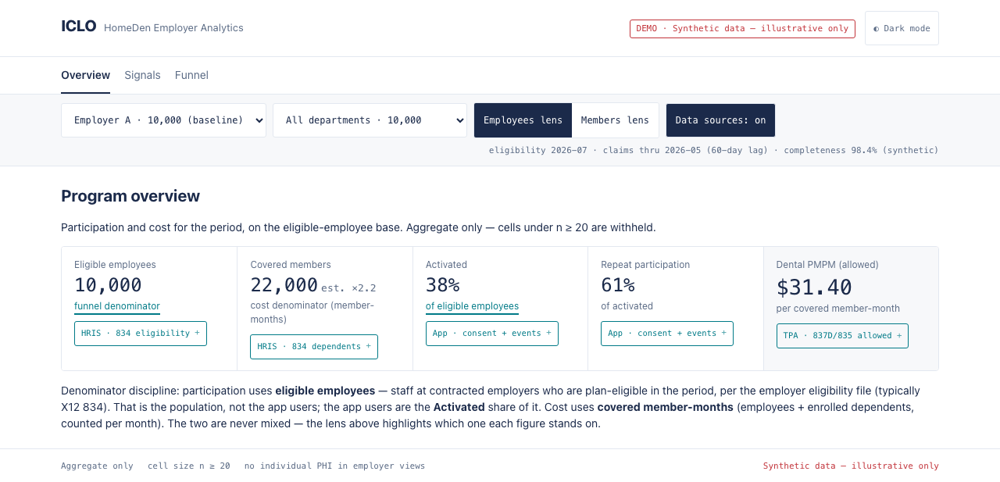

**이 화면의 주장은 숫자가 아니라 분모입니다.** 참여는 **자격자**로, 비용은 **가입자-월**로 셉니다. 상단 렌즈 토글이 지금 어느 쪽에 서 있는지 표시하고, **두 값은 한 지표 안에서 만나지 않습니다.**

각 수치 아래 칩이 출처를 답니다. 탭하면 적재 경로가 열립니다 — `title` 속성이 아니라 버튼인 이유는, 터치 기기에서 `title`은 그 정보가 없는 것과 같기 때문입니다.

### 2.2 최소 셀 — 20명 미만은 값을 가립니다

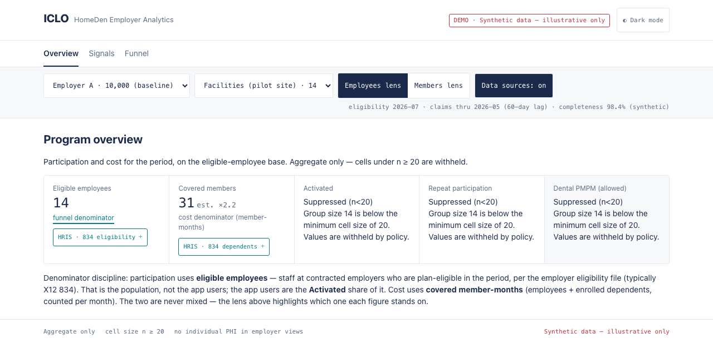

부서를 14명짜리로 좁히면 지표가 사라지고 **사유가 뜹니다.** 분모(14·31)는 남습니다 — 그룹 크기는 억제 문구가 어차피 밝히는 정보입니다.

이 데모는 억제를 JavaScript로 판정합니다. **실제 시스템에서는 DB가 강제해야 하고**, 그것이 §4가 설명하는 이유의 전부입니다.

### 2.3 신호 분포 — 밴드만, 점수 없음

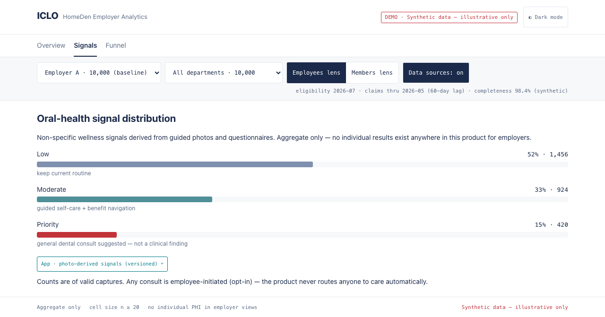

`Low` · `Moderate` · `Priority`. 라벨이 `Review`가 아닌 것도 규칙입니다. `Priority` 설명이 **"general dental consult suggested — not a clinical finding"**인 것은 FDA 2026 웰니스 경계 때문입니다.

### 2.4 개입 퍼널

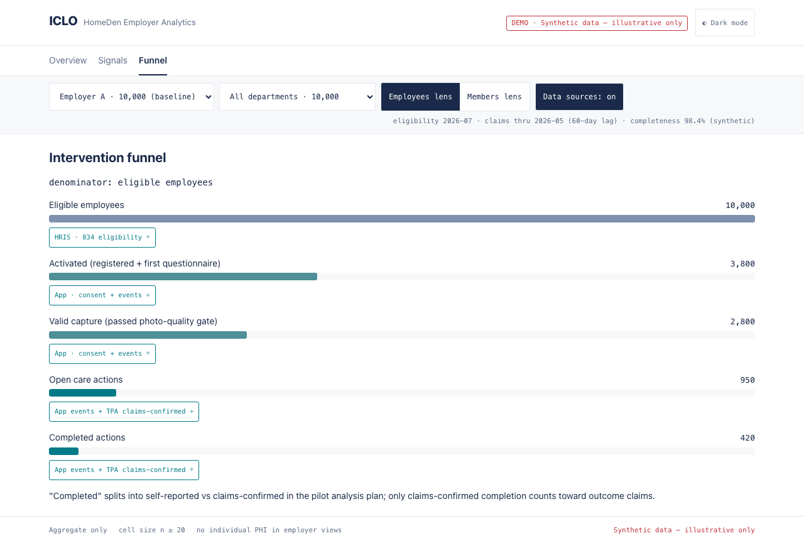

마지막 줄이 핵심입니다 — **"청구로 확인된 완료만 성과 주장에 들어간다."** 자가 보고는 빠집니다. 앱 이벤트만으로는 자가 보고이고 청구만으로는 ICLO의 개입 여부를 모릅니다. **둘을 같은 사람으로 연결해야 성립합니다.**

---

## 3. 임직원 앱

### 3.1 로그인 하나에 사람 넷

사람 · 계정 · 누구를 대신할 수 있는가가 **각각 다른 층**입니다.

```
credential ──N:M── profile_access ──N:M── party
 (로그인)          (SELF | GUARDIAN)      (사람)
```

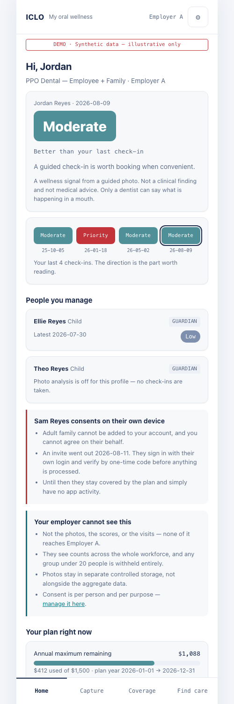

`party`와 `credential` 어디에도 기업이 없습니다. **사람은 하나인데 소속은 시간에 따라 바뀌고 동시에 둘일 수도 있기 때문**입니다 — 부부가 각자 회사에서 서로를 부양가족으로 올리면 같은 사람이 두 기업에 속합니다. 기업을 사람에 넣으면 그 사람이 두 행이 되고 구강 이력이 반으로 쪼개집니다.

**성인 가족은 이 계정에 붙지 않습니다.** 화면이 본인 기기에서 동의한다고, 초대가 나갔다고, 그리고 **여기에 컨트롤이 의도적으로 없다**고 말합니다. 임직원이 배우자 동의를 대신하면 그 처리의 근거가 무효가 될 수 있습니다.

**개인에게 숫자를 주지 않습니다.** 밴드와 방향 문장만 보입니다. 점수는 내부적으로 계산되고 렌더되지 않으며, **FDA clearance 전까지 그렇습니다.**

<div style="clear:both"></div>

### 3.2 촬영 — 대상을 매번 고릅니다

<div style="display:flex;gap:14px;align-items:flex-start">
  <figure style="flex:1;margin:0">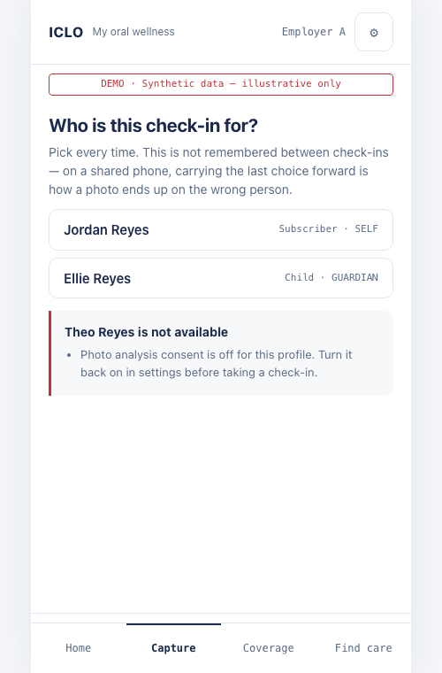
  <figcaption style="font-size:.8em;text-align:center">촬영 대상을 매번 고른다</figcaption></figure>
  <figure style="flex:1;margin:0">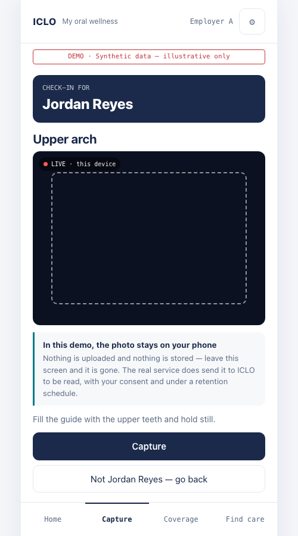
  <figcaption style="font-size:.8em;text-align:center">카메라와 프레임 가이드</figcaption></figure>
</div>

**아무것도 미리 선택되지 않습니다.** 계정 주인조차 기본값이 아닙니다 — 공유 폰에서 직전 프로필을 이어 쓰는 것이 사진이 엉뚱한 사람에게 붙는 가장 흔한 경로입니다.

**그 오류는 집계 화면에 절대 보이지 않습니다.** 화면은 멀쩡하고 청구 연결만 딴 사람을 가리킵니다. 그래서 방어가 다섯입니다 — 매번 선택, 자동 선택 금지, 대상자 이름을 가장 크게, 이탈 시 해제, **촬영자를 대상과 별도 기록.**

사진 동의가 꺼진 프로필은 목록에서 빠지고 이유를 밝힙니다.

### 3.3 카메라

라이브 프리뷰와 프레임 가이드. 품질 검사는 **기기에서** 밝기를 측정합니다 — 서비스 쪽 게이트의 대역입니다.

**이 데모에서는 사진이 기기를 떠나지 않습니다.** 실제 서비스는 동의 하에 보존 일정에 따라 ICLO로 보냅니다. 데모가 안 보내는 이유는 촬영 동의·보존 일정·삭제 경로가 아직 없기 때문입니다.

### 3.4 그리고 판정하지 않습니다

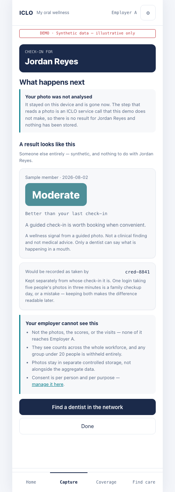

**찍은 사람에 대해 아무 결과도 만들지 않습니다.** Core AI 호출 경로가 없어서 분석할 수단이 없고, 없는 상태에서 밴드를 지어내면 **그 사람에 대한 주장**이 됩니다. DEMO 배너는 자기가 방금 만든 결과를 믿는 걸 막지 못합니다.

대신 결과가 어떻게 생겼는지를 **계정 밖 인물**로 보여줍니다.

<div style="clear:both"></div>

### 3.5 동의는 사람별·목적별

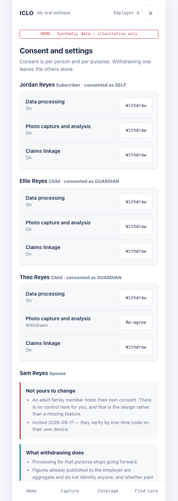

`데이터 처리` · `사진 촬영과 분석` · `청구 연결`이 각각 켜지고 꺼집니다. 한 자녀는 사진이 꺼져 있고 청구 연결은 켜져 있습니다 — **실제로 가능한 입장이고 스위치 하나로는 표현이 안 됩니다.**

철회가 실제로 동작합니다. 그리고 문구가 조심스럽습니다 — 앞으로의 처리는 멈추고, 사진은 보존 일정을 따르며, **이미 배포된 집계를 다시 만드는지는 아직 정해지지 않았다**고 적습니다. 정해지지 않은 것을 정해진 것처럼 쓰지 않습니다.

<div style="clear:both"></div>

### 3.6 급여와 진료 연결

<div style="display:flex;gap:14px;align-items:flex-start">
  <figure style="flex:1;margin:0">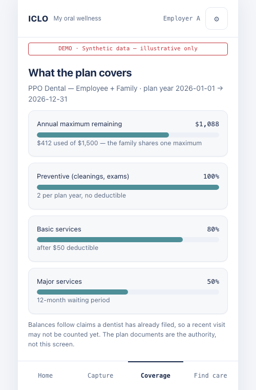
  <figcaption style="font-size:.8em;text-align:center">보장률과 잔여 한도</figcaption></figure>
  <figure style="flex:1;margin:0">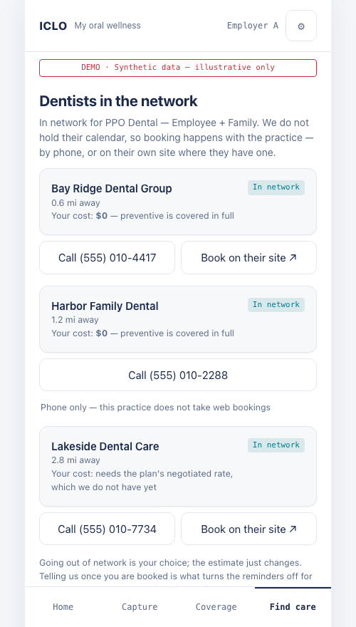
  <figcaption style="font-size:.8em;text-align:center">네트워크 치과와 넘기기</figcaption></figure>
</div>

보장률과 잔여 한도. **잔여 한도는 급여 게이트웨이(270/271)가 있어야 진짜가 되고, 지금은 없습니다.**

예약은 넘깁니다 — 치과 일정표에 연결돼 있지 않으므로 **빈 시간대를 모르고, 그래서 안 보여줍니다.** 전화나 그 치과 사이트로 넘기고, 넘긴 뒤에 **묻습니다.** "예약했다"는 자가 보고이고 청구가 몇 주 뒤에 확정합니다.

<div style="clear:both"></div>

---

## 4. 데이터 흐름

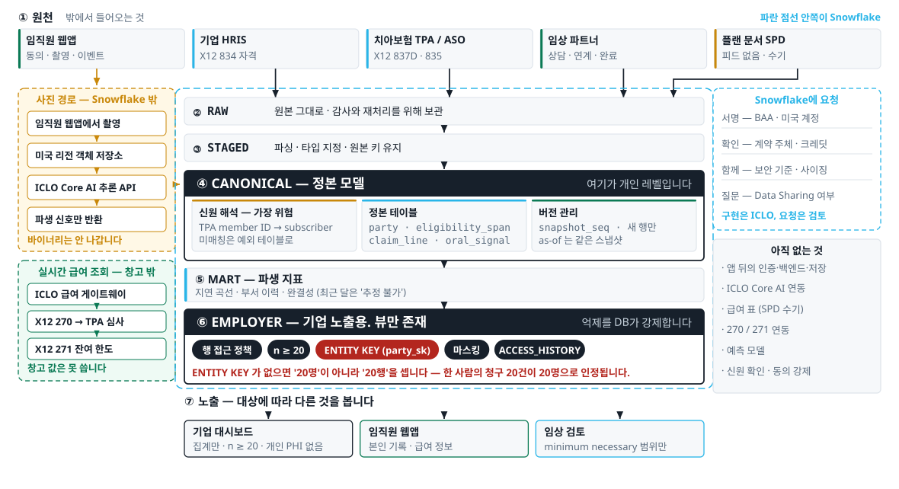

세 구역입니다. **원천**(HRIS 834 · TPA 837D/835 · 앱 · 임상 파트너)에서 **정본**으로 사람 단위로 이어지고, **노출**에서 기업이 볼 수 있는 것만 남습니다.

그림에 **"아직 없는 것"이 표시돼 있습니다.** 그 여섯 항목은 정본 계약 파일의 `does_not_exist`와 항목 단위로 일치시켰습니다 — **그림과 계약이 다르면 회의에서 둘 중 하나가 거짓이 됩니다.**

---

## 5. 아키텍처

두 상태를 나눠 그립니다. 한 장에 그리면 실재하는 상자와 아닌 상자가 구별되지 않습니다.

```
범례   ■ 동작      ▨ 설계만      □ 설계도 없음
```

### 5.1 지금

```
        정본 계약 파일  ■
             │ 손으로 옮김
        ┌────┴────┐
        ▼         ▼
   대시보드 ■   임직원 앱 ■
        └────┬────┘
             ▼
        GitHub Pages ■

   네트워크 호출 0 · 백엔드 없음 · 인증 없음 · 개인정보 없음
```

### 5.2 근거 레이어 (설계 완료, 미착수)

```
Snowflake ▨
  합성 생성기 ▨ → RAW_* → STAGED → CANONICAL (20 테이블)
                                        │  내부 롤만 윈도우 함수
                                        ▼
                        mart.person_month_fact ▨   ← party_sk 보유
                          집계 정책 + ENTITY KEY
                          행 접근 정책 · 마스킹
                                        │  기업 롤은 SUM·COUNT 만
                        R_EMPLOYER_A/B/C 각각 내보내기
                                        ▼
                    기업별 JSON + 부서 카탈로그 ▨
                                        ▼
                        발행 전 검사 → 대시보드
```

**`ENTITY KEY`가 이 설계에서 가장 중요한 한 줄입니다.** 최소 그룹 크기는 기본적으로 **행 수**를 셉니다. 한 사람이 청구 라인 20개만 만들어도 "20"을 충족하고, 그러면 기업 화면에 실제로는 1명짜리 집계가 나옵니다. `ENTITY KEY (party_sk)`가 있어야 **고유 인물 수**로 셉니다.

**데모에서는 절대 드러나지 않습니다** — 데모의 억제는 사람 수로 판정하기 때문입니다. 실데이터로 옮기는 순간 조용히 약해지는 종류의 결함이라, 개통 전 두 기업 데이터로 반드시 시험해야 합니다.

### 5.3 신뢰 경계

```
  개인 레벨 데이터는 존재한다  ─┐
  사진 · 신호 · 방문 · 청구      │  ICLO 안에서만
  전부 사람 단위로 저장된다     ─┘

  기업이 보는 것은 그것이 아니다
  집계 · 최소 셀 20명(고유 인물) · 밴드 · 부서 필터
```

**"집계만 저장한다"가 아니라 "기업이 볼 수 있는 것을 제한한다"입니다.** 전자는 거짓입니다 — 앱과 청구를 같은 사람으로 연결해야 "청구로 확인된 완료"가 성립하고, 그것이 이 시스템의 존재 이유입니다.

---

## 6. GTM

### 6.1 사는 사람

**중견기업 HR의 복리후생 담당자.** 갱신 비용을 억제하면 승진하고 임직원 불만이 터지면 잘립니다.

**자기부담 구조에서는 치과도 직접 손익입니다.** 보험료를 내는 게 아니라 청구를 자기 계좌에서 지급하므로, 이용이 바뀌면 비용이 바뀝니다. 그래서 비용 가시성이 구매 동기가 됩니다.

### 6.2 지금 경쟁 상대는 TPA 연간 리포트와 브로커 갱신 덱

공짜이고, 자동으로 도착하고, 이미 신뢰받고 있으며, **그 관계를 브로커가 소유합니다.**

약점은 **연 1회이고, 사후적이고, 행동으로 연결되지 않는다**는 것입니다. 우리가 다른 점도 거기 있습니다 — 진료 **전** 신호, 그리고 그 신호가 실제 진료로 이어졌는지를 **청구로 확인**하는 것.

**다만 그것을 약점으로 느끼는 담당자가 실제로 있는지는 아직 확인되지 않았습니다.** §8을 보십시오.

### 6.3 최소 파트너 규모가 제품에서 나옵니다

`n ≥ 20` 억제가 규모의 바닥을 정합니다.

| 부서 비중 | 20명을 넘으려면 |
|---|---:|
| 42% | 전사 48명 |
| 26% | 77명 |
| 19% | 106명 |
| **8%** | **250명** |

**250명 미만이면 작은 부서가 항상 가려집니다.** 부서 필터가 제품의 핵심인데 보여줄 게 없어집니다. 첫 파트너는 작을수록 좋다는 통념이 여기서는 뒤집힙니다.

### 6.4 단계

| | 무엇 | 무엇이 열리나 |
|---|---|---|
| **1** | 설계 파트너 1곳 · 착수 게이트 4개 서면 종결 | 실데이터 적재가 가능해짐 |
| **2** | 그 기업의 자격·청구로 대시보드가 합성이 아닌 숫자를 표시 | **첫 결과 보고서** |
| **3** | 결과 보고서가 브로커 채널을 연다 | 갱신 시즌 진입 |

**3단계의 순서에 주의가 필요합니다.** 현상유지를 브로커가 배달하고 있다면 채널이 먼저 열려야 할 수도 있습니다. 이 순서는 아직 검증되지 않았습니다.

### 6.5 한국이 증명하는 것과 못 하는 것

| | |
|---|---|
| 증명함 | **회원이 시키지 않아도 촬영합니다.** 마케팅비 없이 5만 명, 유료 치과 100곳 |
| 증명 못 함 | **기업이 돈을 냅니다.** 한국은 B2C·B2B2C 이고 미국 자기부담 구조와 다릅니다 |

이 구분을 흐리면 제안 전체가 약해집니다. 참여가 일어난다는 것은 미국에서도 유효한 근거이고, **구매가 일어난다는 것은 아직 근거가 없습니다.**

---

## 7. 요청

### 7.1 Step 0 — 연결

미국 **HLS GTM 담당자**와 **아키텍처 담당자** 연결. 완료 정의는 서면 후속 1건입니다.

### 7.2 설계 파트너 소개

찾는 곳의 조건은 넷입니다.

```
· 자기부담(self-funded) 치과 플랜을 운영하는 기업
· 임직원 250명 이상  — 부서별 화면이 억제로 다 가려지지 않는 하한 (§6.3)
· Snowflake 를 이미 쓰는 곳이면 Secure Data Sharing 으로 파일 전송이 없어짐
· 복리후생 담당자가 "치과 이용을 못 본다" 고 말한 적 있는 곳
```

**마지막 줄이 가장 중요합니다.** 설득해야 할 사람이 아니라 **이미 불편을 말한 사람**을 찾고 있습니다.

### 7.3 계정·에디션

거버넌스 기능이 에디션에 묶여 있습니다 — 행 접근 정책, 집계 정책과 `ENTITY KEY`, 마스킹, 접근 이력이 **Enterprise 이상**입니다. PHI 적재 단계에서는 **Business Critical + BAA**가 전제입니다.

**에디션·클라우드·리전은 계정 생성 후 변경 불가**이므로, 크레딧이 붙은 계정이 어느 등급·리전인지 확인이 필요합니다.

---

## 8. 사실 경계

**이 절이 이 문서에서 가장 중요합니다.**

| 주장 | 상태 |
|---|---|
| 화면의 모든 숫자 | **합성입니다.** 고객 결과도 시장 기준치도 아닙니다 |
| 미국 기업 인터뷰 | **0건.** 복리후생 담당자·브로커·컨설턴트 대화 기록이 없습니다 |
| 절감액 | **주장하지 않습니다.** 1년차 성과를 약속하지 않습니다 |
| 임직원 앱 | **화면만 있습니다.** 인증·저장·추론·급여 조회 전부 없음 |
| 최소 셀 강제 | 데모는 화면 코드가 판정합니다. DB 정책 강제는 근거 레이어 단계 |
| `ENTITY KEY` 검증 | **미실증.** 개통 전 두 기업 데이터로 시험해야 합니다 |

### 검증 체계에 대해

이 저장소의 검사는 push마다 자동으로 돕니다 — 금지 용어, 정본 정합성, 단일 출처, 최소 셀 54상태, 내보내기 계약, fixture 산술.

**그렇게 만든 이유는 조용히 죽은 검사를 세 번 찾았기 때문입니다.** 셋 다 "없는 것을 못 찾은 것"을 통과로 읽었습니다 — 문자열이 안 맞게 된 검사, 배포 파일을 아예 안 보던 검사, 렌더 실패를 "위반 없음"으로 읽던 검사.

지금 모든 검사가 **실행이 성공했는지 확인하고, 실제로 몇 개를 봤는지 세고, 0이면 멈춥니다.** 파일럿에서 실데이터가 들어올 때 신뢰할 근거는 숫자가 아니라 이 습관입니다.

---

## 부록. 정본과 파생

값은 한 파일이 정본입니다 — 화면 라벨, 상수, 레드라인, 착수 게이트, 지표 시간 계약, 내보내기 계약이 모두 거기 있습니다. 대시보드·기술문서·이 제안서가 전부 그것을 참조하고, 자동 검사가 어긋남을 잡습니다.

**정본을 먼저 고치고 산출물을 고칩니다. 역순으로 하지 않습니다.**
