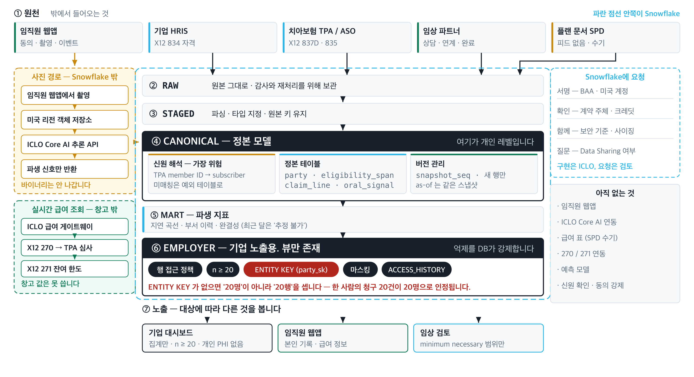

# 미국 임직원 구강 복지 근거 설계 협업 제안

ICLO × Snowflake · 2026-08

---

## 0. 한 장 요약

요청은 하나입니다. **현재 ICLO를 담당하는 Snowflake Korea 스타트업 담당자가, 미국 HLS(헬스케어·생명과학) GTM 담당자와 아키텍처 담당자를 지정해 연결해 주시는 것입니다.**

이것이 Step 0의 전부입니다. 투자, 제품 구매, 크레딧, 구축 승인, 실데이터 제공은 이 단계에서 요청드리지 않습니다.

판단하실 것은 셋입니다.

| 판단할 것 | 본문 |
|---|---|
| ICLO가 하려는 일이 Snowflake 플랫폼 이야기가 맞는가 | 2절, 6절 |
| 지금 실제로 있는 것이 무엇인가 | 7절 |
| 담당자를 연결해 줄 만한가 | 10절 |

미국 치아 플랜 이야기가 3절에 나옵니다. 이 시장을 모르면 나머지가 읽히지 않기 때문입니다. 이미 아신다면 건너뛰셔도 됩니다.

---

## 1. 아이클로는 어떤 회사인가

스마트폰으로 찍은 구강 사진을 **비진단 구강 신호**로 바꾸는 회사입니다. 한국에서 상용 단계이며 B2C·B2B·B2G 모두 매출이 있습니다.

| | |
|---|---|
| 창업자 | 김준배(치과 재료 유통 23년) · 공성배(서울대 치의학, 임상의) |
| 앱 사용자 | 5만 명 이상. 한국, 마케팅비 없이 자발적으로 |
| 유료 치과 | 100곳. 홈덴 커넥트 |
| 구강 데이터 | 850만 건, 전문가 라벨 250만 건 |

모델은 객체 검출 mAP50 **98.996%**로 KOLAS 인정 시험에서 평가받았고, 8개 분류 평균 정확도는 약 0.907로 전 분류가 0.85를 넘습니다.

한국에서 운영 중인 제품은 홈덴 앱(개인 구강 촬영과 기록), 닥터 어랜지(치과 진료실 운영 AI), 홈덴 커넥트, 닥터 알아서, 공공검진입니다. 특허로는 인공지능 구강검진 솔루션과 일본 원격검진 특허가 있고, 과학기술정보통신부 장관상(GovTech, 2025)을 받았습니다.

---

## 2. 미국에서 팔려는 것은 임직원 웰니스입니다

미국 복리후생 스택에는 구강 웰니스 계층이 없습니다. 정신건강, 피트니스, 영양에는 있는데 구강에는 없습니다.

첫 번째 수익 파동은 **자기부담 기업에 파는 비진단 engagement와 비식별 집계 분석**입니다. 인허가 게이트가 없어서 지금 시작할 수 있습니다. 청구 검증과 언더라이팅은 그다음이며 각각 별도의 규제 관문 뒤에 있습니다.

기업에 팔지만 실제로 쓰는 사람은 임직원과 그 가족입니다. B2B2C이고, 그래서 화면이 둘 필요합니다.

### 2.1 Snowflake가 필요한 두 가지 이유

| | 왜 필요한가 |
|---|---|
| 평판 | 미국 기업 고객이 가장 먼저 묻는 것은 “그 데이터를 어떻게 만지느냐”입니다. 답을 구조로 보여주지 못하면 대화가 시작되지 않습니다 |
| 데이터 관리·가공 | 자격·플랜·앱 이용·청구가 서로 다른 기관에서 옵니다. 사람 단위로 잇고 기업 단위로 집계하면서 개인은 가리는 일을, 정책 문서가 아니라 데이터 계층이 강제해야 합니다 |

기술이 없어서 드리는 요청이 아닙니다. **미국 헬스케어에서 무엇이 통용되는지 아는 사람**이 필요합니다.

---

## 3. 미국 기업 치아 플랜은 한국과 무엇이 다른가

이 절은 보험이나 미국 복리후생을 모르는 분을 위한 것입니다.


**미국 치과 접수 창구.** 환자가 보험카드를 내면 그 자리에서 자격이 조회되고, 진료 후 청구는 치과에서 TPA로 넘어갑니다. 이 제안이 다루는 데이터는 대부분 이 장면 뒤에서 오갑니다.

<sub>생성형 이미지입니다. 실제 고객사나 제휴 치과의 사진이 아닙니다.</sub>

### 3.1 누가 무엇을 하는가

한국에서 치과에 가면 건강보험이 일부를 부담하고, 실손보험이 있으면 추가로 돌려받습니다. 회사가 관여하는 부분은 크지 않습니다.

미국의 기업 제공 치아 플랜은 출발점이 다릅니다. 기업이 임직원에게 제공할 플랜의 자격과 조건을 정하고, 그 재원을 어떻게 마련할지도 고릅니다.

| 주체 | 하는 일 |
|---|---|
| 기업 | 플랜을 정하고, 자격 대상을 관리하고, 재원 방식을 고릅니다 |
| 임직원·가족 | 플랜에 가입하고, 네트워크 안에서 치과를 이용합니다 |
| TPA | 자격 관리, 네트워크 운영, 청구 심사를 대행합니다 |
| 치과 | 진료하고 청구를 냅니다 |

여기에 급여 조건이 붙습니다. 네트워크(계약된 치과인가), 연간 한도(플랜이 한 해에 지급하는 상한), 본인부담률(예방·기본·주요 진료마다 다릅니다).

한국의 실손보험과 닮은 점은 진료 뒤 청구와 본인부담이 생긴다는 것입니다. 다른 점은 고용 자격, 기업이 고른 플랜 조건, 네트워크, 허용액과 연간 한도가 처리 결과에 함께 작용한다는 것입니다. 그래서 앱 사용 기록만 봐서는 이용이 실제 진료와 지급으로 이어졌는지 알 수 없습니다.

### 3.2 fully insured와 self-funded / ASO / stop-loss

재원 방식이 갈리는 지점입니다.

| | fully insured | self-funded / ASO / stop-loss |
|---|---|---|
| 비용을 최종 부담하는 주체 | carrier | 기업 |
| 기업이 하는 일 | 보험료 납부 | 진료비 실비 부담 |
| 절감이 생기면 | carrier 몫 | 기업 몫 |
| 큰 부담 대비 | carrier가 위험 인수 | stop-loss로 상한 |

용어를 정확히 갈라두겠습니다. 이 넷을 섞으면 책임 주체를 잘못 짚게 됩니다.

- 기업이 지원하는 플랜은 비용 부담 주체인 **payer**입니다
- **TPA**(third-party administrator)는 **ASO**(administrative services only) 계약에 따라 자격 관리, 청구 처리 같은 관리 업무를 맡습니다
- **stop-loss**는 예외적으로 큰 부담에 대비하는 별도 보호 장치입니다
- **carrier**는 보험 상품 제공자입니다. payer와 같은 뜻이 아닙니다

### 3.3 그 구조가 미국 그룹 치아보험의 46%입니다

**미국 그룹 치아보험의 46%가 self-insured입니다.** 2024년 기준이며 전년 44%에서 올랐습니다. 그만큼의 비용이 보험사가 아니라 기업 손익에 얹힙니다.

미국인의 51%가 고용주 제공 치아보험을 갖고 있고 이는 단일 원천으로 가장 큽니다. 미국 전체 치과 지출은 2024년 1,892억 달러입니다.

비용은 진료비만이 아닙니다. 미치료 구강 문제로 인한 연간 생산성 손실이 450억 달러, 결근·결석이 2억 4,300만 시간으로 집계됩니다. 자기부담 구조에서는 이 손실과 치료비가 모두 기업 몫이고, 반대로 예방으로 줄어든 부분도 기업 몫입니다. ICLO는 여기에 기업이 투자할 유인이 있다고 봅니다. 사업 가설이며 측정된 결과가 아닙니다.

수치의 출처와 검증 상태는 부록에 있습니다.

### 3.4 데이터가 갈라져 있습니다


**청구는 여기서 시작됩니다.** 진료가 끝나면 이 자리에서 청구가 TPA로 제출됩니다. 한국처럼 자동으로 처리되는 것이 아니라 사람이 하는 행정 작업이고, 그래서 제출 시점과 처리 시점이 진료일과 어긋납니다.

<sub>생성형 이미지입니다. 실제 고객사나 제휴 치과의 사진이 아닙니다.</sub>

한 사람의 치과 이용이 데이터가 되는 경로입니다.

1. 기업 또는 benefits administrator가 누가 플랜 대상인지 정리한 자격 파일을 제공합니다. 널리 쓰이는 형식이 `X12 834`입니다
2. 대상 임직원이 네트워크와 조건을 확인하고 치과를 이용합니다
3. 치과가 제공한 서비스의 청구 정보를 보냅니다. 치과 청구 형식이 `X12 837D`입니다
4. 플랜의 처리 주체가 규칙을 적용해 허용액·본인부담·플랜 지급액을 나눠 계산합니다. 이 셋은 합치지 않습니다
5. 임직원은 누가 얼마를 부담하도록 처리되었는지 `EOB`(Explanation of Benefits)에서 확인합니다. 지급·정산 응답에는 `X12 835`가 쓰일 수 있습니다

서로 다른 원천이 같은 사람을 가리켜야 합니다. 공통 식별키가 없으면 자격자, 앱 이용자, 청구 완료자를 연결할 수 없습니다. 8절 네 번째 게이트가 바로 이 문제입니다.

### 3.5 시간이 어긋납니다

청구 데이터는 진료가 일어난 달에 모두 확정되는 월별 장부가 아닙니다. 진료 뒤 청구가 제출되고 처리되는 동안 같은 진료월의 기록이 뒤늦게 추가되거나 상태가 달라질 수 있습니다. **이번 달 화면의 청구 숫자는 아직 완성되지 않은 숫자입니다.**

퇴사로 자격이 끝난 사람도 재직 중 받은 진료의 청구가 나중에 들어옵니다. 퇴사자를 곧바로 계산에서 지우면 이런 run-out 청구가 빠져 완료와 비용의 추세를 잘못 읽게 됩니다.

그래서 진료 발생 시점, 청구 처리 시점, 자격 기준 시점을 분리하고, 어느 시점까지 들어온 청구를 집계했는지 함께 밝혀야 합니다.

---

## 4. 누가 무엇을 보는가

근거 레이어에서 나가는 화면은 셋이고, 셋이 보는 것이 서로 다릅니다. 5절 도식의 ⑦ 노출 단계가 이 셋입니다.

| | 기업 대시보드 | 임직원 앱 | 임상 검토 |
|---|---|---|---|
| 누가 보나 | 인사·복지 담당 | 임직원 본인과 가족 | ICLO 진료 운영 |
| 무엇을 보나 | 집계된 통계와 비용 | 자기 기록과 자기 급여 | minimum necessary 범위만 |
| 개인 식별 | 없음. 최소 셀 `n ≥ 20` | 본인 것만 | 동의 범위 안에서만 |
| 목적 | 프로그램이 작동하는지 판단 | 진료로 연결 | 상담·연계·완료 확인 |

같은 근거 레이어에서 나오지만 보이는 것이 다릅니다. 그 경계를 데이터 계층이 강제하는 것이 이 제안의 핵심입니다.

### 4.1 임직원이 겪는 흐름

```text
회사가 임직원에게 앱 설치를 안내
        ↓
임직원이 설치하고 본인과 피부양 가족을 등록
        ↓
스마트폰으로 구강 촬영. 2분 이내, 병원 방문도 X-ray도 없음
        ↓
본인 화면에만 표시
   · 구강 위험 스코어와 그 추이
   · 우리 회사 플랜이 무엇을 보장하고 한도가 얼마 남았는지
   · 네트워크 안 치과와 예상 본인부담
   · 요청하면 예약까지
        ↓
진료 발생 → 치과가 TPA에 청구
```

가족까지 포함하는 것이 중요합니다. 미국 플랜은 피부양자를 함께 보장하고, 회사가 부담하는 비용도 가족 진료를 포함합니다.

**이 화면은 회사로 넘어가지 않습니다.**

### 4.2 설계로 막아둔 것

| 하지 않는 것 | |
|---|---|
| 자동 진단 | 스코어는 위험 신호이지 진단이 아닙니다 |
| 자동 언더라이팅 판정 | 보험료·인수 여부를 결정하지 않습니다 |
| 청구 승인·거부 | 지급 판단에 관여하지 않습니다 |
| 개인 단위 기업 리포팅 | 기업 화면은 집계 전용입니다 |
| 원본 이미지 반출 | 사진은 플랫폼을 나가지 않습니다. 파생 신호만 나갑니다 |

이 다섯 줄이 미국 기업 고객이 가장 먼저 확인하는 항목입니다.

### 4.3 앱 기능 중 지금 있는 것과 없는 것

| 기능 | 상태 | 무엇이 필요한가 |
|---|---|---|
| 구강 촬영과 스코어 | **한국에서 운영 중** | 미국 이관과 규제 경계 확인 |
| 보장 내용·잔여 한도 조회 | **없음** | 급여 게이트웨이(`X12 270/271`). 별도 트랙 |
| 네트워크 치과·예약 지원 | **없음** | 아직 설계 전 |

임직원 앱 자체가 미국에는 아직 없습니다. 4.1절은 만들려는 그림이지 오늘 도는 물건이 아닙니다.

### 4.4 회사가 보는 것과 못 보는 것

기업 담당자가 보는 화면에는 개인이 나오면 안 됩니다. 고용에 영향을 줄 수 있는 건강정보이기 때문입니다.

| 규칙 | 내용 |
|---|---|
| 집계 전용 | 기업 화면에 개인 단위 결과를 두지 않습니다 |
| 최소 셀 `n ≥ 20` | 20명 미만 그룹은 값 대신 표시할 수 없음이 나옵니다 |
| 기업 간 격리 | 한 고객사가 다른 고객사 데이터를 볼 수 없습니다 |
| 항목별 출처 표기 | 어느 숫자가 어디서 왔는지 화면에 붙습니다 |

회사가 보는 것은 자격 인원, 참여율, 재검진율, 신호 분포, 그리고 자격 → 활성화 → 유효 촬영 → 조치 → 완료로 이어지는 퍼널입니다. 여기에 TPA에서 온 지출이 붙습니다.

회사에 절대 도달하지 않는 것은 개인 식별, 구강 이미지와 임상 기록, 그리고 자격·언더라이팅·보장 판정입니다.

정확히 말하면 “개인정보가 없다”가 아니라 “기업 화면에 개인 단위 정보가 없다”입니다. 가입자-월과 청구 항목은 개인 단위 레코드 없이 계산할 수 없으므로, 관리형 처리 레이어에는 개인 수준 레코드가 존재합니다. 통제 대상은 데이터의 존재가 아니라 누가 읽을 수 있는지입니다.

### 4.5 최소 셀이 사람을 세게 하려면

20명 미만을 가리는 기능은 데이터베이스가 강제합니다. 다만 기본 설정은 행 수를 셉니다. 한 사람의 청구 20건이 20명으로 인정되면 통제가 헐거워집니다. 사람 단위로 세려면 고유 인물 식별자를 지정해야 합니다.

### 4.6 원본 사진의 경계

원본 구강 이미지는 ICLO 운영 미국 리전 객체 저장소에 두고, Snowflake에는 사진 바이너리가 들어가지 않습니다.

“파생 신호만 들어간다”는 표현은 정확하지 않으므로 쓰지 않겠습니다. Snowflake에는 이미지 참조(`image_uri`), 촬영 시각, 모델 버전, 품질 통과 여부, 신호 밴드에 더해 사람·촬영 주체·기업을 가리키는 식별 컬럼이 함께 들어갑니다. 이미지와 행위자를 개인에게 연결하는 것이 바로 그 컬럼들이고, 개인건강정보 인벤토리에서 가장 민감한 항목입니다.

저장소 벤더와 계정 소유자, 암호화 키 관리 주체, 보존·삭제 규칙, 감사 경로는 아직 정해지지 않았습니다. Snowflake 보안 담당자가 가장 먼저 물어볼 지점이라고 보고 미리 밝힙니다.

---

## 5. 전체 그림



가운데 축이 원천에서 기업 화면까지의 본류입니다. 양옆 두 레인은 그 축을 타지 않습니다. 사진은 ICLO 저장소에만 있고 파생 신호만 돌아오며, 잔여 한도 조회는 창고를 거치지 않습니다.

---

## 6. 왜 Snowflake인가

이 제안에서 Snowflake의 역할은 결과를 보장하는 것이 아니라, 기업별 근거를 같은 통제 기준 아래에서 다룰 수 있는지 설계로 확인하는 데 있습니다. 통제 범위와 기대 효과를 나눠서 보셔야 합니다.

| 설계 과제 | 통제 범위 | 기대 효과 | 보장하지 않는 것 |
|---|---|---|---|
| 기업 간 격리 | 행 접근 정책을 기업 식별자와 승인된 역할에 연결해 쿼리 결과에 포함할 행을 통제합니다 | 같은 근거 레이어를 써도 기업 화면 사이의 노출 경계를 일관되게 적용할 수 있습니다 | 잘못된 기업 식별자 매핑이나 과도한 권한 부여까지 자동으로 바로잡지는 않습니다 |
| 고유 인물 기준 최소 셀 | 엔터티 키를 지정한 집계 정책에 `n ≥ 20`을 두어, 화면이 아니라 쿼리 계층에서 최소 셀을 강제합니다 | 대시보드와 후속 소비자가 같은 최소 셀 규칙을 따르게 할 수 있습니다 | 엔터티 키가 사람을 정확히 가리키는지, 예외 역할이 적절한지는 별도로 검증해야 합니다 |
| 데이터 권리 경계 | Secure Data Sharing으로 제공자가 허용한 객체를 복사 없이 읽기 전용으로 공유합니다 | 원본 복사본의 확산을 줄이고 접근 경계를 계약 조항에 맞춰 설계할 수 있습니다 | 공유 기능이 기업과 TPA 사이의 데이터 권리를 만들거나 HIPAA 역할을 결정하지는 않습니다 |

문서를 열어 확인한 내용 셋을 그대로 옮깁니다. 4.5절의 “행이 아니라 사람을 센다”는 주장이 여기 걸려 있어서, 표현을 저희가 지어내지 않았음을 보이는 편이 낫다고 판단했습니다.

- 집계 정책: “the groups returned by a query against an aggregation-constrained table or view must contain at least the specified number of **entities**, not a specified number of **rows**.” 최소 그룹 크기는 `MIN_GROUP_SIZE`로 지정합니다
- 행 접근 정책: `CURRENT_ROLE`로 역할을 판별하며, 정책은 쿼리 실행 시점에 소유자 권한으로 평가됩니다
- Secure Data Sharing: “no actual data is copied or transferred between accounts.” 공유 객체는 읽기 전용이고 소비자 계정의 저장 용량을 쓰지 않습니다

설계에 반영해야 할 제약도 둘 확인했습니다.

- **행 접근 정책은 Enterprise Edition 이상**을 요구합니다. 개인건강정보를 다루려면 Business Critical과 BAA가 어차피 전제이므로 이 요건은 그 안에 들어옵니다
- **하나의 정책을 행 단위 프라이버시와 엔터티 단위 프라이버시에 함께 쓸 수 없습니다.** 기업 간 격리와 최소 셀은 서로 다른 정책 두 개로 설계해야 합니다

데이터 권리와 HIPAA 역할은 플랫폼 설정이 아니라 서면 합의가 먼저입니다.

---

## 7. 오늘 실제로 있는 것

이 절을 흐리면 문서 전체의 신뢰가 무너집니다. 설계를 운영처럼 쓰지 않겠습니다.

| 구분 | 내용 |
|---|---|
| 오늘 도는 것 | 임직원 대시보드 데모 하나. 브라우저 안에서 합성 숫자를 계산하며 실데이터와 Snowflake 연결은 없습니다 |
| 설계된 것 | 근거 레이어 데이터 모델, 신원 해석 규칙, 정책·품질 계약, 기업 온보딩 절차, 추론 API 계약 |
| 90일에 하는 것 | 담당자 연결과 검증 상대 확정, 근거 레이어 아키텍처 설계와 Snowflake 보안 기준 정렬, 네 게이트의 책임자 지정과 종결 경로 합의 |
| 존재하지 않는 것 | 임직원 웹앱, Core AI 호출 경로, 급여 게이트웨이(`X12 270/271`), 급여 표(SPD 수기), 예측 모델, 신원 확인·동의 강제 |
| 정하지 않은 것 | 예측 모델이 무엇을 예측할지, 실험군 배정, 가족·보호자 권한의 전체 흐름 |

존재하지 않는 세 항목은 별도 트랙이며 90일 계획에 포함되지 않습니다. 4.3절에서 “없음”으로 표시한 것이 여기 해당합니다. 실험군 배정은 법무와 프로토콜 승인 전에는 범위에 넣지 않습니다.

### 7.1 데모 화면과 값

데모는 화면과 지표의 뜻을 맞추기 위한 대화 도구이며 고객 결과나 시장 기준치가 아닙니다.

| 탭 | 화면 제목 | 답하는 질문 |
|---|---|---|
| `Overview` | `Program overview` | 자격·참여·조치의 전체 흐름은 어떤가 |
| `Signals` | `Oral-health signal distribution` | 집계 신호 분포는 어떤가 |
| `Funnel` | `Intervention funnel` | 참여가 조치와 청구 확인 완료로 어떻게 이어지는가 |

| 화면 라벨 | 합성 데모 값 | 뜻 |
|---|---:|---|
| `Eligible employees` | 시나리오별 | 기준 시점에 플랜 자격이 있는 임직원 |
| `Activated (registered + first questionnaire)` | 38% | 가입 + 첫 문진 완료 / 자격자 |
| `Valid capture (passed photo-quality gate)` | 28% | 품질 게이트를 통과한 촬영 |
| `Open care actions` | 9.5% | 발생한 조치 |
| `Completed actions` | 4.2% | 청구로 확인된 완료 (confidence HIGH 만) |
| `Repeat participation` | 61% | 2회 이상 유효 촬영 / 활성 사용자 |

신호 분포는 Low 52%, Moderate 33%, Priority 15%입니다. 시나리오는 자격자 10,000명에 PMPM 31.4, 2,500명에 32.8, 25,000명에 30.9를 씁니다. 완결성 98.4%와 청구 지연 60일도 합성 데모 표시값입니다.

모든 시나리오에 `Synthetic data — illustrative only` 라벨이 붙습니다.

---

## 8. 실데이터를 넣기 전에 닫아야 할 네 가지

기술 문제가 아니라 법률과 계약 문제입니다. 넷 다 지금 열려 있고, **네 항목 모두 실데이터 적재 전에 각각의 결론과 책임자를 서면으로 확정해야 합니다.**

| | 서면으로 정할 내용 | 열린 채로 진행하면 |
|---|---|---|
| HIPAA 역할 규정 | ICLO·기업·기업 건강플랜·TPA·Snowflake가 각각 covered entity인지 business associate인지 subcontractor인지 판정합니다. BAA 체인은 이 판정 위에 세웁니다 | 개인건강정보를 적재할 법적 근거가 없습니다 |
| 데이터 권리 | 기업과 TPA 계약에서 원천별·필드별·목적별로 무엇을 받고 무엇에 쓸 수 있는지 정합니다 | 데이터를 받고도 쓸 수 없습니다. 이 사업 지연의 대부분이 여기서 생깁니다 |
| 동의 이전 기준선 적재 | 기준선 적재가 동의보다 먼저 일어납니다. 집계 전용 기준선을 택할지 별도 법적 근거를 세울지 정합니다 | 비동의자의 개인건강정보를 근거 없이 처리하게 됩니다. 예외가 아니라 구조적 문제입니다 |
| 공통 식별키 | 인사 쪽과 TPA 쪽에 같은 사람을 안정적으로 연결할 키가 있는지 정합니다 | 청구와 앱 이용을 연결할 수 없어 “청구로 확인된 완료”라는 주장이 성립하지 않습니다 |

Snowflake에 이 판단을 요청드리지 않습니다. HIPAA 역할도, 데이터 권리도, 규제 판정도 ICLO와 고객이 정할 몫입니다. 플랫폼 설정만으로 닫히는 게이트도 아닙니다. 다만 넷이 열려 있다는 사실을 숨기고 진행하지는 않겠습니다.

---

## 9. 90일과 역할 분담

이 90일이 검증하는 것은 **Snowflake 관계와 설계가 성립하는가**입니다. 치아 PoC 자체가 아닙니다. 이 기간에는 기업 약정도, 계약된 데이터도, 적재된 청구도, 측정된 결과도 없습니다.

| 무엇 | ICLO | Snowflake |
|---|---|---|
| 연결 | 검증 상대와 범위 정리 | 미국 HLS GTM·아키텍처 담당자 지정 |
| 설계 | 근거 레이어 아키텍처 초안, 지표 정의 | 보안 기준 검토, 계정·리전·BAA 경로 확인 |
| 게이트 | 네 항목의 책임자 지정과 종결 경로 | 플랫폼 측 전제 확인 |
| 운영 | 주간 서면 보고와 의사결정 기록 | 검토 참여 |

실데이터 적재는 네 게이트가 모두 서면으로 닫힌 뒤에 시작하는 별도 단계이며, 이 90일 밖입니다. 그 전까지는 합성 데모로 지표 정의, 기업 집계 경계, 필요한 입력 필드, Snowflake 통제 설계를 검토합니다.

### Snowflake에 요청드리지 않는 것

FDA·HIPAA·인허가·데이터 권리에 대한 결론, 규제 준수 보증, 고객 소개. Native App과 Clean Room, 다자간 학습은 조건부이며 지금 요청 대상이 아닙니다.

---

## 10. 요청과 Step 0 완료 정의

Snowflake Korea의 현재 스타트업 담당자가 다음 두 역할을 지정해 ICLO와 연결하면 Step 0이 완료됩니다.

- 미국 HLS GTM 담당자
- 미국 HLS 아키텍처 담당자

이 연결에는 투자, 구매, 실데이터 제공, 90일 계획 승인이 포함되지 않습니다.

그 자리에서 다음 세 가지를 확인해 주시면 이후 계획을 실제 조건에 맞춰 다시 쓰겠습니다.

1. 현재 ICLO 지원 관계의 공식 프로그램명과 스폰서
2. 미국 계정·클라우드·리전, 그리고 BAA 경로
3. 기술 지원 담당

이 셋은 Snowflake만 답할 수 있는 항목입니다. 다만 미확인 항목이 이 셋만은 아닙니다. ICLO의 대외용 법인·본사·단계·핵심팀 정보도 외부 공유 전에 확정해야 합니다.

---

## 부록. 근거와 사실 경계

### 출처

| 무엇을 뒷받침하는가 | 출처 |
|---|---|
| 그룹 치아보험의 46%가 self-insured (2024, 전년 44%) · 고용주 제공 51% | NADP 2025 Dental Benefits Report |
| 미국 치과 지출 1,892억 달러 (2024) | CMS 국민의료비 계정 |
| 생산성 손실 450억 달러 · 결근·결석 2억 4,300만 시간 | CareQuest 2024 |
| self-funded와 fully insured 구분 | [미국 노동부 EBSA, Self-Insured Group Health Plans 2025](https://www.dol.gov/sites/dolgov/files/EBSA/researchers/statistics/retirement-bulletins/annual-report-on-self-insured-group-health-plans-2025.pdf) |
| 치아 보장과 플랜 설계 | [HealthCare.gov](https://www.healthcare.gov/coverage/dental-coverage/) · [미국치과의사협회](https://www.ada.org/resources/practice/dental-insurance/benefit-plan-designs) |
| Snowflake 통제 범위 | [행 접근 정책](https://docs.snowflake.com/en/user-guide/security-row-using) · [엔터티 키 집계 정책](https://docs.snowflake.com/en/user-guide/aggregation-policies-entity-privacy) · [Secure Data Sharing](https://docs.snowflake.com/en/user-guide/data-sharing-intro) |
| ICLO 실적·모델 평가 | 미국판 IR 자료 (2026-08), 회사 자체 보고 및 KOLAS 인정 시험 |

### 링크 검증 상태

정확히 밝힙니다.

- 2026-08-07에 브라우저로 직접 열어 확인한 것: 노동부 연례 보고서, 노동부 EBSA 보고서 색인, Medicaid 예방 서비스 페이지
- 이전 판에서 끊긴 링크를 대체한 수탁 책임 PDF와 그 섹션 페이지는 검색으로 찾았을 뿐 아직 브라우저로 열어 확인하지 않았습니다
- Snowflake 문서 세 건은 2026-08-12에 열어 내용까지 대조했습니다. 6절이 인용한 문장이 실제로 그 문서에 있음을 확인했습니다
- **NADP·CMS·CareQuest 수치는 미국판 IR 자료에서 인용했으며, 원 출처 문서를 직접 열어 확인하지는 않았습니다.** 외부 공유 전에 확인이 필요합니다

이전 판에서 노동부 링크 하나가 검색 결과에는 살아 있으면서 실제로는 404였습니다. 검색 노출은 검증이 아니라는 것을 그때 배웠고, 그래서 위처럼 나눠 적습니다.

### 근거로 삼지 않은 것

아래는 ICLO의 해석이거나 검증되지 않은 계획 가정이며 출처가 없습니다. 회의에서도 그렇게 말씀드리겠습니다.

- 2~3년차에 치료 구성과 run-out이 측정 가능해진다는 시점 판단
- 이직률이 낮은 기업은 다년 가치 논리에, 높은 기업은 직원 경험 논리에 맞는다는 구분
- 임직원이 진료 전에 네 가지 판단을 거친다는 모델
- self-funded 구조가 기업에 구강 관리 투자 유인을 만든다는 3.3절의 가설
